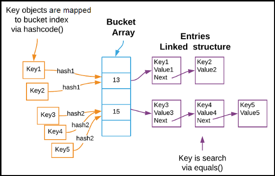

# [←](../README.md) <a id="home"></a> Equals and Hashcode

## Table of Contents:
- [Hashcode and equals contract](#contract)
- [Hashcode](#hashcode)
- [Equals](#equals)

----

## [↑](#home) <a id="contract"></a> Hashcode and equals contract
Every class in Java implicitly inherits from **java.lang.Object**.\
This means that all object types share some common behavior and mechanisms.

Shared behavior includes the implementation of the **equals and hashcode contract**.\
It's needed for Hash data structures like: **HashMap**, **HashSet**, **LinkedHashMap**, **LinkedHashSet**, **ConcurrentHashMap**, etc.

Also, we should remember that frameworks (like Spring or Hibernate) can use own data structures that are based on hash code and equals.\
For example, **@OneToMany** for Hibernate or **@Cacheable** for Spring Cache.

There is a "contract" between the hashcode and equals methods:
- If two objects are equal, then they **MUST** have the same hashCode**!**
- If two objects have the same hashCode then **MAY** NOT be equal.

For example:
```java
boolean electronicArtsIsFacebook = "FB".hashCode() == "Ea".hashCode();
System.out.println(electronicArtsIsFacebook);
```
Such cases are called **Collisions**.

To understand it better let's see how hashcode and equals are used for hash data structures:



To better understand this, we need to analyze the implementation of these methods.

----

## [↑](#home) <a id="hashcode"></a> Hashcode
Hashcodes are used to distinguish objects and choose the correct **bucket** in the hash data structure:
```java
@Override
public int hashCode() {
	return super.hashCode(); //native method
}
```
But as we can see, it return an integer.\
It means that we are quite limited in the number of different options.\
That's why different objects can have the same hash code.

By default, JVM creates an **identity hashcode** for each object.\
This is the default implementation for the hashcode method.\
We always can request this information:
```java
System.identityHashCode(obj)
```
The method implementation is **native**, that means that it's JVM specific and we SHOULD NOT rely on it.

How to implement hashcode correctly?\
It depends on the object use cases.

The easiest implementation is to use current object fields:
```java
@Override
public int hashCode() {
	return Objects.hash(amount, currency);
}
```
But we should remember that such fields **MUST NOT** be changed, because in other cases we can lose an object in the hash.\
Because we store object with one state and search for it with another state (and by another hash).

Such implementation is used for Java **records** because they are immutable and it's safe to use such approach.

More complex cases (like Hibernate entities) should be considered separately.\
For example, Natural Keys (like ISBN number for books) can be used as a hash code:
```java
@Override
public int hashCode() {
	return isbn.hashCode();
}
```
Or it can be any other meaningfull value that can't be changed over the object lifecycle AND known before any usages.

In other cases it can be something that is constant: constant number or the object class: ```return getClass().hashCode()```

For more information: **"[Ultimate Guide to Implementing equals() and hashCode() with Hibernate](https://thorben-janssen.com/ultimate-guide-to-implementing-equals-and-hashcode-with-hibernate/)".

----

## [↑](#home) <a id="equals"></a> Equals
Equals method is quite simple for the default implementation:
```java
@Override
public boolean equals(Object obj) {
	// Default implementation: return (this == obj);
	return super.equals(obj);
}
```

But such approach leads to errors.\
For example, two new instances can return **false** if they are compared by reference (default implementation).

Implementation example:
```java
@Override
public boolean equals(Object obj) {
	if (this == obj)
		return true;
	if (obj == null)
		return false;
	if (getClass() != obj.getClass())
		return false;
	MyEntity other = (MyEntity) obj;
	return Objects.equals(businessKey, other.getBusinessKey());
}
```
It works as usual java method. We would like to return answer as fast as possible.\
The same references are equal.\
Null is not equal to non-null object (object is not null, because we are calling method on it).\
Class should be the same.

The interesting thing is proxy. If it's the case, it's better to use Hibernate **[getClass](https://docs.hibernate.org/orm/current/javadocs/org/hibernate/Hibernate.html#getClass(java.lang.Object))"** method.\
For example:
```java
if (Hibernate.getClass(this) != Hibernate.getClass(o)) return false;
```

Also, for equal method there are some requirements:
- **Symmetry**: Comparison order must not change the result.
- **Reflexivity**: An object must always be equal to itself.
- **Transitivity**: Equal objects are equal between each other (a equals b, b equals c, a equals c)
- **Consistency**: Multiple invocations must reliably return the exact same result (unless a property used in the comparison is modified)
- **Null Comparison**: must always safely return false without throwing an exception

----