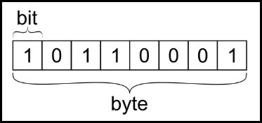
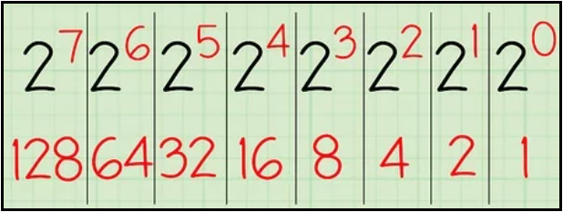
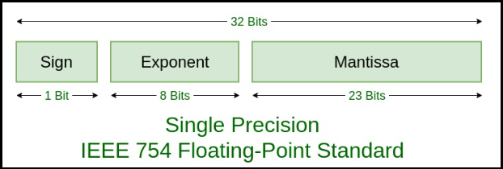

# [←](../README.md) <a id="home"></a> Data Types

## Table of Contents:
- [Information storage](#storage)
- [Primitive Types](#primitives)
- [Widening and Narrowing transformations](#widening)
- [Object Types](#objects)
    - [Integer Pool](#integer)
    - [String Pool](#string)
- [Arrays](#arrays)
- [Enums](#enum)
- [Annotations](#annotations)

----

## [↑](#home) <a id="storage"></a> Information storage
First, it's worth remembering that the unit of information is 1 bit.\
One bit has a value of either zero or one.\
Bits are combined into bytes, where 1 byte = 8 bits. This is just a historical fact:



There are various explanations for the exact number 8.\
But it's worth noting that, due to the binary encoding system in computers, 
the most efficient data sizes for hardware implementation and processing are those that are multiples of two, including 1 byte = 8 bits.

For this reason, the smallest amount of information that can be addressed in memory is a byte.\
The maximum number that can be expressed using a byte is 255:



It's possible to convert number to binary presentation with simple java method:
```java
System.out.println(Integer.toBinaryString(100));
```

It is also worth remembering the following system:
- 1 kilobyte is: 1024 bytes
- 1 megabyte is: 1024 kilobytes
- 1 gigabyte is: 1024 megabytes

Why it can be useful? For example:
```java
public static void printUsedMemory() {
	Runtime runtime = Runtime.getRuntime();
	long allocatedForJvmFromOS = runtime.totalMemory();
	long freeSpaceInAllocated = runtime.freeMemory();
	long usedBytes = allocatedForJvmFromOS - freeSpaceInAllocated;
	long usedMB = usedBytes / (1024 * 1024); // 1024 for kilobytes + 1024 for megabytes
	System.out.println("Used memory: " + usedMB + " mb");
}
```
It can be useful also to check memory with ``jstat -gc <pid>`` and ``jps``.


## [↑](#home) <a id="primitives"></a> Primitive Types
Java is a strongly typed programming language.\
It means that every variable has a type, every expression has a type, and every type is strictly defined.\
One category of data types in Java is **"[Primitive Data Type](https://docs.oracle.com/javase/tutorial/java/nutsandbolts/datatypes.html)"**.

The minimal data type is **byte** (8 bits).\
The most significant bit is used as the sign bit: negative or positive.\
So, we lose one digit. That's why we're left with only 128 options.\
Zero can't be negative, so we have a range ``[-128; 127]`` or ``-2^7 to 2^7-1``.\
Positive part of the range uses one option for zero, that's why we have 127 and not 128.

Each subsequent type is 2 times larger:
| Type      | Bits    | Range           | Values                  |
| --------- | ------- | --------------- | ----------------------- |
| **byte**  | 8       | -2^7 to 2^7-1   | -128 .. 127             |
| **short** | 8x2=16  | -2^15 до 2^15-1 | About 32 thousand       |
| **int**   | 16x2=32 | -2^31 до 2^31-1 | About two billion       |
| **long**  | 32x2=64 | -2^63 до 2^63-1 | About 9 billion billion |

It has values ​​from -2 to the seventh power to 2 to the seventh power minus 1 (due to the loss of one bit per sign of the number).

In addition to integers, there are two types for representing fractional numbers, also known as floating-point numbers: 
- float (similar to int), 32 bits or 4 bytes
- double (similar to long), 64 bits or 8 bytes
```java
System.out.println(Integer.BYTES + " like " + Float.BYTES);
System.out.println(Long.BYTES + " like " + Double.BYTES);
```

They have an interesting approach to store information:



This means that numbers are stored with some precision error\inaccuracy. It leads to interesting results:
```java
System.out.println((0.1F + 0.2F) == 0.3F); //true (floats)
System.out.println((0.1 + 0.2) == 0.3);    //false (doubles)
```
As we can see, Java uses doubles by default.

doubles have greater precision, which leads to greater error\inaccuracy:
```java
System.out.println(0.3+0.6); // == 0.8999999999999999
```

To avoid such issues, use **[BigDecimal](https://docs.oracle.com/en/java/javase/11/docs/api/java.base/java/math/BigDecimal.html)**:
```java
BigDecimal.valueOf(0.3).add(BigDecimal.valueOf(0.6)).floatValue());
```

Additionally, Java has a **boolean** type, which accepts the values ​​true or false.\
A unique feature of this data type is that its memory footprint depends on the JVM implementation.\
For example, a boolean can occupy the same amount of memory as an int, even though a Boolean essentially represents either 1 or 0.\
For this reason, it is recommended to use a **[BitSet](https://www.baeldung.com/java-bitset)** when using a collection of Boolean values.

Boolean types support logical operators such as ``&`` and ``|``, as well as their **short forms** ``&&`` and ``||``.\
Boolean expressions are evaluated for truthiness (true).\
Therefore, in the expression ``a && b``, the b part will not be executed if a is false.\
And in the expression ``a || b``, the b part will not be executed if a is true.\
Additionally, boolean types can be used in ternary operators.

And the final, eighth (just like bits) primitive type is **char**.\
In Java, char uses the **Unicode encoding (UTF-16)**, and **16 bits, or 2 bytes**, are used to store Unicode characters.\
The range of valid values ​​is from 0 to 65536 (there are no negative values).\
So, char is like short, only without negative values.

Furthermore, although char is represented as a number, it is processed differently.\
For example, this code will display the character, not its numeric value:
```java
public static void main(String[] args) {
	char f = 9885;
	System.out.println(f);
}
```

----

## [↑](#home) <a id="widening"></a> Widening and Narrowing transformations
When talking about data types, it's important to remember about the **widening** and **narrowing** transformations.

**Narrowing** occurs when casting a more capacious type to a less capacious one:
```java
double d = 10.7;
int i = (int) d;   // 10 (the fractional part is discarded)
```

But there may be problems with overflow, when the data "does not fit" into the specified type:
```java
int x = 130;
byte b = (byte) x; // overflow: the result will be -126
```

**Widening** is a bit more complicated.\
When executing operators such as addition, Java widens types to the largest usable type:
```java
int myInteger = 100;
double myDouble = myInteger;  // because int type smaller than double (double int)
byte myByte = 10;
int byAsInt = myByte;     // byte can fit into int without issues
```

Interestingly, the byte and short types widen to int, except in cases where the result of the calculation can be known at compile time (static variables or literals).
```java
byte a = 10;
byte b = 20;
byte c = a + b; // ❌ Compilation error!
```

but:
```java
byte x = 10 + 20; // Works fine
```
because it will be calculated at compile time from literals.

----

## [↑](#home) <a id="objects"></a> Object Types
In addition to primitive types, there is another category of types: **[Objects](https://docs.oracle.com/javase/tutorial/java/concepts/object.html)**.

Object types are defined by their class.
Objects can be created using the **new** keyword or using the **[Java Reflection API](https://docs.oracle.com/javase/tutorial/reflect/member/ctorInstance.html)**.

Each object has its own header.\
The header consists of:
- **class word** (class pointer, a reference to class metadata) - 4 bytes (compressed) or 8 bytes (without compression) 
- **mark word**  (gc information, hashcode and monitor metadata) - 8 bytes

So, they can be compared with integers (32 bits, 4 bytes) and with long (64 bits, 8 bytes).

Every class in Java implicitly inherits from **java.lang.Object**.\
This means that all object types share some common behavior and mechanisms.

Primitives can be put into objects like in a box.\
It's called boxing / unboxing:
```java
Integer box = 1;
box = Integer.valueOf(1);
int unboxed = box; 
```
Do not forget that box stores primitive inside + class word + mark word.\
So it means that every boxing adds overhead.

Each class has special methods - **constructors**.\
Constructors are called when creating an instance of the class.\
Which constructor is called depends on the parameters passed when creating the instance.

If no constructors are defined, a default constructor will be added during compilation.\
The default constructor has no parameters. If constructors are defined, the default constructor will no longer be added.

But for Object versions of primitives the **valueOf** should be used because this method provides caching with pools.

Shared behavior includes the implementation of the equals and hashcode contract, generating a text representation using toString, and cloning an object using clone.


### [↑](#home) <a id="integer"></a> Integer Pools
When writing code, the most commonly used types are strings (the String class) and integers (the Integer class).\
Java provides special behavior for these types.

The Integer type contains an **IntegerCache**, which, according to the JLS (Java Language Specification), contains numbers from -128 to 127.\
The upper bound can be changed using a JVM switch. This is why comparison by reference is dangerous:
```java
public static void main(String[] args) {
	Integer a = 127;
	Integer b = 127;
	// If 127 is changed to 128, it will be false
	System.out.println(a == b);
}
```

### [↑](#home) <a id="string"></a> String Pool
Similar to the approach with Integers, strings in Java are stored in the so-called **String Pool**.

The String Pool contains strings declared using literals.\
If you need to add a string to the string pool, you must use the **String#intern** method.

Furthermore, a String is an immutable object (**Immutable Object**) that stores its contents in a **char** array.\
Any modification, such as concatenation, results in the creation of a new object.\
For this reason, a created string cannot be cleared until the JVM decides to delete it from memory.

Interestingly, it is sometimes recommended to use **char** arrays instead of strings for storing passwords.\
However, this is based on the JDBC API, which currently uses Strings to transmit passwords, meaning most of the security arguments are exaggerated.

String concatenation is performed using the "+" operator. Under the hood, concatenation is performed using **StringBuilder**.\
Starting with JDK 9, concatenation is performed by calling **StringConcatFactory**, which, with some optimizations, still requires the creation and use of **StringBuilder**, which leads to increased overhead when concatenating in a loop.

Furthermore, **StringBuffer** is used, which was originally created for simple thread safety, as the string modification methods are synchronized.\
However, this approach has a performance impact.

----

## [↑](#home) <a id="arrays"></a> Arrays
Arrays are a special object type in Java.\
For example:
```java
int[] test = new int[] {2, 3, 4};
test.toString();
```

Every array has a **length** field, from which you can get its length:
```java
System.out.println(new int[] {2, 3, 4}.length);
```

Arrays in Java can be multidimensional:
```java
int[][] test = new int[1][];
test[0] = new int[5];
System.out.println(test[0][1]);
```
At its core, a multidimensional array is simply one-dimensional arrays composed of other one-dimensional arrays. This is why only one dimension is required (see the example above).

----

## [↑](#home) <a id="enum"></a> Enum
Furthermore, Java has an interesting type, Enum, which represents a collection of values. For example:
```java
public enum MyEnum {
	OPTION1, OPTION2
}
```

When compiled, this code becomes:
```java
public final class MyEnum extends java.lang.Enum<MyEnum> {
```
Internally, an array of MyEnum instances will be initialized (OPTION1 and OPTION2 are MyEnum instances).\
This is why we can search the array by index (using the ``values()`` method) or by name (using the ``valueOf(String name)`` method).

It's much better than just integer constants because we can check enum types for arguments.\
We don't need to maintain the collection of entries.\
Also, enums can have the behavior (i.e. methods).

----

## [↑](#home) <a id="annotations"></a> Annotations
Java **[annotations](https://www.youtube.com/watch?v=pPZSFsO1hqw)** are labels that add metadata to your code.\
They do not directly change how code executes. Instead, they provide info to compilers, build tools, or frameworks.

For example:
```java
@Retention(RetentionPolicy.RUNTIME)
@Target(ElementType.METHOD)
public @interface Loggable {
}
```
We can define where annotation can be used (``@Target``) and when it can be available (``@Retention``).

**RetentionPolicy** can be SOURCE, CLASS and RUNTIME.\
Annotations in source are important for compilers, for example: ``@Override``.\
Class retention is a bit tricky. Usually such annotations are used by bytecode analysis tools, IDE (like nullability checks)\
Runtime annotations are available at runtime and can be analyzed with Java Reflection API.

Annotations don't have behavior (i.e. don't have methods).

----