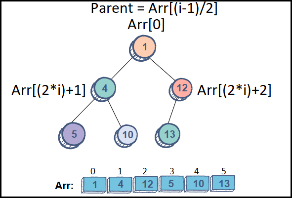

# [←](./README.md) <a id="home"></a> Collection Framework


## Table of Contents:
- [Intro](#Intro)
- [Queue](#queue)
    - [Priority Queue](#priorityQueue)
    - [Concurrent Linked Queue](#concurrentLinkedQueue)
    - [Blocking Queue](#blockingQueue)
    - [Deque](#deque)
- [List](#list)
    - [ArrayList](#arrayList)
    - [LinkedList](#linkedlist)
- [Set](#set)
	- [EnumSet](#enumSet)
	- [CopyOnWriteArraySet](#сopyOnWriteArraySet)
- [Map](#map)
	- [HashMap & LinkedHashMap](#hashMap)
	- [TreeMap](#treeMap)
- [Equals & Hashcode](#equalsHashcode)


## [↑](#home) <a id="intro"></a> Intro
**Коллекции** - это группы объектов (элементов). Коллекции в Java представлены при помощи "[Java Collections Framework](https://docs.oracle.com/javase/tutorial/collections/intro/index.html)".

Во главе иерархии коллекций стоит интерфейс **java.util.Collection**:


Коллекция с точки зрения **java.util.Collection** - это некоторый абстрактный контейнер с элементами. Работая с коллекцией мы имеем только элемент/элементы и коллекцию. Это позволяет нам:
- Добавлять в коллекцию (**add/addAll**), т.к. знаем про элемент
- Удалять из коллекции (**remove/removeAll**), т.к. знаем про удаляемый элемент
- Проверить наличие (**contains/containsAll**)
- Оставить только те элементы, которые есть в другой коллекции (**retainAll**)
- Посчитать элементы **size**
- Проверить, есть ли что-то в коллекции **isEmpty**

**java.util.Collection** не содержит методов получения элементов из коллекции, т.к. способ получения элемента (по индексу, только первый и т.д.) напрямую зависит от реализации.

Благодаря тому, что **java.util.Collection** наследуется от **java.lang.Iterable**, у любой коллекции можно получить **java.util.Iterator**.
Это позволяет использовать любую коллекцию в цикле **[for-each loop](https://docs.oracle.com/javase/8/docs/technotes/guides/language/foreach.html)**:
```java
public static void iterateCollection(Collection< String > collection) {
	for(String item : collection) {
		System.out.println(item);
	}
}
```

Кроме того для всех коллекций начиная с Java 8 при помощи метода **spliterator()** можно получить **java.util.Spliterator** (итератор, который умеет split, т.е. разбиваться на более мелкие spliterator'ы), а в **Iterable** добавился метод **forEach** для обхода коллекции при помощи Consumer'а:
```java
collection.forEach(item -> System.out.println(item));
```

**java.util.Collection** состоит из трёх основных интерфейсов:
- **[List](#list)** 
- **[Set](#set)**
- **[Queue](#queue)**

----

## [↑](#home) <a id="queue"></a> Queue (очередь)
**[java.util.Queue](https://docs.oracle.com/en/java/javase/11/docs/api/java.base/java/util/Queue.html)** (очередь) - это последовательность элементов, где крайние элементы последовательности называют **head** (голова) и **tail** (хвост).

Получение элемента происходит **ВСЕГДА** из **head** (с лица).

**Основные методы очереди:**


Таким образом, методы очереди можно разделить на две категории: методы бросающие исключения и методы, которые в случае проблем просто возвращают значение null или false.

Очереди можно разделить на две категории:
- **unbounded** (без ограничения на кол-во элементов)
- **bounded** (с ограничением кол-ва элементов)


### [↑](#home) <a id="priorityQueue"></a> PriorityQueue
**[PriorityQueue (Очередь с приоритетом)](https://docs.oracle.com/en/java/javase/11/docs/api/java.base/java/util/PriorityQueue.html)** - это реализация очереди, основанная на алгоритме **двоичная куча** или **пирамида**, который так же называют **[Min Heap](https://www.educative.io/edpresso/min-heap-vs-max-heap)**:



Таким образом вставка элементов происходит за logn, а достаётся каждый раз минимальный элемент:

**Пример использования:**
```java
Queue<Integer> q = new PriorityQueue<>();
q.add(2);
q.add(3);
System.out.println(q.poll()); // return 2
```

Чтобы из **Min Heap** сделать **Max Heap** нужно инвертировать компаратор:
```java
Queue<Integer> q;
q = new PriorityQueue<>((a, b) -> Integer.compare(b, a));
// или
q=new PriorityQueue<>(Comparator.comparingInt(Integer::intValue).reversed());
```

**Плюсы:** вставка нового элемента и получение элемента выполняется за **[логарифмическое время](https://habr.com/ru/post/195996/)**.
Кроме того, "под капотом" элементы хранятся в массиве, который увеличивается при заполнении, т.е. данная очередь является **unbounded**. Так как там массив, то contains осуществляется за линейное время.

**Минусы:** НЕ предназначена для работы в многопоточной среде. Для многопоточного выполнения используется блокирующая версия:  PriorityBlockingQueue.

**Дополнительно:** Про структуру данных Heap: **"[Heaps 1 Introduction and Tree levels](https://youtu.be/BzQGPA_v-vc)"**


### [↑](#home) <a id="concurrentLinkedQueue"></a> ConcurrentLinkedQueue
**ConcurrentLinkedQueue** - это очередь, которая разработана специально для использования в многопоточной среде. Данные очереди основаны на принципе **неблокирующей очереди**, который обеспечивается применением **Compare-And-Swap** (сравнение с обменом):


Принцип прост - изменение производится только в том случае, если ожидаемое текущее состояние не изменяется в процессе. CAS обеспечивается поддержкой на уровне процессора и выполнение CAS "дешевле", чем механизмы синхронизации через локи и мониторы.

На эту тему есть отличный материал от IBM: "**[Introduction to nonblocking algorithms](https://www.ibm.com/developerworks/library/j-jtp04186/index.html)**".


### [↑](#home) <a id="blockingQueue"></a> Blocking Queue (блокирующие очереди)
**java.util.concurrent.BlockingQueue** представляют собой **thread-safe** очереди, в которых на добавление и на получение элемента поставлены локи. Данные очереди предназначены в первую очередь для реализации схем **producer-consumer**.

Во-первых, интерфейс **java.util.concurrent.BlockingQueue** добавляет методы **put**/**take**, которые блокируют поток, если элемент не может быть получен сейчас (очередь пуста) или если элемент не может быть добавлен (очередь полная, если очередь bounded).

Во-вторых, блокирующие очереди подразумевают гарантию **Memory consistency**, которая обеспечивается благодаря двум **ReentrantLock**: для добавления и для получения элементов.

**Какие могут быть блокирующие очереди:**
- [PriorityBlockingQueue](https://docs.oracle.com/en/java/javase/15/docs/api/java.base/java/util/concurrent/PriorityBlockingQueue.html) : unbounded очередь с приоритетом
- [SynchronousQueue](https://docs.oracle.com/javase/8/docs/api/java/util/concurrent/SynchronousQueue.html) : очередь, где добавление элемента ожидает, пока этот элемент не заберут. То есть эта такая очередь-синхронизатор всего из 1 элемента.
- [DelayQueue](https://docs.oracle.com/en/java/javase/15/docs/api/java.base/java/util/concurrent/DelayQueue.html) : очередь, где элементы становятся доступны лишь после прошествия какого-то времени
- [ArrayBlockingQueue](https://docs.oracle.com/en/java/javase/15/docs/api/java.base/java/util/concurrent/ArrayBlockingQueue.html) : bounded очередь на основе массива
- [LinkedBlockingQueue](https://docs.oracle.com/en/java/javase/15/docs/api/java.base/java/util/concurrent/LinkedBlockingQueue.html) : optionally-bounded queue based on linked nodes
- [LinkedTransferQueue](https://docs.oracle.com/en/java/javase/15/docs/api/java.base/java/util/concurrent/LinkedTransferQueue.html) : реализация интерфейса **TransferQueue**, который является наследником **BlockingQueue** и добавляется возможность при добавлении элемента в очередь ожидать, пока этот элемент заберут. Своего рода расширенная версия SynchronousQueue.


### [↑](#home) <a id="deque"></a> Deque (двусторонние очереди)
**Double ended queue**, она же двусторонняя очередь - это очередь, работа с которой возможно как с head, так и с tail. Двусторонние очереди в Java выражены при помощи интерфейса **java.util.Deque**.

Самым интересным примером применения двусторонней очереди является так называемый **A-steal algorithm**:


Это отличный пример разделения элементов на начало и конец списка. Разделив элемент таким образом уменьшается вероятность одновременной работы с одними и теми же элементами из разных потоков.

Примером двусторонних очередей являются: **ArrayDeque**, **ConcurrentLinkedDeque**, **LinkedBlockingDeque** и **LinkedList**.
LinkedList особенно интересен, ведь он является одновременно и очередью (queue) и списком (List).


----

## [↑](#home) <a id="list"></a> List
**Списки** - это последовательности элементов, у каждого из которых есть свой индекс, по которому данный элемент может быть получен. Списки выражены в Java при помощи интерфейса **java.util.List**.

Списки расширяют базовое поведение коллекций, добавляя возможность работать с элементами по их индексу. Кроме того, добавляют возможность получить **java.util.ListIterator** - итератор, который может перемещаться в обе стороны, а не только в одну, как это делает обычный итератор коллекций (т.к. зная индекс мы можем вернуться и к предыдущему элементу).
Кроме того, списки позволяют получить sublist, который является представлением порции списка.

Говоря про итератор стоит отметить, что итератор в списках fail-fast. Это означает, что когда создаётся итератор, то он запоминает кол-во изменений в списке. Если изначальный список будет изменён во время итерации кем-то сто стороны (вне итератора), то следующий сдвиг итератора приведёт к исключению **ConcurrentModificationException**. Таким образом, модифицировать списки лучше через метод коллекций **[removeIf](https://docs.oracle.com/en/java/javase/15/docs/api/java.base/java/util/Collection.html#removeIf(java.util.function.Predicate\))** или через listIterator.

Говоря про списки стоит рассмотреть следующие реализации:
- [ArrayList](#arrayList)
- **CopyOnWriteArrayList**
- [LinkedList](#linkedList)


### [↑](#home) <a id="arrayList"></a> ArrayList
**ArrayList** - это список на основе массива.
Является одной из самых часто используемых реализаций, т.к. использование массива для хранения данных позволяет:
- получать элемент за константное время. Выражено интерфейсом "**[RandomAccess](https://docs.oracle.com/en/java/javase/15/docs/api/java.base/java/util/RandomAccess.html)**".
- уменьшение накладных расходов при получении элементов из списка, т.к. массив расположен в памяти последовательно и нет необходимости перемещаться из одного места в heap в другое (что дорого)

ArrayList не потокобезопасный, однако это позволяет отказаться от лишних затрат на синхронизацию, т.к. в большинство случаев это не нужно. ArrayList пришёл на смену **java.util.Vector**, методы доступа к элементам которого синхронизированы.

Подробнее про ArrayList в статье **"[Структуры данных в картинках. ArrayList](https://habr.com/ru/post/128269/)"**.

**CopyOnWriteArrayList** - потокобезопасный аналог **ArrayList**, в котором на любое изменение создаётся новая копия массива, на котором основан список. Дорого, зато потокобезопасно. Подробнее в материале от IBM: **"[Параллельные классы коллекций](https://www.ibm.com/developerworks/ru/library/j-jtp07233/index.html)"**.


### [↑](#home) <a id="linkedList"></a> LinkedList
**LinkedList** - это связанный список, в котором каждый элемент имеет ссылку на следующий элемент. Таким образом LinkedList - это цепочка из элементов.

В отличии от ArrayList, структура LinkedList представляет не случайный доступ, а последовательный (**"sequential access"**), что выражено наследованием от **java.util.AbstractSequentialList**. Таким образом, доступ к элементу по индексу происходит за линейное время, а не за константное время.

Удаление элемента наоборот заключается лишь в перепривязке ссылок соседних элементов (предыдущего и следующего). Таким образом, в отличии от ArrayList, список LinkedList позволяет удалять элемент за константное время.

Кроме того, LinkedList является ещё и двусторонней очередью.

Подробнее описано в статье **"[Что «под капотом» у LinkedList?](https://habr.com/ru/post/337558/)"** и в комментариях к ней.

----

## [↑](#home) <a id="set"></a> Set (множество)
**Set (множество)** - это коллекции, которые не содержат дубликатов. Если говорить формально, то это коллекции, где нет такие элементов ``e1`` и ``e2``, для которых ``e1.equals(e2)`` вернёт true.

У интерфейса **Set** есть наследники, которые расширяют возможности Set.

**Интерфейс java.util.SortedSet:** \
Интерфейс SortedSet показывает, что данный Set обеспечивает упорядоченность элементов. А это в том числе означает, что элементы надо как-то сравнивать, чтобы их выстроить в порядке. Как сказано в JavaDoc, все элементы должны реализовывать интерфейс **Comparable** или их можно сравнить через компаратор, который был передан в конструктор **SortedSet**.

**SortedSet** определяет первый элемент (**first()**) как самый маленький, а последний элемент (**last()**), как самый большой. То есть элементы в SortedSet идут от меньшего к большему.

Подобно спискам Set умеет возвращать представления части коллекции:
- **headSet(E toElement)**, возвращающий часть Set'а, которая строго меньше переданного элемента
- **tailSet(E fromElement)**, возвращающий часть Set'а, которая больше или равна переданному элементу
- **subSet(E fromElement, E toElement)**, возвращающий представление, которое больше или равно элементу fromElement и которое строго меньше toElement


**Интерфейс java.util.NavigableSet:** \
Интерфейс NavigableSet добавляет некоторые методы для навигации по Set коллекции. Например, методы **pollFirst()** и **pollLast()** напоминают очередь и возвращают элемент с начала/конца Set коллекции, при этом удаляя элемент из коллекции. Есть возможность получить при помощи **descendingIterator()** итератор, который идёт из конца множества в начало. Аналогично, при помощи **descendingSet** можно получить представление текущего Set, которое является зеркальным представлением.

Другие возможности:
- **higher(E e)**
Выбрать все значения, которые больше переданного, и получить наименьшее из них.
- **lower(E e)**
Выбрать все значения, которые меньше переданного, и получить наибольшее из них
- **ceiling(E e)**/**floor(E e)**
Похожи на higher/lower, но включают переданный элемент в диапазон поиска

Учитывая выше изложенное можно представить следующую схему:


В первую очередь, стоит приглядеться к EnumSet.

### [↑](#home) <a id="enumSet"></a> EnumSet

**EnumSet** - это множество для хранения enum значений. Операции основаны на побитовых операциях, что делает работу с данным множеством максимально эффективно.
```java
enum Flags {
	READ_ONLY, HIDDEN, LOCKED
}

public static void main(String[] args) {
	EnumSet<Flags> fileFlags = EnumSet.noneOf(Flags.class);
	fileFlags.add(Flags.HIDDEN);
	System.out.println(fileFlags.contains(Flags.HIDDEN));
}
```

### [↑](#home) <a id="сopyOnWriteArraySet"></a> CopyOnWriteArraySet
Другой реализацией Set является **CopyOnWriteArraySet**.
На самом деле, **CopyOnWriteArraySet** является своего рода обёрткой надо CopyOnWriteArrayList, цель которой - не допустить дубликаты и сделать возможным работу с List по контракту Set.
Рекомендуется использовать только в случае небольших коллекцией без большого количества изменений, для которых требуется безопасный обход коллекции из нескольких потоков.

----

## [↑](#home) <a id="map"></a> Map
**Map** - это тоже часть Java Collection Framework, хотя и не является наследником **java.util.Collection**. Согласно **"[Java Collections API Design FAQ](https://docs.oracle.com/javase/8/docs/technotes/guides/collections/designfaq.html)"** это связано с тем, что **Map** состоит из записей, каждая из которых представляет связку ключ-значение. Поэтому неочевидно, что считать элементом.

Поэтому карты позволяют получить три вида коллекций:
- **entrySet()** : множество всех связок ключ-значение
- **keySet()** : множество всех ключей (ключи уникальны)
- **values()** : коллекция всех значений (значения не уникальны)

**Как выглядит иерархия интерфейсов и классов для Map?** \
Если посмотреть на иерархию от Set, то станет понятно, что если слово Set заменить на Map, то мы получим иерархию для Map:


И это не просто так. Реализации Set по умолчанию основаны на реализациях Map. Set в качестве ключей используют значения, а в качестве значений, которые ассоциируются с ключами, используют одно и то же константное значение-заглушку.


## [↑](#home) <a id="hashmap"></a> HashMap и LinkedHashMap
**HashMap** - это коллекция, основанная на структуре данных, называемой "хэш таблица".
Хэш таблица реализована при помощи массива из **Node**, которые хранят ключ и значение. Размер массива называется **CAPACITY** и по умолчанию равен 16. Эти ячейки ещё называют **корзинами**.
Чтобы Node поместить в эту таблицу, на основе его hash вычисляется индекс в массиве. Логично, что индекс учитывает в том числе и размера массива (используя побитовое И):
```java
(n - 1) & hash
```

Так же для HashMap используется некоторое значение **threshold** (порог), которое высчитывается перед каждой вставкой элемента.
**threshold** = **capacity** * **load factor**.

**Load Factor** - это показатель загруженности карты. По умолчанию он равен 0.75, т.е. когда карта заполнена на 75% происходит увеличение capacity карты в два раза (т.е. увеличивается массив, содержащий элементы).
Т.к. индекс должен определяться с учётом размера массива, то при каждом изменении размера пересчитывается хэш для всех элементов и происходит их перераспределение.

**Что такое коллизии?** \
Иногда случается такое, что разные элементы попадают в одну и ту же корзину. В этом случае говорят, что произошла коллизия. После этого используется метод **equals** чтобы понять, вдруг это один и тот же элемент. Если элементы разные, то значения будут выстроены в связный список (как LinkedList).

**Оптимизация при коллизиях:** \
В случае, если цепочки становятся длиннее, чем предустановленное значение, то цепочка превращается в дерево. Таким образом доступ к элементам становится быстрее. Интересно, что при этом элементы в HashMap могут не реализовывать Comparable. При добавлении элементов будет использовать так называемый **tieBreakOrder**, который для расположения элементов будет использовать **identityHashCode**. Однако стоит при этом помнить, что tieBreakOrder не учитывается при поиске и если элементы не comparable, то поиск будет происходить перебором всех элементов. Подробнее можно прочитать тут: "[Tiebreaker Regarding Java HashMap, TreeNode and TieBreakOrder](https://yermilov.github.io/blog/2017/02/24/tiebreaker-regarding-java-hashmap-treenode-and-tiebreakorder/)" и тут "[IdentityHashCode in HashMap's bucket](https://stackoverflow.com/questions/53658426/identityhashcode-in-hashmaps-bucket/53659668)".

**LinkedHashMap** - это наследник HashMap, в котором обход коллекции соблюдает порядок, в отличии от обычной HashMap. Это достигается путём наличия двух ссылок, на начало и на конец коллекции, а так же путём добавления в каждый элемент коллекции (в каждый Entry) ссылок на следующий и предыдущий элемент. Интересной особенностью в том числе является тот факт, что порядок может быть как "в порядке вставки элемента", так и "в порядке последнего обращения к элементу" (данный порядок задаётся в конструкторе). Подробнее можно прочитать в материале **"[Internal Working of LinkedHashMap](https://www.dineshonjava.com/internal-working-of-linkedhashmap-in-java/)"**.

На основе LinkedHashMap можно даже сделать простейший LRU (Least recently used) кэш:
```java
final int size = 10;
Map<Integer, Integer> set = new LinkedHashMap<>(size * 4/3, 0.75f, true) {
    @Override
    protected boolean removeEldestEntry(Map.Entry<Integer, Integer> eldest) {
        return this.size() > size;
    }
};
```

**ConcurrentHashMap** - это специальная версия HashMap для работы в многопоточном окружении. Корзины в этом случае уже сегменты. Каждый сегмент при изменении блокируется отдельно от других. Подробнее см. **"[Как работает ConcurrentHashMap](https://habr.com/ru/post/132884/)"**.


## [↑](#home) <a id="treemap"></a> TreeMap
**Что такое TreeMap?**
**TreeMap** - это реализация **Map**, в которой элементы упорядоченны или при помощи **natural ordering** (т.е. элементы Comparable) или при помощи указания **Comparator'а**.

Как и следует из названия, TreeMap основан на дереве (**[Tree](https://youtu.be/lhTCSGRAlXI)**), а если быть точным, то на красно-чёрных деревьях (**[A Red-Black tree](https://youtu.be/nMExd4DthdA)**).
Т.к. это красно-чёрное дерево, то каждый Entry имеет цвет (``boolean color = BLACK``), где BLACK - это константа, равная TRUE.
Корень (root) красно-чёрного дерева всегда BLACK, а новые элементы всегда RED.
Пустые Node всегда BLACK.
Есть два ограничения:
- Нельзя, чтобы два последовательных Node были RED
- Путь от Root до Leaf состоит из одинакового числа BLACK элементов

Балансировка таких деревьев происходит по "aunt" элементу. Их два типа:
- БАР : Black Aunt Rotate.
Заканчивается BLACK parent и RED дочерними элементами
- РАК : Red Aunt Colorflip
Заканчивается RED parent и BLACK дочерними элементами

Отличный и качественный разбор работы можно увидеть здесь: **"[Red Black Trees 2 Example of building a tree](https://youtu.be/v6eDztNiJwo)"**.

Кроме того, интересен вопрос, как к null относятся HashMap и TreeMap. Об этом подробнее можно прочитать **"[Коллекции vs null](https://m.habr.com/ru/post/164027/)"**.


## [↑](#home) <a id="equalsHashcode"></a> Equals & Hashcode
Как говорит спецификация **java.util.Collection** (т.е. JavaDoc):
> Many methods in Collections Framework interfaces are defined in terms of the equals method.

Таким образом, equals - это один из методов, который должен работать правильно.
Известно, что все объекты наследуются неявно от Object, а следовательно наследуют и поведение equals по умолчанию:
```java
public boolean equals(Object obj) {
	return (this == obj);
}
```
Таким образом, по умолчанию equals сравнивает по ссылке.

Кроме того, спецификация Collection говорит:
> Implementations are free to implement optimizations whereby the equals invocation is avoided, for example, by first comparing the hash codes of the two elements.

По умолчанию, hashcode - это native метод, поведение которого зависит от реализации в конкретной используемой JVM. Однако известно, что вернётся какое-то integer значение. На всё про всё 2^32 чисел. На всё многообразие возможных данных небольшой диапазон, а это значит, что для разных объектов хэшкоды могут совпасть, например:
```java
public static void main(String []args){
	System.out.println("Aa".hashCode());
	System.out.println("BB".hashCode());
}
```
По этой причине, контракт hashcode нам говорит, что:
- два объекта могут иметь одинаковый hashcode и быть не равны по equals
- если объекты равны по equals, то их hashcode должны совпасть
- hashcode не должен меняться от вызова к вызову

Последние два пункта продиктованы механизмами работы хэш таблиц, т.к. чтобы получить объект по ключу, нам надо этот ключ найти. Если учитывать, что мы равный объект, то если у равного объекта будет другой хэш, то искать мы его будет в не той корзине, что в итоге сломает поиск.

Кроме того, на этом контракте основаны механизмы и разных фрэймворков, которые в том числе используют коллекции в основе. Например, тот же Hibernate. Подробнее можно прочитать здесь: **"[Ultimate Guide to Implementing equals() and hashCode() with Hibernate](https://thorben-janssen.com/ultimate-guide-to-implementing-equals-and-hashcode-with-hibernate/)"**.