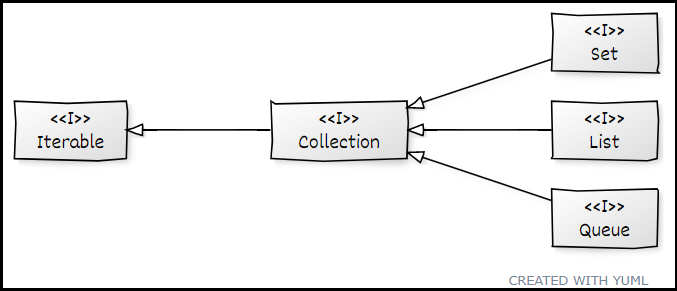
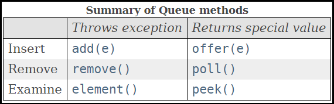
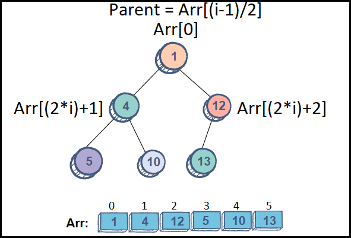
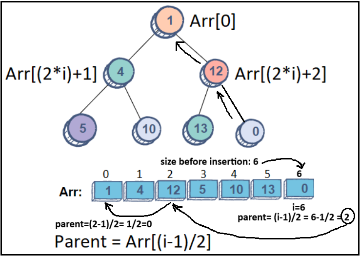
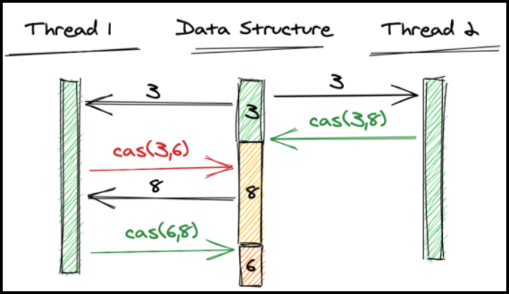
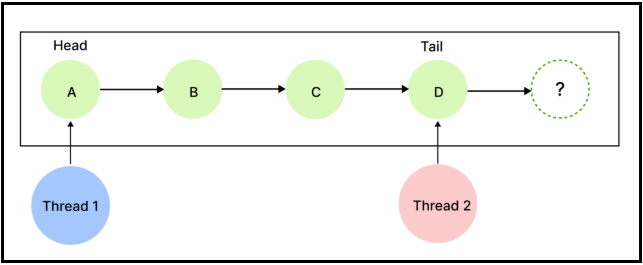
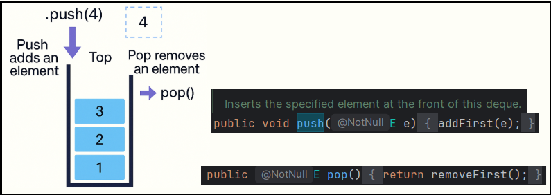
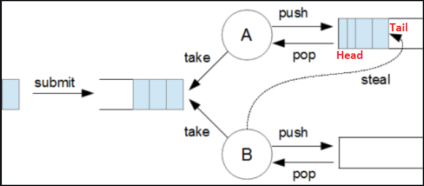
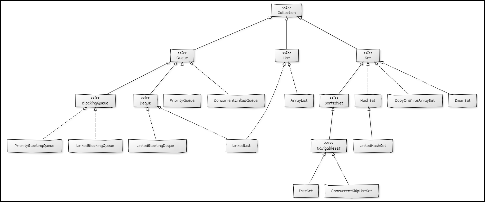
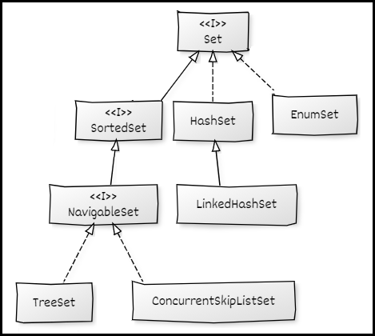

# [←](../README.md) <a id="home"></a> Collection Framework


## Table of Contents:
- [Intro](#Intro)
- [Queue](#queue)
    - [Priority Queue](#priorityQueue)
    - [Concurrent Linked Queue](#concurrentLinkedQueue)
    - [Blocking Queue](#blockingQueue)
    - [Deque](#deque)
- [List](#list)
    - [ArrayList](#arrayList)
    - [LinkedList](#linkedlist)
- [Set](#set)
	- [EnumSet](#enumSet)
	- [CopyOnWriteArraySet](#сopyOnWriteArraySet)
- [Map](#map)
	- [HashMap & LinkedHashMap](#hashMap)
	- [TreeMap](#treeMap)
- [Equals & Hashcode](#equalsHashcode)


## [↑](#home) <a id="intro"></a> Collections Framework
Collections are groups of objects (elements).\
Collections in Java are represented by the **Java Collections Framework**.

At the top of the collection hierarchy is the **java.util.Collection** interface:



A collection, from the perspective of **java.util.Collection**, is an abstract container with elements.\
When working with a collection, we only have element(s) and the collection. This allows us to:
- Add to the collection (**add/addAll**), since we know about the element.
- Remove from the collection (**remove/removeAll**), since we know about the element. We know about the element being removed
- Check for presence (**contains/containsAll**)
- Retain (i.e. keep) only those elements that are in another collection (**retainAll**)
- Count elements (**size**)
- Check if the collection contains anything (**isEmpty**)

**java.util.Collection** does not contain methods for retrieving elements from a collection, since the method for retrieving an element (by index, only the first element, etc.) is implementation-dependent.

Because **java.util.Collection** inherits from **java.lang.Iterable**, you can get a **java.util.Iterator** from any collection.\
This allows you to use any collection in a **[for-each loop](https://docs.oracle.com/javase/8/docs/technotes/guides/language/foreach.html)**:
```java
public static void iterateCollection(Collection< String > collection) {
	for(String item : collection) {
		System.out.println(item);
	}
}
```

Furthermore, for all collections since Java 8, you can use the **spliterator()** method to get a **java.util.Spliterator** (an iterator that can split, i.e., be broken down into smaller spliterators).\
**Iterable** has a new **forEach** method for traversing a collection using a Consumer:
```java
collection.forEach(item -> System.out.println(item));
```

**java.util.Collection** consists of three main interfaces:
- **[List](#list)**
- **[Set](#set)**
- **[Queue](#queue)**

**Map** is also part of the Java Collection Framework, although it is not a descendant of **java.util.Collection**.\
According to **"[Java Collections API Design FAQ](https://docs.oracle.com/javase/8/docs/technotes/guides/collections/designfaq.html)"**, this is because **Map** consists of entries, each of which represents a key-value mapping.
Therefore, it is not obvious what is considered an element.

Also, there are interfaces to emphasize the orderliness of the elements: SortedSet, SortedMap.\
Also, there are specific interfaces for navigation across the sorted elements: NavigableSet and NavigableMap.

Specific **Sequenced Collection** interfaces were introduced in Java 21: **[What is a Sequenced Collection?](https://www.youtube.com/watch?v=nwGo4jRKbvo)**.

----

## [↑](#home) <a id="queue"></a> Queue
**[java.util.Queue](https://docs.oracle.com/en/java/javase/11/docs/api/java.base/java/util/Queue.html)** (queue) is a sequence of elements, where the outermost elements of the sequence are called the **head** and **tail**.

An element is ALWAYS retrieved from the **head**.

**Main Queue Methods:**



Thus, queue methods can be divided into two categories:
- methods that throw exceptions
- methods that simply return null or false in the event of a problem.

Queues can be divided into two categories:
- **unbounded** (without a limit on the number of elements)
- **bounded** (with a limit on the number of elements)

### [↑](#home) <a id="priorityQueue"></a> PriorityQueue
**[PriorityQueue (Priority Queue)](https://docs.oracle.com/en/java/javase/11/docs/api/java.base/java/util/PriorityQueue.html)** is a queue implementation.\
PriorityQueue based on the **binary heap** or **pyramid** algorithm, also called **[Min Heap](https://www.educative.io/edpresso/min-heap-vs-max-heap)**:



It's really convenient to store heap in the array. In that case we can put elements from left to right.\
It's **NOT** a binary tree, so we can just follow the rule that parent **MUST BE** less than children.\
It makes the implementation simple and efficient.\
Also, it allows us to get the min element for the constant time from the ``queue[0]``.

It works really efficient for insertion:



Deletion works very similar: **[hello-byte: Heap Deletion Explained in 3 Minutes](https://www.youtube.com/shorts/XuZCJ5eeZf8)**.

Thus Inserting elements takes logn times, and the minimum element is retrieved each time for the constant time:

**Usage example:**
```java
Queue<Integer> q = new PriorityQueue<>();
q.add(2);
q.add(3);
System.out.println(q.poll()); // return 2
```
It's useful for tasks that requires priority to handle.

To convert a **Min Heap** to a **Max Heap**, you need to invert the comparator:
```java
Queue<Integer> q;
q = new PriorityQueue<>((a, b) -> Integer.compare(b, a));
// or
q=new PriorityQueue<>(Comparator.comparingInt(Integer::intValue).reversed());
```

**Pros:** Inserting and retrieving a new element takes **[logarithmic time](https://habr.com/ru/post/195996/)**.
Furthermore, "under the hood," elements are stored in an array that grows when full, meaning this queue is **unbounded**. Since it's an array, the contains function executes in linear time.

**Cons:** It is NOT designed for multithreaded operation. For multithreaded execution, the blocking version is used: PriorityBlockingQueue.

**Additional:** About the Heap data structure: **"[Heaps 1 Introduction and Tree levels](https://youtu.be/BzQGPA_v-vc)"**


### [↑](#home) <a id="concurrentLinkedQueue"></a> ConcurrentLinkedQueue
**ConcurrentLinkedQueue** is a queue designed specifically for use in a multithreaded environment.\
These queues are based on the **non-blocking queue** principle, which is achieved through the use of **Compare-And-Swap** (comparison and swap):



The principle is simple: a change is made only if the expected current state does not change during the process.\
CAS is supported at the processor level, and CAS execution is cheaper than synchronization mechanisms via locks and monitors:



It's useful for Event Loops systems like Netty framework.


### [↑](#home) <a id="blockingQueue"></a> Blocking Queue
**java.util.concurrent.BlockingQueue** are thread-safe queues with locks on both adding and receiving elements.\
These queues are primarily intended for implementing producer-consumer schemes.

First, the **java.util.concurrent.BlockingQueue** interface adds **put**/**take** methods.\
They block the thread if an element cannot be received immediately (the queue is empty) or if an element cannot be added (the queue is full, if the queue is bounded).

Secondly, blocking queues imply a guarantee of **Memory consistency**, which is ensured by two **ReentrantLock** locks: one for waiting element availability and one for queue availability.

**There are different types of blocking queues:**
- [PriorityBlockingQueue](https://docs.oracle.com/en/java/javase/15/docs/api/java.base/java/util/concurrent/PriorityBlockingQueue.html): an unbounded priority queue
- [SynchronousQueue](https://docs.oracle.com/javase/8/docs/api/java/util/concurrent/SynchronousQueue.html): a queue where adding an element waits until that element is retrieved. In other words, this is a synchronizer queue with only one element.
- [DelayQueue](https://docs.oracle.com/en/java/javase/15/docs/api/java.base/java/util/concurrent/DelayQueue.html): a queue where elements become available only after a certain amount of time has passed.
- [ArrayBlockingQueue](https://docs.oracle.com/en/java/javase/15/docs/api/java.base/java/util/concurrent/ArrayBlockingQueue.html): a bounded queue based on an array.
- [LinkedBlockingQueue](https://docs.oracle.com/en/java/javase/15/docs/api/java.base/java/util/concurrent/LinkedBlockingQueue.html): an optionally bounded queue based on linked nodes.
- [LinkedTransferQueue](https://docs.oracle.com/en/java/javase/15/docs/api/java.base/java/util/concurrent/LinkedTransferQueue.html) : interface implementation **[TransferQueue](https://poltora.info/ru/blog/synchronousqueue-ili-transf

It's important because they are quite different.\
For example, **ArrayBlockingQueue** uses the same lock for adding and removing.\
But **LinkedBlockingQueue** uses two different locks for adding and removing.

**PriorityBlockingQueue** is a concurrent version of [Blocking Queue](#blockingQueue).\
Concurrency works because the same lock is used for any queue changes. And because the heap is used (i.e. tree) the queue is unbounded.


### [↑](#home) <a id="deque"></a> Deque (dequeues)
For **java.util.Queue** an element is **ALWAYS** retrieved from the **head** and added to the **tail**!

**Double-ended queue**, also known as a double-ended queue, is a queue that can be accessed from both the head and tail.
Deques in Java are expressed using the **java.util.Deque** interface.

Here it's interesting to compare **Stack** and **Queue/Deque**.


In java we have a **java.util.Stack** that is **java.util.Vector** that extends **AbstractList**.\
So, it means that stack is a list. Also, beacuse it uses Vector as a super class all methods for gettings/adding elements are synchronized.\
The idea of stack:



As we can see, for Queue elements are added to the tail (addLast) and obtained/retrieved from the head (getFirst).\
**Deque** allows us to use both approaches.\
Also, its recommended to use **ArrayDeque** instead of **java.util.Stack** because it doesn't use the synchronization.

For example, let's consider the Removing adjacent duplicates task:
```java
public static void main(String[] args) {
	String s = "abbaca";
	Deque<Character> stack = new ArrayDeque<>();
	for (char chr : s.toCharArray()) {
		if (!stack.isEmpty() && stack.peek() == chr) {
			stack.pop();
		} else {
			stack.push(chr);
		}
	}
	StringBuilder res = new StringBuilder();
	stack.descendingIterator().forEachRemaining(res::append);
	System.out.println(res);
}
``` 

The most interesting example of a double-ended queue is the so-called **A-steal algorithm**:



This is an excellent example of dividing elements into the head and tail of a list. Dividing an element in this way reduces the likelihood of simultaneous access to the same elements from different threads.

Examples of double-ended queues include: **ArrayDeque**, **ConcurrentLinkedDeque**, **LinkedBlockingDeque**, and **LinkedList**.

LinkedList is particularly interesting because it is both a queue and a List.

----

## [↑](#home) <a id="list"></a> List
**Lists** are sequences of elements, each of which has an index by which the element can be retrieved.\
Lists are expressed in Java using the **java.util.List** interface.

Lists extend the basic behavior of collections by adding the ability to work with elements by their index.\
They also add the ability to obtain a **java.util.ListIterator**—an iterator that can traverse in both directions, not just one, as with a regular collection iterator (since knowing the index, we can return to the previous element).

Furthermore, lists allow you to obtain a sublist, which is a representation of a portion of the list (i.e. the specific List view).

Speaking of iterators, it's worth noting that the iterator in lists is **[fail-fast](https://www.youtube.com/watch?v=KvEsuJ5Tp0g)**.\
This means that when an iterator is created, it remembers the number of changes to the list.\
If the original list is modified while being iterated by someone outside the iterator, the next iterator shift will result in a **[ConcurrentModificationException](https://www.youtube.com/watch?v=IrahCREGwBo)**.\
Therefore, it's better to modify lists using the **[removeIf](https://docs.oracle.com/en/java/javase/15/docs/api/java.base/java/util/Collection.html#removeIf(java.util.function.Predicate\))** collection method or via listIterator.

All lists extends **AbstractList** that has a specific field:
```java 
protected transient int modCount = 0;
```
This field can be treated as a list version.\
Each created list iterator has expected modCount field. If it differ from list modCount - the concurrent exception is thrown.

There are some collections with safe iterators: CopyOnWriteArrayList / CopyOnWriteArraySet\
They are safe because any changes of collection create a new data collection.\
It means that each iterator has it's own reference to the collection that was actual on iterator creation time.

When talking about lists, the following implementations are worth considering:
- [ArrayList](#arrayList)
- [LinkedList](#linkedList)
- **CopyOnWriteArrayList**


### [↑](#home) <a id="arrayList"></a> ArrayList
**ArrayList** is a list based on an array.\
It is one of the most commonly used implementations, as using an array to store data allows for:
- Retrieving an element in constant time. Expressed by the "**[RandomAccess](https://docs.oracle.com/en/java/javase/15/docs/api/java.base/java/util/RandomAccess.html)**" interface.
- Reduced overhead when retrieving elements from a list, as the array is stored sequentially in memory and there is no need to move from one location in the heap to another (which is expensive).

ArrayList is **NOT** thread-safe, but this eliminates unnecessary synchronization overhead, as it is not necessary in most cases.\
ArrayList replaces **java.util.Vector**, whose element access methods are synchronized.

CopyOnWriteArrayList is a thread-safe analogue of ArrayList, in which a new copy of the array underlying the list is created for every change.\
It's expensive, but thread-safe.\

Some short videos:
- [What is an ArrayList?](https://www.youtube.com/shorts/vJUDlDq82kE)
- [How is Arrays.asList() working?](https://www.youtube.com/shorts/xBpNWchgSI0)


### [↑](#home) <a id="linkedList"></a> LinkedList
LinkedList is a linked list in which each element has a link to the next element.\
Thus, a LinkedList is a chain of elements.

Unlike ArrayList, the LinkedList structure does not provide random access, but rather sequential access, which is expressed by its inheritance from java.util.AbstractSequentialList.\
Thus, accessing an element by index occurs in linear time, not constant time.

Conversely, deleting an element simply involves rebinding the references of adjacent elements (previous and next).\
Thus, unlike ArrayList, LinkedList allows deleting an element in constant time.

Furthermore, LinkedList is also a double-ended queue.

Fantastic video: **"[Choosing between ArrayList and LinkedList - JEP Cafe #20](https://www.youtube.com/watch?v=ul4wHrbJ8Fk)"**.


----

## [↑](#home) <a id="set"></a> Set (set)
**Set (set)** are collections that do not contain duplicates.\
Formally, these are collections that do not have elements ``e1`` and ``e2`` for which ``e1.equals(e2)`` returns true.

The **Set** interface has subinterfaces that extend the capabilities of Set.

**java.util.SortedSet:** interface
The SortedSet interface indicates that this Set ensures the ordering of its elements.\
This means, among other things, that the elements must be compared somehow to arrange them in order.\
As stated in the JavaDoc, all elements must implement the **Comparable** interface or can be compared using the comparator passed to the **SortedSet** constructor.

**SortedSet** defines the first element (**first()**) as the smallest, and the last element (**last()**) as the largest.\
That is, elements in a SortedSet are ordered from smallest to largest.

Like lists, Set can return views of a portion of the collection:
- **headSet(E toElement)**, which returns the portion of the Set that is strictly smaller than the passed element
- **tailSet(E fromElement)**, which returns the portion of the Set that is greater than or equal to the passed element
- **subSet(E fromElement, E toElement)**, which returns a view that is greater than or equal to the element fromElement and that is strictly smaller than the element toElement

**java.util.NavigableSet Interface:**
The NavigableSet interface adds some methods for navigating a Set collection. For example, the **pollFirst()** and **pollLast()** methods resemble a queue and return an element from the beginning/end of the Set collection, removing the element from the collection.\
You can use **descendingIterator()** to get an iterator that goes from the end of a set to the beginning.\
Similarly, you can use **descendingSet** to get a mirror representation of the current Set.

Other options:
- **higher(E e)**
Select all values ​​greater than the passed value and get the smallest one.
- **lower(E e)**
Select all values ​​less than the passed value and get the largest one.
- **ceiling(E e)**/**floor(E e)**
Similar to higher/lower, but include the passed element in the search range.

Considering the above, we can imagine the following scheme:



It's interesting that usually Sets are wrappers on top of Maps.\
See **"[José Paumard: How is a HashSet working?](https://www.youtube.com/watch?v=fpq4SQKLPDs)"**.\
The same works for LinkedHashSets: **"[José Paumard: What is a LinkedHashSet?](https://www.youtube.com/watch?v=BCwHuOyaDGw)"**.

First of all, it's worth taking a closer look at EnumSet.

### [↑](#home) <a id="enumSet"></a> EnumSet

**EnumSet** is a set for storing enum values.\
Operations are based on bitwise operators, making working with this set as efficient as possible.
```java
enum Flags {
	READ_ONLY, HIDDEN, LOCKED
}

public static void main(String[] args) {
	EnumSet<Flags> fileFlags = EnumSet.noneOf(Flags.class);
	fileFlags.add(Flags.HIDDEN);
	System.out.println(fileFlags.contains(Flags.HIDDEN));
}
```

### [↑](#home) <a id="сopyOnWriteArraySet"></a> CopyOnWriteArraySet
Another implementation of Set is **CopyOnWriteArraySet**.
In fact, **CopyOnWriteArraySet** is a kind of wrapper around CopyOnWriteArrayList, the purpose of which is to prevent duplicates and make it possible to work with Lists according to the Set contract.
It is recommended to use it only for small collections without a large number of changes, which require safe traversal of the collection by multiple threads.

----

## [↑](#home) <a id="map"></a> Map
**Map** is also part of the Java Collection Framework, although it is not a descendant of **java.util.Collection**.\
According to **"[Java Collections API Design FAQ](https://docs.oracle.com/javase/8/docs/technotes/guides/collections/designfaq.html)"**, this is because **Map** consists of entries, each of which represents a key-value pair.\
Therefore, it is not clear what constitutes an element.

The idea of **Map** is to define mapping.\
See: **[José Paumard: What is a Map?](https://www.youtube.com/watch?v=u8ujMXUM90Q)**


Therefore, maps allow us to obtain three types of collections:
- **entrySet()** : the set of all key-value mappings
- **keySet()** : the set of all keys (keys are unique)
- **values()** : a collection of all values ​​(values ​​are not unique)

**What does the interface and class hierarchy for Map look like?**
If we look at the hierarchy from Set, it becomes clear that if we replace the word Set with Map, we get the hierarchy for Map:



And this is not without reason. The default implementations of Set are based on Map implementations.\
Sets use values ​​as keys, and the values ​​associated with keys are all assigned the same constant placeholder value.

In addition to the well-known implementations, there are also the following:
- [What is an Identity HashMap?](https://www.youtube.com/watch?v=ptKwNH0BmMA): each separate instance is a different key
- [What is a WeakHashMap?](https://www.youtube.com/watch?v=bZoUTUUzGu4): keys (i.e. entries) can be garbage collected.

----

## [↑](#home) <a id="hashmap"></a> HashMap and LinkedHashMap
**HashMap** is a collection based on a data structure called a "hash table."\
A hash table is implemented using an array of **Node**, which store a key and a value.\
The array size is called **CAPACITY** and is 16 by default. These cells are also called **buckets**.\
See **"[José Paumard: What is a bucket in a Map?](https://www.youtube.com/watch?v=1LzriAPWvXY)"**.

To place a Node into this table, an index in the array is calculated based on its hash.\
Logically, the index also takes into account the array size (using bitwise AND):
```java
(n - 1) & hash
```

HashMap also uses a **threshold** value, which is calculated before each element is inserted.
**threshold** = **capacity** * **load factor**.

**Load Factor** is an indicator of the map's load.\
By default, it is set to 0.75, meaning that when the map is 75% full, the map's capacity doubles (i.e., the array containing the elements increases).\
Since the index must be determined based on the array size, each time the size changes, the hash for all elements is recalculated and they are redistributed.

**What are collisions?**
Sometimes, different elements end up in the same bucket.\
In this case, a collision occurs. The **equals** method is then used to determine whether they are the same element.\
If the elements are different, the values ​​will be arranged in a linked list (like a LinkedList).

**Collision optimization:**
If chains become longer than the preset value, the chain is transformed into a tree.\
This makes accessing elements faster.\
Interestingly, elements in a HashMap may not implement Comparable.\
When adding elements, it will use the so-called **tieBreakOrder**, which will use **identityHashCode** to arrange elements.\
However, it is worth remembering that tieBreakOrder is not taken into account during search, and if the elements are not comparable, the search will occur by enumerating all elements.

**LinkedHashMap** is a HashMap descendant that maintains an orderly traversal of the collection, unlike a regular HashMap. This is achieved by having two references, one to the beginning and one to the end of the collection, and by adding references to the next and previous elements to each collection element (each Entry). An interesting feature is that the order can be either "insertion order" or "last access order" (this order is specified in the constructor). More details can be found in the article **"[Internal Working of LinkedHashMap](https://www.dineshonjava.com/internal-working-of-linkedhashmap-in-java/)"**.

You can even create a simple LRU (Least Recently Used) cache using LinkedHashMap:
```java
final int size = 10;
Map<Integer, Integer> set = new LinkedHashMap<>(size * 4/3, 0.75f, true) {
	@Override
	protected boolean removeEldestEntry(Map.Entry<Integer, Integer> eldest) {
		return this.size() > size;
	}
};
```

**ConcurrentHashMap** is a special version of HashMap for working in a multithreaded environment.\
In this case, the buckets are already segments. Each segment is locked separately from the others when modified.\
For more information, see **[How ConcurrentHashMap Works Internally After Java 8?](https://javaconceptoftheday.com/how-concurrenthashmap-works-internally-after-java-8)**.

**Hashtable** is an old approach to implement Hash Map.\
Mutation methods are synchronized and lock the whole data structure. That's why it's mych slower than ConcurrentHashMap and should be avoided.\
Also, short video: [José Paumard: What is a HashTable?](https://www.youtube.com/watch?v=TvLm8R45ziQ).

----

## [↑](#home) <a id="treemap"></a> TreeMap
**What is a TreeMap?**
**TreeMap** is a **Map** implementation in which elements are ordered either by **natural ordering** (i.e., Comparable elements) or by specifying a **Comparator**.

As the name suggests, TreeMap is based on a tree (**[Tree](https://youtu.be/lhTCSGRAlXI)**), or more precisely, on red-black trees (**[A Red-Black tree](https://youtu.be/nMExd4DthdA)**).\
An excellent and high-quality analysis of this work can be found here: **"[Red Black Trees 2 Example of building a tree](https://youtu.be/v6eDztNiJwo)"**.

The short introduction: **"[José Paumard: What is a red black tree?](https://www.youtube.com/watch?v=642xsKA1ZdA)"**.\
Since Java 21 TreeMap implements **SequencedMap**: **"[José Paumard: What is a Sequenced Map?](https://www.youtube.com/watch?v=-rNpk1f1VY4)"**.

TreeMap expects **Comparable** keys. If Keys are not comparable the **Comparator** should be passed to the TreeMap.\
There is **NO** compile-time checks. The runtime check will be done.\
The **java.lang.ClassCastException** is thrown when there is no comparator and keys are NOT comparable.

By default, the **NullPointerException** is thrown when null is added as a key.\
**BUT** the specific comparator can be passed to change this behavior:
```java 
TreeMap<String, String> map;
map = new TreeMap<>(Comparator.nullsFirst(Comparator.naturalOrder()));
map.put(null, "test");
```

HashMaps allow null key (because null is treated as a special hash value for the key) and null values are available.\
ConcurrentHashMap **DOES NOT** allow null keys and null values!

----

## [↑](#home) <a id="equalsHashcode"></a> Equals & Hashcode
As the **java.util.Collection** specification (i.e., JavaDoc) states:
> Many methods in Collections Framework interfaces are defined in terms of the equals method.

Therefore, equals is one of the methods that must work correctly.
It is known that all objects implicitly inherit from Object and therefore inherit the default equals behavior:
```java
public boolean equals(Object obj) {
	return (this == obj);
}
```
Thus, by default, equals compares by reference.

Furthermore, the Collection specification states:
> Implementations are free to implement optimizations whereby the equals invocation is avoided, for example, by first comparing the hash codes of the two elements.

By default, hashcode is a native method whose behavior depends on the implementation in the specific JVM being used. However, it is known that some integer value will be returned. 2^32 integers in total. The range for the entire variety of possible data is small, meaning that hashcodes for different objects may be the same, for example:
```java
public static void main(String []args){
	System.out.println("Aa".hashCode());
	System.out.println("BB".hashCode());
}
```
For this reason, the hashcode contract dictates that:
- two objects can have the same hashcode and not be equals-equals-equals
- if objects are equals-equals-equals, their hashcodes must match
- the hashcode must not change from call to call

The last two points are dictated by the mechanics of hash tables, since to retrieve an object by key, we need to find that key.\
Considering that we are an equal object, if an equal object has a different hash, we will look for it in the wrong bucket, which will ultimately break the search.

Furthermore, this contract underlies the mechanisms of various frameworks, including those that use collections as their core.\
For example, Hibernate. You can read more here: **"[Ultimate Guide to Implementing equals() and hashCode() with Hibernate](https://thorben-janssen.com/ultimate-guide-to-implementing-equals-and-hashcode-with-hibernate/)"**.

The good video lecture: [José Paumard: Optimizing your equals() methods with Pattern Matching - JEP Cafe #21](https://www.youtube.com/watch?v=kuzjX_efuDs)

Also, a short overview: 
- [José Paumard: What is the hash code of an object?](https://www.youtube.com/watch?v=saa_wJZB7r8)
- [José Paumard: What about equals() and hashCode()?](https://www.youtube.com/watch?v=RIynixWWkXk)

----