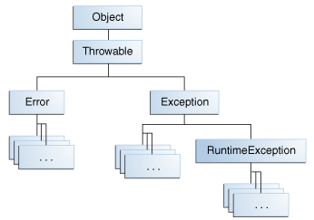
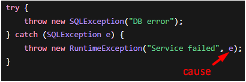

# [←](../README.md) <a id="home"></a> Java Exceptions

## Table of Contents:
- [Exceptions API](#exceptions)
- [Exception Handling](#handling)
- [Chained exceptions](#chain) 
- [Stacktrace](#stacktrace)
- [UncaughtExceptionHandler](#uncaughtExceptionHandler)
- [Try with resources](#withResources) 
- [Inheritance](#inheritance)
- [NoClassDefFoundError](#noClassDefFoundError)

----

## [↑](#home) <a id="exceptions"></a> Exceptions API
During program execution, events can occur that disrupt the normal execution of instructions.\
In Java, these events are called **Exceptions**.

As stated in the [Oracle documentation](https://docs.oracle.com/javase/tutorial/essential/exceptions/definition.html):
> The term exception is shorthand for the phrase "exceptional event."

To use an exception, you should use the ``throw`` keyword (i.e. throw an exception):
```java 
public static void main(String[] args) {
	if (args.length == 0) {
		throw new IllegalArgumentException("Arguments are absent!");
	}
```

Anything that can be **thrown** by a throw statement inherits from the **Throwable** class.\
Thus, the class hierarchy looks like this:



You can read more about this in the official documentation: **"[The Catch or Specify Requirement](https://docs.oracle.com/javase/tutorial/essential/exceptions/catchOrDeclare.html)"**.

Exceptions are divided into **checked** and **unchecked**.\
Anything that is NOT an **Error** or a **RuntimeException** is a **checked exception** and requires mandatory handling.

It's worth noting that the distinction between checked and unchecked exceptions occurs only at the compiler level.\
The compiler requires that checked exceptions be handled using the **try-catch** construct.

Also, as we can see, **Error** stands to the side.\
It's because we can catch Errors (as it is Throwable), but there is no sense to do so.\
Error means "we have an unpredictable state".

For example, we have **java.lang.NoClassDefFoundError**.\
It differs from the exception **ClassNotFoundException** because it means that class was found but it couldn't be loaded from the class source.\
For example:
```java
public static void main(String[] args) {
    try {
        Tezt tezt = new Tezt();
    } catch (Throwable ex) {
        // save the thread - skip ex
    }
    Tezt tezt = new Tezt();
}
```
In that case if exception was thrown on class loading (for example, from static initialization block), we couldn't use such class.

This is a great demonstration of the difference.\
If we tried to load a class and it wasn't there, that's fine.\
But if we found the class but couldn't load it, that's abnormal; it shouldn't be that way.\
It means the application is in some kind of bad state.

----

## [↑](#home) <a id="handling"></a> Exception Handling
If a section of code requires special exception handling, it is placed in a **try** block.\
The try block continues to execute until an exception occurs or until all instructions are executed.

The **try** block cannot be used by itself.\
Since we're saying "try" in the code, the JVM doesn't know what to do if it fails.\
Therefore, the try block must be used with a **catch** block ("and if there's an error, then") and/or **finally** block ("do it anyway").

The **[catch](https://docs.oracle.com/javase/tutorial/essential/exceptions/catch.html)** block is executed after the try block if an exception occurs.\
That is, This block is designed to "catch" exceptions:
```java
public static void main(String[] args) {
	try {
		File.createTempFile("123", ".tmp");
	} catch (IOException e) {
		e.printStackTrace();
	}
}
```
**catch** block must be added (and can't be omitted) if try block contains any methods that throw **checked** exception. 

There can be multiple catch blocks.\
In this case, the JVM searches from top to bottom until it finds a matching exception type.\
Therefore, catch blocks should be ordered from the most specific exception to the most general (if exceptions are within the same hierarchy).

Exceptions can also be listed separated by the "|" character:
```java
catch (IOException|SQLException ex) {
	logger.log(ex);
	throw ex;
}
```
In this case, the search for a matching exception is performed from left to right, and the "from specific to general" rule remains the same.

The **[finally](https://docs.oracle.com/javase/tutorial/essential/exceptions/finally.html)** block finalizes exception handling.\
It means that it is executed last (i.e., AFTER the catch statement), but it is guaranteed to execute even if the catch block contains a return statement.

The only cases when finally can be missed:
- System.exit() - to exit the whole program 
- thread.stop() - deprecated dangerous method to kill the current process

Using return in a catch block should be avoided, as executing a return statement from within a catch block while using variables will result in changes to local variables in the final block being ignored. For example:
```java
public static int sendMessage() {
	int msg = 0;
	try {
		throw new IllegalStateException("Error");
	} catch (Exception e) {
		msg++;
		return msg;
	} finally {
		msg++;
	}
}
```
This code will return 1, even though the finally block will actually execute.

Additionally, we can use the **[throws](https://docs.oracle.com/javase/tutorial/essential/exceptions/declaring.html)** keyword to delegate exception handling to the caller:
```java
public static File createTempFile() throws IOException {
	File tmp = File.createTempFile("1", ".tmp");
	return tmp;
}
```

----

## [↑](#home) <a id="chain"></a> Chained exceptions
Sometimes you need to handle sequence of exceptions.\
In this case, there are several options.



Exceptions can be chained together (**chain**):
```java
public static File createTempFile() {
	try {
		File tmp = File.createTempFile("1", ".tmp");
		return tmp;
	} catch (Exception e) {
		throw new IllegalStateException("tmp file error", e);
	}
}
```
This code can be read as "A new exception of type IllegalState occurred BECAUSE of exception e."\
Thus, the exception used as an argument when creating another exception is called the **Cause** (i.e., the cause).

In the case of Chained exceptions, we will see the following stacktrace:
```
Exception in thread "main" java.lang.IllegalStateException: tmp file error 
	at TestClass.createTempFile(TestClass.java:33) 
	at TestClass.main(TestClass.java:38)
	Caused by: java.lang.IllegalArgumentException: Prefix string "1" too short: length must be at least 3 
	at java.base/java.io.File.createTempFile(File.java:2083) 
	at java.base/java.io.File.createTempFile(File.java:2154) 
	at TestClass.createTempFile(TestClass.java:30) 
	... 1 more
```
For more details see **"[Chained Exceptions](https://docs.oracle.com/javase/tutorial/essential/exceptions/chained.html)"**.

As we can see, exceptions can **"wrap"** other exceptions.\
Sometime Runtimeexception (i.e. unchecked exception) can wrap and replace the checked exception.\
We should be careful with this approach, because it can be dangerous and produce unexpected issues at runtime.\
That's why the ``@SneakyThrows`` lombok annotation should be used with extreme caution.

----

## [↑](#home) <a id="stacktrace"></a> Stacktrace
Exceptions in Java are objects.\
However, it's important to remember that creating an exception isn't free and can be quite expensive.\
The main reason for this is that, by default, exceptions contain a stack trace, which explains the program flow that led to the error.

Suppose we have three methods: M1, M2, and M3.\
Method M1 is called and adds a new frame to the call stack.\
M1 then calls M2, and M2 also adds a new frame to the call stack.\
M2 calls M3, which also adds a new frame to the call stack.\
An unhandled exception then occurs in M3. Thus, when created, this exception will fill itself with the call stack M1->M2->M3.

To avoid filling the stack trace, an exception has a protected constructor that allows you to omit the stack trace.\
Therefore, you can create your own exception class without a stack trace.\
We should use the specific protected constructor from **Throwable** OR we can override the **fillInStackTrace** method.

----

## [↑](#home) <a id="uncaughtExceptionHandler"></a> UncaughtExceptionHandler
If an exception occurs for which no handler was found, the exception will be handled using **UncaughtExceptionHandler**.

In Java, it is possible to set a custom handler for uncaught exceptions at the thread level:
```java
Thread.UncaughtExceptionHandler handler = new Thread.UncaughtExceptionHandler() {
	@Override
	public void uncaughtException(Thread t, Throwable e) {
		e.printStackTrace();
		System.err.println("Handled");
	}
};
Thread.currentThread().setUncaughtExceptionHandler(handler);
```
If such a handler is not specified, the thread that received the unhandled exception will receive a group, and the **[uncaughtException()](https://docs.oracle.com/en/java/javase/11/docs/api/java.base/java/lang/ThreadGroup.html#uncaughtException(java.lang.Thread,java.lang.Throwable))** method will be called.\
By default, this method is implemented so that it prints the exception stack trace to System.error.

----

## [↑](#home) <a id="withResources"></a> Try with resources
When working with exceptions, we have a construct called **[try-with-resources](https://docs.oracle.com/javase/tutorial/essential/exceptions/tryResourceClose.html)**.\
The purpose of this construct is to handle exceptions when working with resources and automatically close the resource without writing redundant code.

A special feature of this construct is that **the catch and finally blocks are optional** with try-with-resources:
```java
public static String readFirstLineFromFile(String path) throws IOException {
	try (BufferedReader br = new BufferedReader(new FileReader(path))) {
		return br.readLine();
	}
}
```

Any class implementing the **java.lang.AutoCloseable** interface can be used as a resource:
```java
public static void main(String[] args) {
	try (AutoCloseable closeable = () -> {throw new IllegalStateException("close");}) {
		throw new IllegalStateException("try");
	} catch (Exception e) {
		e.printStackTrace();
	}
}
```
It's important to remember that the resource is closed IMMEDIATELY as soon as we exit the try block for any reason.\
In other words, the resource is closed BEFORE even the catch clause is executed.\
The logic here is simple - **catch** is designed to handle exceptions from both try and resource closing.

As you can see from the example, we can always encounter two errors: during the try clause and during the resource closing clause.\
An error that occurs in a try block is always the most significant, meaning that an error occurring when closing a resource is "suppressed" and counted as **"Suppressed"**:
```
java.lang.IllegalStateException: try
	at TestClass.main(TestClass.java:49)
Suppressed: java.lang.IllegalStateException: close
	at TestClass.lambda$main$0(TestClass.java:48)
	at TestClass.main(TestClass.java:48)
```
Interestingly, if the try block succeeds, but an exception occurs during closing, that exception will also be handled by the catch block. This means that any try-with-resources construct must have a catch block, or the method using such a construct must be declared with a throws clause.

It is also worth knowing that, starting with Java 9, the try-with-resources block can work with resources that were created outside the block, provided that the requirement that such resources are **final** or **effective final** is met.

----

## [↑](#home) <a id="inheritance"></a> Inheritance
Speaking of inheritance, it's worth mentioning that descendants can override methods:
```java
AutoCloseable acl = new AutoCloseable() {
	@Override
	public void close() throws IOException {
		System.out.println("close");
	}
};
```
As can be seen from the example, descendants can narrow the type (i.e., refine it).\
Based on this feature, for example, the old **Closeable** interface was adapted to the try-with-resources mechanism.\
For more details, see **"[What is the difference between Closeable and AutoCloseable?](https://itsobes.ru/JavaSobes/chem-otlichaetsia-closeable-ot-autocloseable/)"**.

It's impossible to add exceptions to methods that do not throw exceptions in the parent. 

----

## [↑](#home) <a id="noClassDefFoundError"></a> NoClassDefFoundError
An exception is a normal mechanism as long as it doesn't interfere with other mechanisms.
For example, if an error occurs during static initialization of a class, the class will not be loaded, and when accessing it later, we'll get the error **java.lang.NoClassDefFoundError**:
```java
public static void main(String[] args) {
try {
Tezt tezt = new Tezt();
} catch (Throwable ex) {
// save the thread - skip ex
}
Tezt tezt = new Tezt();
}
```
This example clearly illustrates the difference between Error and Exception.

**ClassNotFoundException** is an exception because there can be no guarantee that a particular class is available, as there are billions of classes worldwide.\
But if a class is available, it must be loaded. If this is not the case, we will get an **ExceptionInInitializerError**.\
And if we then access such a class, we will get a **NoClassDefFoundError**.

----