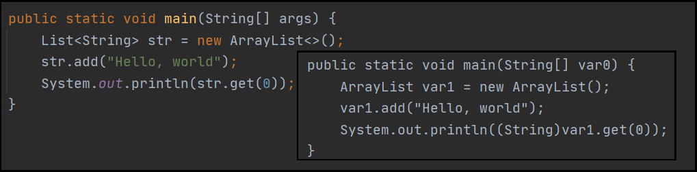
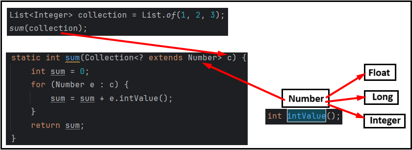

# [←](../README.md) <a id="home"></a> Java Generics

## Table of Contents:
- [Java Generics](#generics)
- [Covariance](#сovariance)
- [Wildcards](#wildcards)
- [Generic classes](#class)
- [Generic methods](#methods)

----

## [↑](#home) <a id="generics"></a> Generics
**[Generics](https://docs.oracle.com/javase/tutorial/java/generics/why.html)** is a special mechanism introduced in Java 5.0.\
It enables stronger type checking at compile time, allows reuse of the same code but with different inputs, and reduces the number of explicit casts in code.\
See **[What is a generic type?](https://www.youtube.com/watch?v=8hrwY3gflSw)**.

Before Generics, we would write it like this:
```java
List numbers = new ArrayList();
numbers.add(2);
numbers.add("2");
System.out.println((Integer) numbers.get(0) + 2);
```
The problem with this code is that it uses an explicit cast, which can lead to a runtime error.\
The zeroth element will work fine in this case, but the first element will fail.

Starting with Java 5, this type usage was called **Raw Types**.\
And now it's recommended to use qualified types that are called **Generic Types**:
```java
List<Integer> numbers = new ArrayList<Integer>();
numbers.add(2);
System.out.println(numbers.get(0) + 2);
```

In addition, the generics mechanism uses the **"[type inference](https://docs.oracle.com/javase/tutorial/java/generics/genTypeInference.html)"** mechanism, also known as Type Inference.\
Thanks to this, generics do not need to specify the type if the compiler can infer it automatically (from the passed parameters or the variable type).\
This specification is called the **"Diamond operator"**:
```java
List<Integer> numbers = new ArrayList<>();
```

Since generics didn't exist previously and compatibility with legacy code is required, type erasure (**[Type Erasure](https://docs.oracle.com/javase/tutorial/java/generics/erasure.html)**) occurs when compiling Java code to bytecode.\
This process replaces generics with types that define bounds. If such bounds are not specified, the bounds will be defined by the Object type.\
For example:



It's also worth noting that, although type erasure does occur, some information is still available at runtime in some cases.\
For example, for anonymous classes:
```java
public static void main(String[] args) {
	List<String> list = new ArrayList<String>() {};
	ParameterizedType t = (ParameterizedType) list.getClass().getGenericSuperclass();
	System.out.println("Generic:" + t.getActualTypeArguments()[0]);
}
```

Thanks to this fact, frameworks like Spring can use this information for their own purposes.\
You can read more in the articles "[Spring Framework 4.0 and Java Generics](https://spring.io/blog/2013/12/03/spring-framework-4-0-and-java-generics)", which explains that Spring uses this information to do the following:
```java
@Autowired
private Store<String> s1;
```

Generics can be specified for methods, as well as classes and interfaces.\
⚠️ Generic class can't extend **'java.lang.Throwable'**.\
The reason is that parameter will be erased and we can't distinguish different options:
```java
try {
    throw new MyException<Integer>(42);
} catch (MyException<String> e) { // How JWM should deal with it?
    ...
}
```

----

## [↑](#home) <a id="covariance"></a> Covariance and Invariance
There are two approaches to working with types: **Covariance** and **invariance**.

Types are **Invariant** if there is no inheritance relationship between them.

Initially, Java chose the **covariance** approach. This is how arrays were constructed:
```java
Number[] tst = new Integer[5];
tst[0] = 2;
System.out.println(Arrays.toString(tst));
```
Covariance means that types support inheritance.\
We can use more general type for variable declaration and more specific type for variable initialization.

The problem is that we can put any numbers to array that is integer array.\
And such problems throw exception at Runtime that is very painful.\
For example:
```java
Number[] tst = new Integer[5];
tst[0] = 2;
tst[1] = 2.2F;
``` 
Such code throws **java.lang.ArrayStoreException** because we can't put float to integer array.

Generics were designed for stricter typing.\
Genericas are **invariant** that means that they don't support inheritance.\
For example, the following line simply won't compile:
```java
List<Number> numbers = new ArrayList<Integer>();
```

The only problem is that the generics mechanism breaks when mixing generics and raw types.\
This situation is called **"[Heap Pollution](https://itsobes.ru/JavaSobes/chto-takoe-heap-pollution/)"**:
```java
List<Integer> numbers = new ArrayList<Integer>();
List rawList = numbers;
rawList.add("test");
System.out.println(numbers.get(0) + 2);
```
That's why it's not recommended to use raw types.\
This code will fail at runtime because For the compiler, the last line does not contain an error.

----

## [↑](#home) <a id="wildcards"></a> Wildcards
**[Wildcards](https://docs.oracle.com/javase/tutorial/java/generics/wildcards.html)** is a special mechanism for indicating that a type is unknown.\
According to Oracle's Java Tutorial, a wildcard is a question mark (?), which implies that an unknown type is specified where it is used.

A good explanation is given in the Oracle guide: **"[Generics: Wildcards](https://docs.oracle.com/javase/tutorial/extra/generics/wildcards.html)"**.\
As mentioned above, generics are invariant, and therefore a problem arises with the following method:
```java
static void printCollection(Collection<Object> c) {
	for (Object e : c) {
		System.out.println(e);
	}
}
```
We can accept any Collection implementation (because types are covariant).\
But we can't accept parametrization that is differ from Object, because parametrization is invariant.\
That is, you can't call the method: ``printCollection(new ArrayList<Integer>());``.

**Wildcards** allows to enable inheritance support at some extent.\
The main idea of wildcards is to say: "I don't know the type".

But you can use a wildcard and change the method signature:
```java
static void printCollection(ArrayList<?> collection) {
	Object o = collection.get(0); // Anyway it will be Object
	collection.add(2); // We can't guarantee that collection contains ints 
}
```
So, we can work with any ArrayList (or any subtypes of it) BUT **we don't know the type** that we can put inside.\
Also, we don't know what we can get out of it, that's why it's Object.

Because generics are about strict type parametrization, we can't put anything inside.\
Because in other cases we can put something that should not be inside this collection.\
And we don't have enough information to check it and to prevent it.

So, for the question "can we add something to List<?>"? the answer is: No.


We can define **[bounds](https://www.youtube.com/watch?v=zVDCSUkZA0A)** for this unknown type.

It is possible to specify an **upper bound**.\
In that case we should use the **"extends"** keyword:
```java
List<? extends Number> integers = List.of(1, 2.2F, 3);
```
It means that "we don't know the type, BUT we 100% sure that it's Number".\
Then, we are 100% sure that elements are Number and they have all methods that are available for Numbers.\
It means that we can call such methods on elements, BUT we can't put anything to the list.

```java
ArrayList<Number> arr = new ArrayList<>();
arr.add(2);
arr.add(2.3);
```
Looks similar to this code. BUT!\
Here we say "**we KNOW the type**. We are storing anything that is Number".\
That's why we can put any Number inside, because we **KNOW**/**expect** it.

The same approach can be used for methods:
```java
static int sum(Collection<? extends Number> c) {
	int sum = 0;
	for (Number e : c) {
		sum = sum + e.intValue();
	}
	return sum;
}
```



As we can see, we know that collections consists of Numbers.\
We know that whatever is lying there, it definitely has methods of Numbers.\
That's why we can use methods that are available for Number class.

It's worth remembering that by specifying extends, we lose the ability to add values:
```java
static void addZero(Collection<? extends Number> c) {
	c.add(0);
}
```
The reason is simple: we can't "polute" collection with new items without knowing their type.\
We MUST NOT put integers to collection of float numbers, etc.

It is possible to specify an **lower bound**.\
In that case we can use the **super** keyword:
```java
static void addZero(ArrayList<? super Number> c) {
	c.add(0);
	c.add(0.0);
	Object object = c.get(0);
}
```
The target type is: Number. It means that we know that we get a container where it's safe to store Numbers.
BUT we know that our method user can pass ``ArrayList<Number>`` or ``ArrayList<Object>``.\
We don't know the type. That's why we get Object.

Such rules are called **PECS**.\
**PECS** (**Producer Extends Consumer Super**) is a rule that states that if the typed object is a data source (i.e., we receive data from it),\
then **extends** is used in the generic, and if the object is a data consumer (i.e., we add data to it), then **super** is used.

----

## [↑](#home) <a id="class"></a> Generic classes
Generics can be used when defining a class:
```java
private static class Box<T> {
	private T entry;
	public Box(){}
	public Box(T entry) { this.entry = entry; }
	public void add(T obj) { this.entry = obj; }
	public T get() { return this.entry; }
}
```
For classes we should add them AFTER the class name.

Thanks to the generic, the compiler can infer the type:
```java
new Box<>("string").get().length();
```
This is possible because since we received a string in the constructor, the type will be string.

Additionally, generics in class definitions can be qualified with the **extends** keyword, for example:
```java
public static class Box<T extends Number> {
```

This will only allow us to create Box instances with types that inherit from Number:
```java
Box<Integer> t = new Box<>();
t.add(1);
```

Furthermore, generics can specify which interfaces must be implemented in addition to the primary requirement.\
For example:
```java
private static class Box <T extends Number & Comparable<T>> {
```

----

## [↑](#home) <a id="methods"></a> Generic methods
Generics can be used not only in class declarations but also in method declarations: **"[Generic Methods](https://docs.oracle.com/javase/tutorial/java/generics/methods.html)"**.

A generic is declared last in a method, but before its first use.\
Since a generic can be used as a method result, generics are declared BEFORE the return type for methods.

For example, we can specify generic for **[static method](https://www.youtube.com/watch?v=uZ8XM1dvgRA)**:
```java
public static <K extends Number> Box<K> create(K obj) {
	return new Box<K>(obj);
}
```
This method will attempt to infer K from the argument specified as the method parameter.\
However, if inference fails (for example, ``Box.create(null)``), the bound will be set to the specified bound, which in this case is Number.

To specify a type in a method, you must specify the generic BEFORE the method:
```java
Box.<Integer>create(null)
```

----