# [←](../README.md) <a id="home"></a> Design patterns

## Table of Contents:
- [Design patterns](#info)
- [Creational patterns](#create)
- [Structural Design Patterns](#struct)
- [Behavioral patterns](#behavior)
- [Architectural Patterns](#arch)
- [Microservices Patterns](#micro)

----

## [↑](#home) <a id="info"></a> Design patterns
The best source about Design patterns is: **"[refactoring.guru](https://refactoring.guru/design-patterns/java)"**.

**Design patterns** - best practices for writing code from an architectural perspective.

Because Java is still object-oriented language, we are working with objects.\
It means that we should define:
- constructors, to express objects creation (**Creational patterns**)
- class structure (**Structural patterns**)
- class behavior, i.e. methods (**Behavioral patterns**)

----

## [↑](#home) <a id="create"></a> Creational patterns
Let's start with most clear patters - Creational patterns.

The most known pattern is the **"Build pattern"** to step-by-step object build.\
Usually, we have the **"Builder"** in a class name.\
For example, **StringBuilder** or **HttpRequest builder**:
```java
public static void main(String[] args) throws Exception {
	HttpClient client = HttpClient.newHttpClient();
	URI uri = URI.create("https://jsonplaceholder.typicode.com/posts/1");
	HttpRequest request = HttpRequest.newBuilder()
			.uri(uri)
			.GET()
			.build();
	HttpResponse<String> response =
			client.send(request, HttpResponse.BodyHandlers.ofString());
	System.out.println(response.body());
}
```

Another approach is **"Factory Method"**.\
Idea is to have a method that should create a new instance.\
But the logic of this creation is implemented in the heirs.

The similar pattern is **Abstract Factory**.\
When class has several factory methods that create relative objects such class can be treated as a factory.\
Abstract factory because we have an abstract super class that defines a contract which objects should be created.

Another well known pattern: **Prototype**.\
Each Class in Java has a method: ``clone``.

And, for sure, the **Singleton** pattern:
```java
public class Singleton {

    private Singleton() {
    }

    private static class Holder {
        private static final Singleton INSTANCE = new Singleton();
    }

    public static Singleton getInstance() {
        return Holder.INSTANCE;
    }
}
```

----

## [↑](#home) <a id="struct"></a> Structural Design Patterns
Let's review a little bit Structural Design Patterns.

The most simple one is **Adapter**.\
The main purpose is adapt one interface to another.\
For example: we can adapt InputStream to Reader:
```java 
public class InputStreamReader extends Reader {

    public InputStreamReader(InputStream in) {
```
We take InputStream and adapt to Reader.

Another well-known patter is **Proxy**.\
For example, it's often used to implement lazy loading.\
Also, proxy pattern is used for dependency injection in Spring.

An interesting pattern is **Flyweight** (also known as: Cache).\
The main idea is to share common information among different objects.\
For example, it can be some common configuration.

There are some patterns that are similar to other.\
For example, the **Decorator** pattern.\
It's quite similar to the Proxy pattern. But Decorators:
- just add a behavior, without controlling the access
- can't skip the target object interaction

For example:
```java
InputStream in = new BufferedInputStream(
                    new FileInputStream("file.txt"));
```
As we can see, original input stream works "as is", but we add bufferization on top of it.

An interesting pattern is a **Bridge**.\
It can be explained and described in a different way by different authors.\
The simplest way to define it: split architecture into a separate class hierarchy.\
And then we can switch from inheritance to the object composition.

For example, Hibernate distinguish class hierarchy for dialects (how to talk with DB, like MySQL, PostgreSQL, etc) and Hibernate API.

**Composite** is a frequently used pattern in UI (like Swing).\
The idea is to compose objects into tree structures and then work with these structures as if they were individual objects.\
For example, we can put elements (like buttons, labels, etc) into container (like panels). Then we can call "draw" on a container.

And the last one the **Facade** pattern.\
The facade patterns allows us to provide simple API for complex things and to hide this complexity.\
For example:
```java 
ExecutorService executor = Executors.newFixedThreadPool(10);
```
We hide all low-level work and just use high-level API to work with tasks.

----

## [↑](#home) <a id="behavior"></a> Behavioral patterns
**Iterator** pattern is also well-known pattern because Java has **java.util.Iterator** and **java.lang.Iterable**:
```java
public static void main(String[] args) throws Exception {
	Iterator<String> iterator = List.of("1", "2", "3").iterator();
	while (iterator.hasNext()) {
		System.out.println(iterator.next());
	}
}
```

**Visitor** pattern is quite similar to the Iterator pattern.\
But the idea is that visiting logic is presented as a separate object:
```java
public static void main(String[] args) throws Exception {
	Files.walkFileTree(Paths.get("."), new SimpleFileVisitor<>(){
		@Override
		public FileVisitResult visitFile(Path file, BasicFileAttributes attrs) throws IOException {
			System.out.println(file);
			return super.visitFile(file, attrs);
		}
	});
}
```

**Observer** pattern allows us not to visit something (like events), but register ourself and wait notifications.\
For example: **"[Watching a Directory for Changes](https://docs.oracle.com/javase/tutorial/essential/io/notification.html)"**.\
Another examples: ActionListener in Swing. We can register action listeners for buttons click events.

There is a **Pub/Sub** pattern that is really similar to **Observer**.\
But the idea is to separate publishers and subscribers.\
They should not know about each other and work just with a "Broker" (that is called **mediator**).

Also, there is a separate pattern that is called **"Mediator"**.\
The main idea from the Mediator perspective to decrease coupling.\
Objects communicate with each other through the **Mediator**.

Pattern **Command** used to present command (i.e. task) logic as an object.\
For example: Runnable, Callable
```java 
ExecutorService executorService = Executors.newFixedThreadPool(3);
Runnable command = () -> System.out.println("command");
executorService.execute(command);        
```

Pattern **Strategy** is very similar to **Command**.\
But the idea is to store not the command/task, but to store the way how it should be done.\
For example, Spring has different **PasswordEncoder** implementations.\
They are using different approaches to encode and check passwords.

The **State** pattern describes the approach when we can store state as an object.\
The stored state has an influence on the code logic.\
For example, Hibernate entities can be changed (i.e. fields can be changed, child entries can be added, etc).\
This state in Hibernate is used to calculate which sql requests should be done.

The **Momento** pattern is very similar to **State**.\
But the idea is that momento is just a snapshot. It doesn't change the current behavior.\
The main idea is just we should store some state to which we can return (i.e. roll back).\
It's actively used in IDEs to implement undo/redo actions.

The **Template Method** pattern is the most powerfull pattern.\
The idea is to provide "infrastructure" and leave a space to put your logic.\
For example:
```java 
public abstract class DataProcessor {

    public final void process() {
        readData();
        processData();
    }

    protected abstract void readData();
    protected abstract void processData();
```

The **Chain of Responsibility** is used actively in Spring Security filters.\
The idea is that we have a pipeline and each step in this pipeline is performed by a separate participant.

----

## [↑](#home) <a id="arch"></a> Architectural Patterns
Architectural Patterns is a very broad category of patterns.

For example, we can single out some of them into a separate category **Application-level**:
**Layered Architecture**:\
The idea is to split system into several layers: Presentation (UI or REST), Business logic and Data access.\
More information: "[N Tier Architecture Tutorial - Software Design](https://www.youtube.com/watch?v=xJC7ItRoEbw)"

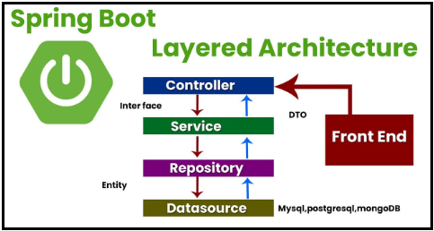

**Hexagonal Architecture**:\
The idea is to separate architecture into: input, core and output.\
We have ports and adapters to communicate with outer world.

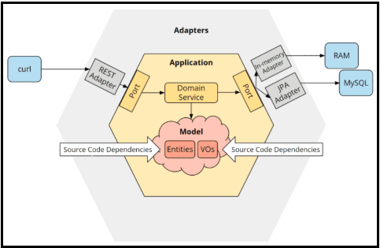

More information:
- "[Hexagonal Architecture: What You Need To Know](https://www.youtube.com/watch?v=bDWApqAUjEI)"
- "[Hexagonal Architecture in Practice, Live Coding That Will Make Your Applications More Sustainable](https://www.youtube.com/watch?v=3siPsq17NAU)"
- "[Hexagonal Architecture with Spring Boot — Clean, Testable Java Apps with Ports & Adapters](https://www.youtube.com/watch?v=FggktSHhXdw)"

**Clean Architecture**:\
[Clean Architecture vs Domain-Driven Design (DDD) - Understand the Difference](https://www.youtube.com/watch?v=eUW2CYAT1Nk)

**CQRS (Command Query Responsibility Segregation)**:\
The idea is to split read and write actions.

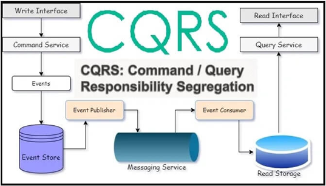

More information:
- [CQRS Meets Modern Java | Simon Martinelli](https://www.youtube.com/watch?v=g4V-F60LZ4Y)
- [Event Sourcing 101: Command Query Responsibility Segregation (CQRS)](https://www.youtube.com/watch?v=lg6aF5PP4Tc)

**Event-Driven**:\
The idea is to communicate with events between different participants: 

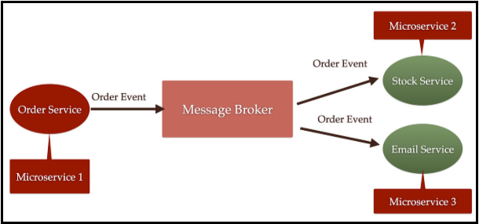

**Event Sourcing**:\

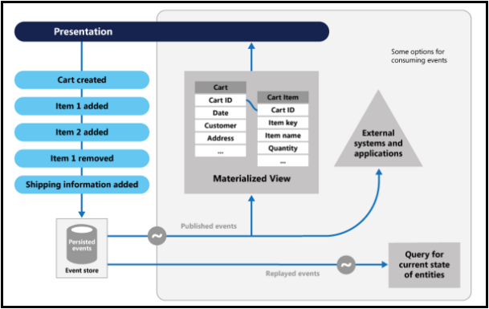

**Vertical Slice Architecture**:\
The idea is to minimize dependencies noise and split separate use cases as separate elements.\
It's a little bit similar to **package per feature** (as an alternative to **package per layer** from Layered Architecture).\
But the main difference is original intention. But it's a little bit holywar topic =)\
In theory methods and classes should be well-readable, self-doccumented and clear, without additional comments.\
The amount of lines of code will be decreased to decrease the cognitive load and improve maintainability.

According to "Clean code" idea of R. C. Martin:
- It reads like well-written prose (names should immediately communicate intent)
- It has clear, intention-revealing names (should answer “what is this for?” rather than “how does this work?”)
- Functions are small and do one thing
- It avoids duplication (DRY principle)
- It has minimal surprise (low cognitive load)
- It is easy to change
- It is well-tested (small, decoupled, and predictable components)
- It has minimal complexity
- It follows the Single Responsibility Principle (SRP)

----

## [↑](#home) <a id="micro"></a> Microservices Patterns
Historically, applications have been developed as a monolith:

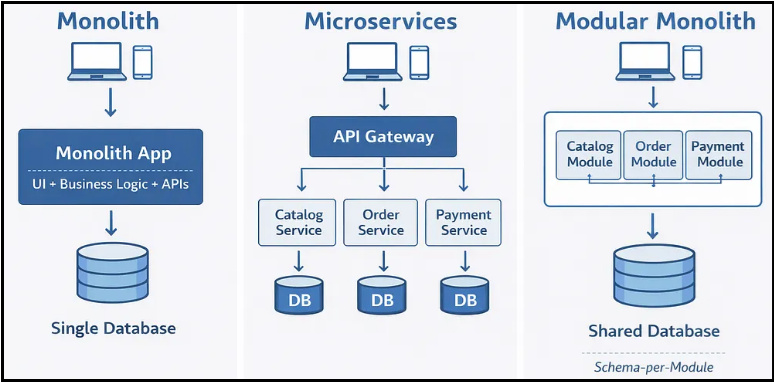

But in the modern time it's difficult to maintain it and scale for big and distributed systems.

It's easy to communicate inside the same application.\
But how to deal with it when we have separate services?\
The **Microservices Communication patterns** take the stage.

So, microservices can communicate with each other directly:

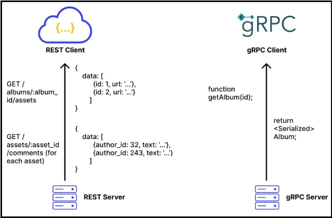

In that case we have two diffent approaches: via REST or via gRPC.\
RPC means [Remote Procedure Call](https://www.wallarm.com/what/what-is-remote-procedure-call-by-wallarm).

The main difference between RPC and REST is that rpc fundamentally based on methods (like getUser), but REST based on resources (/users/1).\
In the modern time this border is not always so clear.\
For example, REST also can use contracts (via OpenAPI and Swagger) and can be used through autogenerated clients like Spring Feign clients.

That's why it's more about technical details.\
For example, REST usually works with JSON data, gRPC uses binary format.\
Also, gRPC is a contract first approach anyway. For REST it's not a mandatory feature.

Services can communicate through a mediator that is called **Message Broker**.\
There is two main approaches:
- queue-based brokers (like RabbitMQ)
- event streaming brokers (like Kafka)

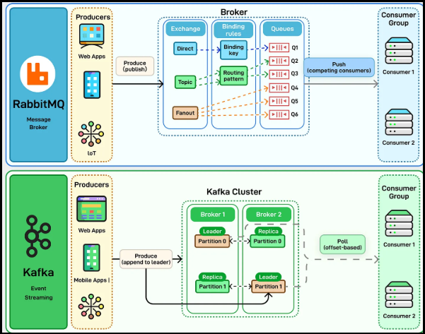

Queue based brokers usually used for **Point-to-Point** (Queue) communicatio patterns.\
Main idea: one message to one handler.

Event streaming brokers usually used for **Event-Driven Architecture**.\
Messenger doesn't know about reciever/recievers and just sends messages to the broker.\
Messages will not be deleted at the consume(i.e. recieve) time.\

The **Event Sourcing** approach is othen used with event streaming brokers.\
The idea is to store steps/stages, not the final result.\
But some snapshot state can be created based on the event sourcing data.

When we are talking about brokers the **Saga** pattern should be considerred.\
Saga pattern describe two main ideas: **Choreography** and **Orchestration**.

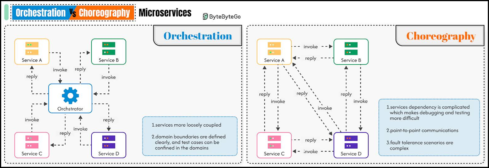

Also, a few words about REST communication.\
So, REST is a way to communicate. The idea is that there are different ways to communicate and to work with Resources.\
Resource is a thing that is mapped to the current REST request.

For example:

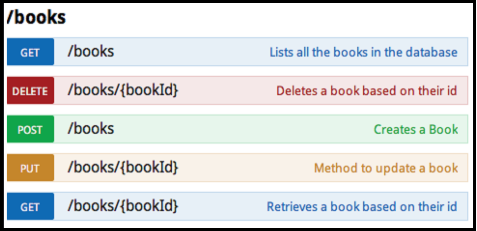

The idea of methods is simple: you can ``get``, ``delete``, ``post`` (like post a message) or ``put`` (like put instead of resource).\
There are two similar methods: ``put`` and ``patch``.\
But ``put`` replaces the whole object, ``patch`` replaces ONLY mentioned fields.

More about microservices communication patterns:
- [Distributed Transactions Explained: 2 Phase Commit vs Saga Pattern](https://www.youtube.com/watch?v=DOFflggE_0Q)
- [Kafka vs RabbitMQ](https://www.youtube.com/watch?v=1HOVtQ-_fcE)
- [hello_interview: basics](https://www.youtube.com/watch?v=1HOVtQ-_fcE&list=PL5q3E8eRUieVFeK1oLahJ8KONkAxDpqk2&pp=0gcJCeECOCosWNin)

Also, it's useful to know about the Domain-Driven Design principles.\
Read the **[A Crash Course on Domain-Driven Design](https://blog.bytebytego.com/p/a-crash-course-on-domain-driven-design)**.

The idea of **Bounded context** is very useful for microservices architecture creation:

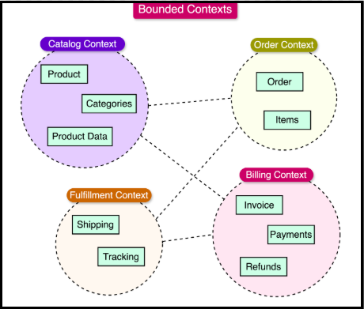

----
