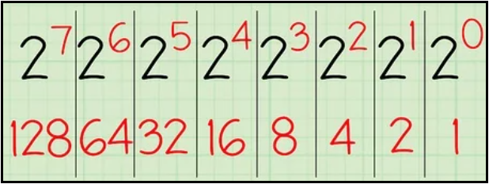

# [←](../README.md) <a id="home"></a> Data Types

## Table of Contents:
- [Primitive Types](#primitives)
- [Object Types](#objects)
    - [Equals & HashCode](#equalsAndHash)
    - [Integer Pool](#integer)
    - [Strings](#string)
- [Arrays](#arrays)

----

## [↑](#home) <a id="primitives"></a> Primitive Types
Java является строго типизированным языком программирования. Это значит, что каждая переменная обладает типом, каждое выражение имеет тип, и каждый тип строго определен. Одной из категорий типов данных в Java являются **"[Primitives Data Type](https://docs.oracle.com/javase/tutorial/java/nutsandbolts/datatypes.html)"**.

Основной примитивный тип данных - **int** (от слова integer, т.е. целочисленный).\
Есть более длинные числа (**long**) и более короткие числа (**short**). Меньше них только **byte**.

Прежде чем говорить про примитивы стоит вспомнить, что единицей информации является 1 бит, который имеет значение ноль или один. Биты объединяются в байты, где 1 байт = 8 бит. Так уж исторически сложилось. Есть разные варианты, почему именно 8. Но стоит отметить, что из-за двоичной системы кодирования в компьютерах наиболее выгодными для аппаратной реализации и удобными для обработки данных являются объёмы данных, кратные степеням двойки, в том числе и 1 байт = 8 бит. По этой причине минимальный объём информации, который имеет адрес в памяти, является байт.

Максимальное число, которое можно выразить при помощи байта - 255:



Таким образом:
- **byte** имеет значения от -2 в седьмой степени до 2 в седьмой степени минус 1 (из-за потери одного бита на знак числа). То есть от -128 до (128-1)
- **short** больше байта в 2 раза, т.е. 8x2=16 бит. Таким образом диапазон от -2^15 до 2^15-1.
- **int** больше short в 2 раза, т.е. 16x2=32. Таким образом диапазон от -2^31 до 2^31-1.
- **long** больше int в 2 раза, т.е. 32x2=64. Таким образом диапазон от -2^63 до 2^63-1.

Говоря про типы данных стоит помнить про преобразования расширения (**widening**) и сужения (**narrowing**).\
Сужение типа происходит при касте более "вместительного" типа к менее "вместительному".\
Расширение типа чуть сложнее. Java, выполняя операторы, такие как сложение, расширяет типы до наибольшего из используемых. Интересно, что типы byte и short расширяются до int, кроме случаев, если результат вычисления может быть известен на момент компиляции (статические переменные или литералы).

Помимо целых чисел есть два типа для представления дробных чисел, они же числа с плавающей точкой: float (аналог int) и double (аналог long).\
Однако, с ними есть важный нюанс:
```java
public static void main(String[] args) {
    System.out.println(0.3+0.6); // == 0.8999999999999999
}
```
Проблема в том, как числа с плавающей точкой хранятся. Из-за этого при вычислениях появляется погрешность.\
Чтобы избежать этого стоит использовать [BigDecimal](https://docs.oracle.com/en/java/javase/11/docs/api/java.base/java/math/BigDecimal.html):
```java
BigDecimal.valueOf(0.3).add(BigDecimal.valueOf(0.6)).floatValue());
```

Кроме того, в Java есть логический тип **boolean**, который принимает значения true или false.\
Особенность данного типа данных в том, что занимаемый объём памяти зависит от реализации JVM. Например, boolean может занимать столько же, сколько и int, хотя при этом boolean по сути представляет либо 1, либо 0. По этой причине рекомендуют использовать [BitSet](https://www.baeldung.com/java-bitset) при использовании коллекции boolean значений.

К boolean типам применимы логические операторы, такие как & и |, а так же их короткие формы && и ||.\
boolean выражения проверяются на истинность (на true). Следовательно, в выражении a && b часть b не будет выполнена, если a будет false. А в выражении a || b часть b не будет выполнена, если часть a будет true. Кроме того, boolean типы могут быть использованы в [тернарных операторах](https://docs.oracle.com/javase/tutorial/java/nutsandbolts/op2.html).

И последний восьмой (прямо как битов) примитивный тип - **char**. В Java для char используется кодировка Unicode (UTF-16) и для хранения Unicode-символов используется 16 бит или 2 байта. Диапазон допустимых значений - от 0 до 65536 (отрицательных значений не существует). То есть char - это как short, только без отрицательных значений. Кроме того, хоть char и представлен числом, но обрабатывается иначе. Например, данный код отобразит символ, а не его числовое значение:
```java
public static void main(String[] args) {
    char f = 9885;
    System.out.println(f);
}
```


## [↑](#home) <a id="objects"></a> Object Types
Кроме примитивных типов есть другая категория типов: **[Objects](https://docs.oracle.com/javase/tutorial/java/concepts/object.html)**.

Объектные типы определяются их классом.\
Объекты могут быть созданы при помощи ключевого слова **new** или при помощи **"[Java Reflection API](https://docs.oracle.com/javase/tutorial/reflect/member/ctorInstance.html)"**.

Каждый объект имеет свой заголовок (header). Заголовок состоит из **mark word** и **klass word**.

Кроме этого, у каждого класса есть особые методы - **конструкторы**. Конструкторы вызываются при создании экземпляра класса. Какой конструктор вызвать зависит от того, какие параметры будут переданы при создании экземпляра.

Если конструкторы не определены, тогда при компиляции будет добавлен конструктор по умолчанию (default constructor). Конструктор по умолчанию не имеет параметров. Если же конструкторы определены, то default конструктор больше не будет добавлен.

Каждый класс в Java неявным образом наследуется от **java.lang.Object**. Это означает, что все объектные типы имеют некоторое общее поведение.\
К общему поведению можно отнести реализацию контрактра **equals and hashcode**, формирование текстового представления через **toString**, а так же клонирование объекта при помощи **clone**.


### [↑](#home) <a id="equalsAndHash"></a> Equals & HashCode
По умолчанию, метод **Equals**, сравнивающий два объекта, реализован через сравнение ссылок:
```java 
public boolean equals(Object obj) {
    return (this == obj);
}
```

Рекомендуется переопределять метод с учётом ключевых для сравнения полей. Например:
```java
@Override
public boolean equals(Object o) {
    if (this == o) return true;
    if (o == null || getClass() != o.getClass()) return false;
    if (!super.equals(o)) return false;
    Clazz t2 = (Clazz) o;
    return name.equals(t2.name);
}
```

Метод Equals является частью контракта между Equals и HashCode. Поэтому их рекомендуют переопределять одновременно.

Метод **hashCode** возвращает хэш-код (т.е. числовое представление) объекта, ограниченное размером **int**. По умолчанию метод hashCode реализован на стороне виртуальной машины, поэтому вычисление является JVM специфичным. Однако, если метод переопределён, то за вычисление hashCode отвечает разработчик. Это значит, что он должен следовать следующим правилам:
- hashCode для одного и того же объекта должен возвращать одинаковое значение
- Если объекты равны через equals, то должны быть равны и их hashCode.
- Если у объектов равны hashCode, то их equals не обязательно должны быть равны

Даже если у объекта переопределён hashCode можно до сих пор получить его оригинальный hashCode при помощи метода **System.identityHashCode**.


### [↑](#home) <a id="integer"></a> Integer Pools
При написании кода самыми часто используемыми типами являются строки (класс String) и целые числа (класс Integer).\
В Java для этих типов предусмотрено особое поведение.

Тип Integer содержит внутри себя **IntegerCache**, который согласно требованиям JLS (Java Language Specification) содержит числа от -128 to 127. Верхняя граница может быть изменена при помощи ключа JVM. Вот почему сравнение по ссылке использовать опасно:
```java
public static void main(String[] args) {
    Integer a = 127;
    Integer b = 127;
    // Если 127 изменить на 128, то будет false
    System.out.println(a == b);
}
```


### [↑](#home) <a id="string"></a> Strings
Аналогично подходу с Integer'ами, строки в Java хранятся в так называемом **String Pool**.

В String Pool попадают те строки, которые объявленны при помощи литералов. Если необходимо строку добавить в пул строк, то необходимо использовать метод **String#intern**.

Кроме того, String - это неизменяемый объект (**Immutable Object**), который хранит своё содержимое в массиве типа **char**. Любое изменение, такое как конкатенация, приводит к созданию нового объекта. По этой причине созданную строку нельзя очистить до того, как JVM решит удалить её из памяти.

Интересно, что иногда советуют использовать массивы **char**, вместо string, для хранения паролей. Однако, в основе всего лижет JDBC API, который на текущий момент времени использует String для передачи пароля, а значит большая часть доводов про безопасность преувеличена.

Конкатенация же строк выполняется через оператор "+". Конкатенация "под капотом" выполняется при помощи **StringBuilder**'а.\
Начиная с JDK 9 конкатенация выполняется через вызов **StringConcatFactory**, которая с некоторыми оптимизациями всё равно задействует создании и использование **StringBuilder**, что при конкатенации в цикле приводит к повышенным накладным расходам.

Кроме того, используется **StringBuffer**, который когда-то был создан для простой потокобезопасности, т.к. методы изменения строки синхронизированы. Однако, такой подход сказывается на производительности.


## [↑](#home) <a id="arrays"></a> Arrays
Массивы - особый объектный тип в Java. Например:
```java
int[] test = new int[] {2, 3, 4};
test.toString();
```

У каждого массива есть поле **length**, из которого можно получить его длину:
```java
System.out.println(new int[] {2, 3, 4}.length);
```

Массивы в Java могут быть многомерными:
```java
int[][] test = new int[1][];
test[0] = new int[5];
System.out.println(test[0][1]);
```
По своей сути многомерный массив - это просто одномерные массивы, состоящие из других одномерных массивов. Именно по этой причине требуется указание лишь одного размера (см. пример выше).