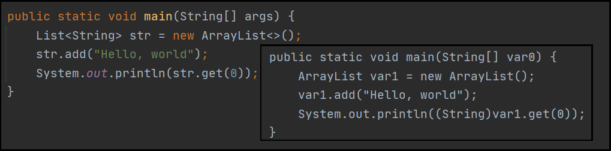

# [←](./readme.md) <a id="home"></a> Java Generics

## Table of Contents:
- [Java Generics](#generics)
- [Covariance](#сovariance)
- [Wildcards](#wildcards)
- [Generic classes](#class)
- [Generic methods](#methods)
- [Resources](#resources)

----

## [↑](#home) <a id="generics"></a> Generics
**[Generics](https://docs.oracle.com/javase/tutorial/java/generics/why.html)** - это специальный механизм, появившийся на чиная с Java 5.0, который позволяет достичь более сильной проверки типов (**Stronger type checks**) на этапе компиляции, позволяет переиспользовать один и тот же код, но с разными входными данными, а так же позволяет уменьшить количество явных кастов в коде.

До Generics мы бы писали так:
```java
List numbers = new ArrayList();
numbers.add(2);
numbers.add("2");
System.out.println((Integer) numbers.get(0) + 2);
```       
Проблема данного кода в том, что в нём используется явный cast, который может привести к ошибке уже во время выполнения. Нулевой элемент в данном случае отработает без проблем, а вот первый элемент упадёт с ошибкой.

Начиная с Java 5 такое употребление типов назвали **Raw Types**, а типы с уточнением - **Generic Types**:
```java
List<Integer> numbers = new ArrayList<Integer>();
numbers.add(2);
System.out.println(numbers.get(0) + 2);
```

Кроме этого, механизм дженериков использует механизм **"[выведения типов](https://docs.oracle.com/javase/tutorial/java/generics/genTypeInference.html)"**, оно же Type Inference. Благодаря этому в дженериках можно не указывать тип, если его компилятор сможет определить сам (по переданным параметрам или по типу переменной). Такое указание называется **"Diamond operator"**:
```java
List<Integer> numbers = new ArrayList<>();
```

Так как раньше дженериков не было и нужна совместимость со старым кодом, то при компиляции java кода в байт-код происходит стирание типов (**[Type Erasure](https://docs.oracle.com/javase/tutorial/java/generics/erasure.html)**), при котором дженерики заменяются типами, которые задают границы. В случае, если такие границы не указаны, то границы будут заданы типом Object.\
Например:



Но стоит так же отметить, что на самом деле стирание типов хоть и происходит, но всё же некоторая информация в некоторых случаях доступна и в runtime. Например, для анонимных классов:
```java
public static void main(String[] args) {
    List<String> list = new ArrayList<String>() {};
    ParameterizedType t = (ParameterizedType) list.getClass().getGenericSuperclass();
    System.out.println("Generic:" + t.getActualTypeArguments()[0]);
}
```
Благодаря этому факту, такие фрэймворки как Spring могут использовать эту информацию для своих целей. Подробнее можно прочитать в статей "[Spring Framework 4.0 and Java Generics](https://spring.io/blog/2013/12/03/spring-framework-4-0-and-java-generics)", где рассказывается, что Spring благодаря этой информации умеет делать так:
```java
@Autowired
private Store<String> s1;
```

Дженерики могут быть указаны для методов, а так же классов и интерфейсов.


## [↑](#home) <a id="covariance"></a> Ковариантность и инвариантность
К работе с типами есть два подхода: **Ковариантность** и **инвариантность**.

Изначально в Java выбрали вариант с ковариантностью. Так были построены массивы:
```java
String[] strings = new String[2];
Object[] objects = strings;
objects[0] = 12;
```
Строчка 2 не содержит ошибок, т.к. тип Object является родительским для String. С точки зрения компилятора строчка 3 корректна, т.к. массив objects принимает любые объекты, то туда можно положить и Integer. Однако в реальности массив у нас должен содержать строки. В итоге на строчке 3 всё упадёт с ошибкой **java.lang.ArrayStoreException**. Что самое страшное, что эта ошибка не будет отловлена на моменте компиляции, а произойдёт уже где-то и когда-то в работающем приложении.

Так как дженерики были разработаны для более строгой типизации, то дженерики инварианты. Это означает, что дженерики не сохраняют иерархию. Например, следующая строчка просто не скомпилируется:
```java
List<Number> numbers = new ArrayList<Integer>();
```

Единственное, механизм дженериков ломается при смешивании дженериков и raw types. Такую ситуацию называют **"[Heap Pollution](https://itsobes.ru/JavaSobes/chto-takoe-heap-pollution/)"**:
```java
List<Integer> numbers = new ArrayList<Integer>();
List rawList = numbers;
rawList.add("test");
System.out.println(numbers.get(0) + 2);
```
Данный код упадёт с ошибкой во время выполнения, т.к. для компилятора последня строчка не содержит ошибки.


## [↑](#home) <a id="wildcards"></a> Wildcards
**[Wildcards](https://docs.oracle.com/javase/tutorial/java/generics/wildcards.html)** - это специальный механизм, позволяющий указать, что тип неизвестен. Согласно Java Tutorial от Oracle, wildcard'ом называется question mark (?), который подразумевает, что в месте его использование указан неизвестный тип.

Хорошее объяснение даётся в guide от Oracle: **"[Generics: Wildcards](https://docs.oracle.com/javase/tutorial/extra/generics/wildcards.html)"**. Как выше было сказано, дженерики инварианты, а следовательно возникнет проблема с таким методом:
```java
static void printCollection(Collection<Object> c) {
    for (Object e : c) {
        System.out.println(e);
    }
}
```
То есть нельзя вызвать метод: ``printCollection(new ArrayList<Integer>());``\
Но можно использовать wildcard и изменить сигнатуру метода:
```java
static void printCollection(Collection<?> c) {
```

Кроме того, есть возможность указать верхнюю границу:
```java
static int sum(Collection<? extends Number> c) {
    int sum = 0;
    for (Number e : c) {
        sum = sum + e.intValue();
    }
    return sum;
}
```

Стоит помнить, что указав extends мы теряем возможность добавлять значения:
```java
static void addZero(Collection<? extends Number> c) {
    c.add(0);
}
``` 
Как можно догадаться, нет никакой гарантии, коллекция каких Number нами получена. Следовательно, мы не можем ничего добавить, чтобы в какие-нибудь Double не добавить Integer.

Если wildcard используется в определении потребителя (т.е. куда мы хотим добавить значение), то нужно использовать ``<? super Number>``:
```java
static void addZero(Collection<? super Number> c) {
    c.add(0);
    c.add(0.0);
}
```

Таким образом, при использовании wildcard'ов следует помнить про **PECS**.
**PECS** (**Producer Extends Consumer Super**) - это правило, которое гласит, что если типизируемый объект является источником данных (т.е. мы получаем из него данные), тогда в дженерике используется **extends**, а если объект является получателем данных (т.е. мы добавляем в него данные) - используется **super**.

Правило **PECS** удобно рассмотреть на примере:
```java
public void addFirst(List<? extends T> source) {
	this.entry = source.get(0);
}
```
В данном случае **source** выступает в роли producer, а следовательно должен указывать **extends**. Если указать здесь **super**, то это приведёт к ошибке компиляции.

Тема Wildcard в дженериках отлично раскрыта в лекции от **"[Тагир Валеев - Generics](https://www.youtube.com/watch?v=usiKCn7SwxI&t=2234s)"**.


## [↑](#home) <a id="class"></a> Generic classes
Дженерики могут быть использованы при описании класса:
```java
private static class Box<T> {
    private T entry;
    public Box(){}
    public Box(T entry) { this.entry = entry; }
    public void add(T obj) { this.entry = obj; }
    public T get() { return this.entry; }
}
```

Благодаря дженерику компилятор сможет сам вывести тип:
```java
new Box<>("string").get().length();
```
Это возможно благодаря тому, что раз в конструктор мы получили string, значит и тип будет string.

Кроме того, дженерики в описании класса могут быть уточнены при помощи слова **extends**, например:
```java
public static class Box<T extends Number> {
```
При этом мы сможем создавать экземпляры Box только с типами, которые наследуются от Number:
```java
Box<Integer> t = new Box<>();
t.add(1);
```

Кроме этого, в дженерике можно указать, какие интерфейсы должны быть реализованы дополнительно к основному требованию. Например:
```java
private static class Box <T extends Number & Comparable<T>> {
```


## [↑](#home) <a id="methods"></a> Generic methods
Дженерики могут быть использованы не только в объявлении классов, но и в объявлении методов ([Generic Methods](https://docs.oracle.com/javase/tutorial/java/generics/methods.html)).

Дженерик в методе указывается в самый последний момент, но до его первого использования. Так как дженерик может использоваться как результат метода, то для методов дженерики указываются **ПЕРЕД** возвращаемым типом.

Например:
```java
public static <K extends Number> Box<K> create(K obj) {
    return new Box<K>(obj);
}
```
Такой метод будет пытаться вывести K из того аргумента, который будет указан в качестве параметра метода. Но если вывести не получится (например, ``Box.create(null)``), то граница будет приведена к указанной границе. Т.е. в данном случае к Number.

Чтобы в методе уточнить тип необходимо указывать дженерик ПЕРЕД методом:
```java
Box.<Integer>create(null)
```


## [↑](#home) <a id="resources"></a> Resources
Дополнительные материалы на тему дженериков:
- [Тагир Валеев - Generics](https://www.youtube.com/watch?v=usiKCn7SwxI&t=2234s).
- [Александр Маторин — Неочевидные Дженерики](https://www.youtube.com/watch?v=_0c9Fd9FacU)
- [Юрий Ткач - Generics](https://www.youtube.com/watch?v=MniNZsyjH9E&list=PL6jg6AGdCNaX1yIJpX4sgALBTmTVc_uOJ)
- [Пришел, увидел, обобщил: погружаемся в Java Generics](https://habr.com/ru/company/sberbank/blog/416413/)