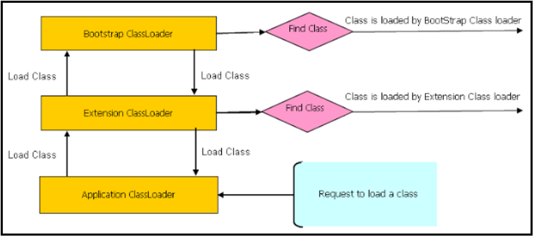

# [←](../README.md) <a id="home"></a> Class Loaders

## Table of Content:
- [Class Loaders](#loaders)
- [Class Loading](#loading)
- [Linking](#linking)
- [Initialization](#initialization)

----

## [↑](#home) <a id="loaders"></a> Class Loaders
Ранее, в теме про **[JVM, Bytecode и JIT](../jvm.md)** мы сказали, что Java код - это просто текст в файлах с расширением **.java**.\
Чтобы этот код выполнить его необходимо скомпилировать в промежуточный формат, который называется **байт-кодом**. Байт-код хранится в файлах с расширением **.class**.

Виртуальная машина Java (JVM) - это среда выполнения, ей надо как-то загрузить внутрь себя class файлы. И для этих целей используются загрузчики классов, они же **Class Loader'ы**. Кроме этого загрузчик классов отвечает за поиск ресурсов (таки данных, как изображения или конфигурационные файлы). Чтобы отработала минимальная программа на языке Java нужно выполнить начальную загрузку (в переводе на английский - **bootstrap**) основных классов. Для этого используется Bootstrap Class Loader.

**Bootstrap Class Loader** - это начальный, стартовый загрузчик. Он реализован на стороне JVM и к нему нет доступа из среды исполнения, т.е. из кода. Поэтому если класс возвращает в качестве загрузчика null - значит он загружен системным classloader'ом. Кроме того, загрузкичик классов сами по себе являются экземплярами **java.lang.ClassLoader**, следовательно их самих кто-то должен загрузить. Этот кто-то - Bootstrap Class Loader.

Таким образом Bootstrap Class Loader загружает другие загрузчики, а так же базовые классы, критичные для выполнения Java программы. До Java 9 данным загрузчиком загружались классы из $JAVA_HOME/lib. Начиная с Java 9 загрузка классов притерпела изменения и теперь этот загрузчик загружает только критичные для исполнения Java программы классы, такие как пакет **[java.base](https://docs.oracle.com/en/java/javase/15/docs/api/java.base/module-summary.htmlх)**.

Как только есть Bootstrap Class Loader могут быть загружены и другие загрузчики классов. В Java есть свои "встроенные" загрузчики классов, но программы могут создавать и собственные загрузчики. Например, веб-сервера часто добавляют свои загрузчики классов.


**Extension Classloader** - это загрузчик расширений. До Java 9 этот загрузчик подгружал классы из **$JAVA_HOME/lib/ext**. Это место предполагалось для своего рода расширений, которые должны были быть видимы для всех Java программ, выполняемых на одной и той же JVM (см **"[Lesson: Creating and Using Extensions](https://docs.oracle.com/javase/tutorial/ext/basics/install.html)"**). Начиная с Java 9 данный загрузчик переименован в **Platform class loader** и загружает он модули и пакеты, которые не являются базовыми (т.е. которые загрузил не Bootstrap class loader). Например, к таким пакетам можно отнести **[JDBC API (java.sql)](https://docs.oracle.com/en/java/javase/15/docs/api/java.sql/module-summary.html)**.

**System Class Loader** (он же **Application Class Loader**) - загрузчик классов, который загружает классы запускаемого приложения (поэтому он и Application class loader). Некоторые JDK специфичные классы утилит тоже грузятся этим загрузчиком. Например: jdk.jconsole, jdk.jshell.

Кроме этих загрузчиков, как было выше сказано, может быть и любые другие, созданные непосредственно Java приложением.


## [↑](#home) <a id="loading"></a> Class Loading
Загрузчики классов на самом деле образуют иерархию. Во главе иерархии стоит Bootstrap загрузчик:



Кроме того, у каждого загрузчика есть свой "кэш" загруженных классов. Таким образом при загрузке класса сначала каждый загрузчик смотрит в свой кэш (не загрузил ли он уже этот класс). Если нет, то далее каждый загрузчик классов смотрит, а есть ли у него родитель. Если родитель есть - делегирует loadClass родителю. Если класс не найден или если родителя нет - выполняется findClass самим загрузчиком. Если класс самому найти не удалось - возвращается null.

Если никто не смог найти класс - получаем **java.lang.ClassNotFoundException** (класс не найден).\
Если класс найден - создаётся его runtime представление в области памяти, называемой **metaspace**.

Но загрузка байткода из источника это только пол дела. Далее предстоит линковка.


## [↑](#home) <a id="linking"></a> Linking
Связывание - второй этап загрузки классов. Оно состоит из нескольких этапов:
- **Верификация (Verification)**
- **Подготовка (Preparation)**
- **Разрешение (Resolution)**

Данный процесс описан в спецификации JVM: **"[Java Virtual Machine Specification : Chapter 5. Loading, Linking, and Initializing](https://docs.oracle.com/javase/specs/jvms/se8/html/jvms-5.html#jvms-5.4)"**.

Верификация - это процесс, при котором проверяется байт-код. Проверяется как общая корректность (не пуст, нет "дыр" между инструкциями), так и структура (корректность типов, правильность размера стэка при выполнении каждой инструкции). Верификация использует потоковый анализатор кода, благодаря которому такого типа проверки возможны без непосредственного выполнения кода.\
Более подробно см. доклад **"[Никита Липский — Верификация Java байт-кода](https://youtu.be/m16AIz1fIFI?t=640)"**.

Подготовка - это процесс создания статических полей и инициализация этих полей значениями по умолчанию. Так как значения по умолчанию известны и без запуска. Например, статические Object поля по умолчанию null, а статические boolean поля по умолчанию false. Не стоет путать подготовку с инициализацией, о которой будет рассказано далее.

Разрешение - это процесс, при котором символьные ссылки разрешаются в конкретные  значения.


## [↑](#home) <a id="initialization"></a> Initialization
Инициализация - финальная стадия загрузки классов. Во время финальной стадии выполняются статические инициализаторы и получение значений для статических полей.

Это означает, что очень важно, чтобы статика не падала с исключениями, иначе мы рискуем не загрузить класс вовсе.
Простой пример:
```java
public class Main {
    public static class Inner {
        static int inner = 2 / 0;
    }

    public static void main(String[] args) {
        try { new Inner(); } catch (Throwable e) { /* skip */ }
        new Inner();
    }
}
```
В результате мы получим **java.lang.NoClassDefFoundError**. Казалось бы байт-код класса загружен, линковка выполнена, но вот инициализаци класса не завершена.


## [↑](#home) <a id="resources"></a> Resources
Есть много интересных докладов на тему загрузки классов:
- [Антон Архипов — Загрузчики классов в Java: коллекция граблей](https://www.youtube.com/watch?v=RHVzgXff9jg)
- [Никита Липский — Верификация Java байт-кода](https://www.youtube.com/watch?v=m16AIz1fIFI)
- [Антон Архипов — От HotSwap до Java-агентов: горячая замена классов](https://www.youtube.com/watch?v=wJwCjXcCH90)
- [Jar Hell Made Easy - Demystifying the Classpath](https://dzone.com/articles/jar-hell-made-easy)
- [When should I use Thread.getContextClassLoader()](https://www.infoworld.com/article/2077344/find-a-way-out-of-the-classloader-maze.html)