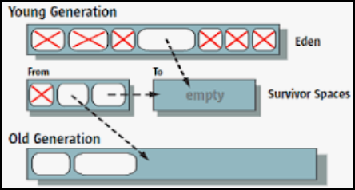

# [←](../README.md) <a id="home"></a> Garbage Collection

## Table of Content:
- [Java Memory](#memory)
- [Java object references](#ref)
- [java.lang.ref.Reference](#langref)
- [Garbage collections](#garbage)
- [Serial And Parallel GC](#serialgc)
- [G1 Garbage Collector](#g1)
- [Finalize](#finalize)
- [JVM monitoring](#monitoring)

---------

## [↑](#home) <a id="memory"></a> Java Memory
When considering garbage collection in Java, it's worth remembering the structure of Java memory.

In general, the whole JVM memory can be divided into several parts:
- Stack
- Heap
- Off-Heap

In terms of garbage collection mechanism there can be defined:
- **GC managed spaces**\
Heap (to store instances), Metaspace (to store classes and metadata, it was PermGen before Java 8)
- **Native Memory**\
ByteBuffers, NIO, JNI
- **Other**\
Codecache (JIT compiled code), Internal JVM allocations (thread stacks, loaded libraries, memory for GC

For more information: **"[Mastering JVM Memory Troubleshooting - From OutOfMemoryErrors to Leaks](https://www.youtube.com/watch?v=kwFP-zCLV2M)"**

The [Heap memory](https://www.youtube.com/watch?v=BcVKKXx8KT0) the most interisting one because it's used to store objects.\
The heap memory is splitted (logically) by generations: **Young Generation** and **Old Generation** (**tenured**, i.e. permanent).\
**Young Generation** consists (logically) of: **Eden** (new objects) and **Survivor** (survived garbage collection).

A few words about the [Off-heap memory](https://www.youtube.com/watch?v=sJlXbQvgU-4).\
The **[Bytebuffer API](https://www.youtube.com/watch?v=NKPNxhatAVk)** (old) or Memory API (preferrable) to get an access to it.

Modern Memory API uses [Memory Segments](https://www.youtube.com/watch?v=u3PTqVdijvg) and [Arenas](https://www.youtube.com/watch?v=sHu3sv5dj3k).\
For more information please check: **"[Memory API - JEP Cafe #25](https://www.youtube.com/watch?v=lVORyDhQzf8)"**.

A few words about the **Metaspace**:\
Metaspace is an area of ​​JVM memory that stores metainformation or metadata: loaded classes, method bytecode, static fields, and methods.\
Before Java 8, this memory area was called PermGen (Permanent Generation).\
The main difference between Metaspace and PermGen is that Metaspace's size dynamically changes based on demand.\
Additionally, there may be a special area called "Compressed Class Space".

**Stack memory:**\
Stack is the memory area that allocates space for thread stacks, and also stores local variables and lightweight monitors.\
You can read more about this in the article: **"[Stack Overflow Handling in HotSpot JVM](https://pangin.pro/posts/stack-overflow-handling)"**.

**Codecache:**\
Codecache is an area of ​​JVM memory that contains code compiled by the JIT compiler (so-called hot spots).\
You can read more here: **"[15 Codecache Tuning](https://docs.oracle.com/javase/8/embedded/develop-apps-platforms/codecache.htm)"**.\
You may sometimes find information that codecache is part of Metaspace, but this is not true.\
This is confirmed by the training slides on the Oracle website: **"[HotSpot JVM Memory Management](https://www.oracle.com/webfolder/technetwork/tutorials/mooc/JVM_Troubleshooting/week1/lesson1.pdf)"**.
Also, the "Active Memory Pools" section in the official Java Mission Control utility can be used.

There are also other areas, such as Symbols or Internal/Other. Symbols contain method signatures, variable names, and strings (the very same **"[string pool](https://docs.oracle.com/en/java/javase/15/docs/api/java.base/java/lang/String.html#intern())"**). Internal allocates memory for the JVM and for **[Direct Byte Buffer](https://www.youtube.com/watch?v=0y6_RDga-fk)** memory.

The Garbage Collector primarily works with the **Heap** memory area, but the GC can sometimes "collect garbage" outside the Heap.\
For example: **[How Java GC Does Direct Byte Buffer Clean Up](https://stackoverflow.com/questions/40122063/how-java-gc-does-direct-byte-buffer-clean-up-because-ibm-docs-says-it-does)**.

---------

## [↑](#home) <a id="ref"></a> Java object references
To understand how Garbage collection works we need to understand object references.

For example:
```java
MyClass obj = new MyClass();
```
The MyClass instance is stored in the Heap memory.\
But ``obj`` is a reference can be stored in different places.

If obj is local variable - it's stored in the stack.\
If obj is object field - it's stored in the heap.\
It obj is static field - it's stored in the metaspace.

References also require some space.\
It depends on different aspect, but in general:
- require 4 bytes (32 bits, like integer) when Compressed Oops are enabled
- require 8 bytes (64 bits, like long) when Compressed Oops are disabled (or if heap is too big)

Compressed Oops use 32-bit reference, which can express **ONLY** ~4 billion values.\
Objects are aligned in memory, typically 8 bytes.\
It means that we can address only (4 billion block indexes * 8 bytes), i.e. ``2^32 x 8 = 2^35``.\
``2^30 bytes = 1 GiB``, it means that ``2^35=2^5×2^30=32 GiB``.\
When Heap is **MORE** than 32gb (i.e. more than -Xmx32g) the **Compressed Oops** are disabled.

Also, when we are talking about the immutable object in Java we should remember about references.\
For example:
```java 
BigDecimal data = new BigDecimal("0.1");
data = data.add(new BigDecimal("0.2"));
System.out.println(data);
```
In that case two objects ``data`` reference changed from one big decimal instance to the result of the method ``add``.\
It means that two big decimal objects will be unreacheble by references and will be garbage collected.

float primitives in that case are just values.\
They can be mutated and will be garbage collected ONLY with the owner (i.e. with the object instance), i.e. when owner will not be reachable by references.

Also, we should be careful when objects copies are created.\
If references are copied and not values (not the deep copy) some "garbage" can be still accessible and consume memory OR can be mutated from unexpected place.\
Deep copy should copy **NOT** references, **BUT** values.

We should also remember about the **Variable shadowing** when we are talking about references.\
For example:
```java 
class A {
    Object field;

    void f(Object x) {
        Object field = x; // variable shadowing!
		// this.field is empty. Field is living ONLY whyle method stack frame is alive!
		// x will be garbage collected when method is be finished!
    }
}
```

How Garbage collection analyzes references?\
Garbage collectors use entry points that are called **GC Roots**.

**GC Roots** are the root elements of the graph from which live objects are searched.\
Looking at the material **[Garbage Collection in Java](https://www.w3resource.com/java-tutorial/garbage-collection-in-java.php)**, you can see that these elements include:
- active threads (JVM has an access to them)
- local variables (in that active threads stacks) 
- static variables (in the loaded classes metadata)
- JNI references (i.e., references **FROM** callable native code)

----

## [↑](#home) <a id="langref"></a> java.lang.ref.Reference
Java has a special abstract class that represents a reference to an object.\
Implementations of this class are treated specially by garbage collectors.\
Each implementation describes a different level of reference "strength".\
This strength affects the circumstances under which the referenced object will be garbage collected.

It's worth remembering that simply assigning a reference to an object is a "strong" reference.\
This means that as long as the reference exists, the object will not be garbage collected. This is the strictest obligation.

The opposite of "strong references" is "weak references" (**Weak Reference**).
**Weak Reference** is a reference that does not prevent the object from being collected by the GC.\
An example of its use is **WeakHashMap**, where values ​​are removed from the map when the keys are no longer used (with the caveat that the values ​​must not hold the keys).

Between **Strong** and **Weak** stands **Soft**.\
**Soft Reference**, or "soft references," are collected only when memory becomes scarce.\
If memory is sufficient and the objects are no longer in use, they remain alive.

And the most unusual Reference is **PhantomReference**.\
**PhantomReference** are phantom references.\
These references are unusual in that they always return null instead of an object and are primarily used to track object collection, as phantom references are added to the ReferenceQueue when objects are collected (which is why they always return null).

For example:
```java
ReferenceQueue<Object> queue = new ReferenceQueue<>();
Object obj = new Object();
PhantomReference<Object> ref =
    new PhantomReference<>(obj, queue);
```
reference will be added to the queue by JVM when object is garbage collected.\
PhantomReference can't be used to get object. So we can create own phantom reference with additional data.

Instead of using phantom references, starting with Java 9 it became possible to use a special **[Cleaner](https://www.logicbig.com/tutorials/core-java-tutorial/gc/ref-cleaner.html)**.

----

## [↑](#home) <a id="garbage"></a> Garbage collection
Garbage collection in Java relies on the **"Weak Generational Hypothesis"**.\
The hypothesis states: "Most objects survive for only a short period of time".\
A prime example of this is autoboxing.

Based on this hypothesis, objects are divided into generations based on their lifetime (i.e. Heap Layout structure):
- Young Generation
- Old Generation

This generational division allows garbage collection to be divided into minor GCs and full GCs.\
Minor GCs process only young objects, reducing the number of objects considered during garbage collection.

To ensure the operation of garbage collection algorithms, the heap space is divided into regions (at least logically).

The Young Generation is divided into the following regions:
- **Eden**: newly created objects live here
- **Survivor**: objects that have survived a certain number of builds live here

**Eden** is the region where objects are created.\
Since object creation can be performed by multiple threads, **[TLAB](https://dzone.com/articles/thread-local-allocation-buffers)** are used to reduce the need for synchronization.\
Each thread is assigned its own region in Eden.

**Survivor** are regions (there are several) between which young objects move between minor builds.\
This allows some survivor regions to be filled with surviving objects, while others are cleared of unused objects.\
It also allows the number of builds it has survived to be counted and determines when an object becomes long-lived.

The Old Generation is located in the Tenured region.\
Tenured is the area where long-lived objects are stored.\
These objects are no longer included in minor collections.

To perform garbage collection, the JVM stops all threads of the program.\
These pauses are called **stop-the-world pauses**, or **STWs** for short, because ALL threads are stopped, so the entire world truly stops.\
STWs can be placed not at any point in time, but at so-called **Safepoints**.

**Safepoints** are special execution locations where the thread's state is known.\
For more details, see Shipilev's article: "[JVM Anatomy Quark #22: Safepoint Polls](https://shipilev.net/jvm/anatomy-quarks/22-safepoint-polls/)"**.\
The locations where safepoints can be placed depend on whether the code is interpreted or compiled by a JIT compiler. In the interpreter, we can pause between any bytecode instructions.\
In compiled code, these points are before method exits, before loop exits, and where the VM Runtime is called.

Since no memory changes occur during a pause, the garbage collector can begin the process of detecting live objects.\
First, the garbage collector must determine the starting points from which to traverse the object graph.\
These starting points are called GC Roots.

**GC Roots** are the root elements of the graph from which the search for live objects begins.\
A look at the material **[Garbage Collection in Java](https://www.w3resource.com/java-tutorial/garbage-collection-in-java.php)** reveals that these elements include:
- local variables
- active threads
- static variables
- JNI references (i.e., references from called native code)

GC Roots are chosen for a reason.\
When the JVM is paused, it has stopped threads and has access to them.\
This means the JVM has access to the threads and everything on the thread stack (for example, local variables or **[JNI local references](https://www.ibm.com/docs/en/sdk-java-technology/8?topic=collector-overview-jni-object-references)**).

Furthermore, **"[classes can also be garbage collected](https://docs.oracle.com/javase/specs/jls/se8/html/jls-12.html#jls-12.7)"**.\
This means that static variables are also eligible for collection.

There is a possibility to interract with Garbage Collectors from the code.\
But it's not a command, but a hint (that can be disabled by ``-XX:+DisableExplicitGC``):
> You can request garbage collection in the JVM by calling System.gc(), but it is only a hint, not a guarantee.

The subsequent garbage collection behavior depends on the garbage collector implementation.\
There are several such implementations.

---------

## [↑](#home) <a id="serialgc"></a> Serial And Parallel GC
Before Java 9 (Java 8 included), the default garbage collector was the **Parallel GC**.

The operating scheme is clear and straightforward:



With **Serial GC**, the heap is divided into regions.\
All new objects go to the "Eden" region.\
When Eden becomes too crowded, a minor GC is triggered. During this collection, all "dead" objects are removed from Eden.

Besides Eden, there are two Survivor regions for those that survive a minor GC.\
One of these regions is always empty and is used to move all survivors from Eden and from another Survivor region.\
In this way, surviving objects are moved from one Survivor region to another.\
This avoids unnecessary fragmentation. This process is called **Compacting**.

Moving between Survivors is not infinite.\
If an object survives a certain number of such moves, it is moved to the last available region for moving—the Tenured region (which is permanent).

When even the Tenured region runs out of space, a full garbage collection (full GC) occurs, which is much more resource-intensive than the Minor GC.

For more information: [Serial Garbage Collector](https://perfmatrix.com/serial-garbage-collector-gc/).

As the name suggests, this garbage collector performs all collection **sequentially**.\
However, there is an alternative—Parallel GC.

**Parallel GC** is a serial GC that runs in multiple threads and with some improvements.\
During a minor GC, objects are moved to the older generation by multithreading, while during a full collection, data is compacted in the older generation.\
Because each thread receives its own processing area (promotion buffer) that only it can work with, different threads do not interfere with each other.

The number of threads is calculated based on the number of processor cores.\
Each thread is allocated its own area in the **Old Gen** region (called Tenured here). This area is called the **promotion buffer**.

Parallel GC maintains statistics and, based on these, can make certain optimizations to best meet the specified maximum collection time and throughput parameters.\
These parameters can be configured using the JVM options ``-XX:MaxGCPauseMillis`` and ``-XX:GCTimeRatio``.

For more information: [Parallel Garbage Collector](https://perfmatrix.com/parallel-garbage-collector/)

As an alternative to Parallel GC was provided Concurrent Mark Sweep collector (CMS).\
But later it was marked as deprecated and it was removed in JDK 14.\
Full GC was renamed to **major GC** because the scope of this phase was ONLY Tenured region.\
This GC doesn't have **Compact** stage and garbage from the young gen can keep garbage from old gen.\
We should know about it only for historical reason.

---------

## [↑](#home) <a id="g1"></a> G1 Garbage Collector
Starting with Java 9, the default collector is the **G1 Garbage Collector** (Garbage first).

Regions also have the **Eden**, **Survivor**, and **Tenured** types, but now there are multiple of regions.\
Their size is chosen by JVM to limit regions conunt to NOT more than 2048 regions.\
However, there are cases where regions are combined into a larger region to contain a very large object. Such regions are called **"humongous"**.

The division of regions into Eden, Survivor, and Tenured is now logical.\
Regions of the same generation do not have to be consecutive and can even change their type.

Minor collections are performed periodically, during which living objects are either promoted to Survivor or promoted to Tenured.\
The migration is performed by multiple threads (as in Parallel GC) with stop the world pause.

With Minor GC, cleaning is performed not on the entire generation, but only in a subset of regions, so as not to exceed the desired collection time.\
The GC tries to select those regions where the largest number of "dead" objects can accumulate. Hence the name G1, which stands for **Garbage First**.

A full collection in G1 is called **mixed**, because this type of cleaning is actually performed along with a minor collection if a full collection is necessary.\
This decision is made based on statistics from previous collections.\
Before initiating a mixed collection, the GC performs a marking cycle, called a Marking Cycle.

This garbage collector uses a tactic called **Snapshot-At-The-Beginning**.\
This means that the garbage collector remembers the state at the start of the garbage collection and then tracks changes to this snapshot (i.e., new objects + reference changes).

The **Marking Cycle** is a special phase that runs in parallel with the application.\
It consists of several steps, some of which are performed while the application is stopped.

The steps performed are:
1. **Initial mark** - stops the application to mark the GC Root. This uses statistics obtained during minor collections.
2. **Concurrent marking** - resumes the application, after which all live objects on the heap are marked in multiple threads.
3. **Remark** - stops the application again to try to find still-live objects.
4. **Cleanup** - cleans up auxiliary structures (for keeping track of object references) and searches for empty regions that can be used to allocate objects.

Once these steps are completed, the GC will switch to mixed collection mode, which will remove garbage from more than just the younger generations.\
The number of older regions to clean is determined based on statistics.\
These statistics will also be used by the GC to decide when to stop running in mixed collection mode.

For more information:
- **"[Java's G1 Garbage Collector](https://www.youtube.com/watch?v=2PIBF92iOvQ)"**.
- **"[Garbage Collection in Java - The progress since JDK 8](https://www.youtube.com/watch?v=L68zxvl2LPY)"**
- **"[Garbage Collection in Java: Choosing the Correct Collector](https://www.youtube.com/watch?v=2Obf2LqEvyk)"**
- **"[Devoxx: Exploring the JVM memory management by Gerrit Grunwald](https://www.youtube.com/watch?v=Jh79ojcror0)"**

There are exist other GC from external companies, like **[C4 Garbage Collector](https://docs.azul.com/prime/c4-garbage-collection.html)**.

---------

## [↑](#home) <a id="finalize"></a> Finalize
When talking about garbage collection, it's important to remember the method in the Object class called **[finalize](https://docs.oracle.com/en/java/javase/15/docs/api/java.base/java/lang/Object.html#finalize())**.

This method can be overridden in any class, and then during garbage collection, garbage objects won't be easily deleted.\
Such objects will be placed in a special ReferenceQueue queue on a special background Finalizer thread, which retrieves such objects from this queue one by one and calls **finalize()** on each one.\
After this, such objects will become eligible for collection.

From this description alone, the shortcomings are already clear:
- Objects whose classes have finalize are collected in two garbage collections.
- The more objects in the Finalizer queue, the longer the lifespan of garbage objects.
- The finalize method is just a regular method. Thus, implementations can "lose" logic from the superclass if they forget to call finalize on the super.
- If exceptions occur in finalize, finalization may not complete, leaving the object in an inconsistent state, and resources will not be freed.
- There are no guarantees when and in what order finalize methods will be called on different objects.

Therefore, the finalize mechanism should be avoided.\
Since Java 9, it has been replaced by **[java.lang.ref.Cleaner](https://bugs.openjdk.java.net/browse/JDK-8138696)**.\
Cleaner allows you to register an object and a runnable that is invoked as a finalizer.

---------

## [↑](#home) <a id="monitoring"></a> JVM monitoring
So, which tools can be used to analyze the JVM?

At first, we need to know **Process ID** of our analyzed java application.\
The **[jps](https://docs.oracle.com/en/java/javase/11/tools/jps.html)** tool should be used for that.

The **JVisual VM** can be used to analyze GC activities and related things.\
For example: **"[Analyze JVM Memory using JVisual VM](https://www.youtube.com/watch?v=AHLkbqcVLvY)"**.

Download link: [VisualVM](https://visualvm.github.io/download.html).\
More details about getting started can be found in the **"[VisualVM: Getting Started](https://visualvm.github.io/gettingstarted.html)"** manual.

For more details: **"[Mastering JVM Memory Troubleshooting - From OutOfMemoryErrors to Leaks](https://www.youtube.com/watch?v=kwFP-zCLV2M)"**.

Also, Flight Recorder and Mission Control can be used.\
See more: 
- **"[Java Flight Recorder Tutorial: How to Profile Java Applications](https://www.youtube.com/watch?v=bUnhIa2xuiE)"**
- **"[Programmer's Guide to JDK Flight Recorder](https://www.youtube.com/watch?v=AgFOJEkBVjg)"**.

The **jcmd** tool can be used to get details. For example:
```
jcmd <pid> VM.info
jcmd <pid> VM.flags
jcmd <pid> GC.heap_info
jcmd <pid> GC.class_histogram
jcmd <pid> Thread.print -l
```

For Thread dumps the **Eclipse Memory Analyzer Tool (MAT)** can be used.

Also, since Java 9, using the [jhsdb](https://docs.oracle.com/javase/9/tools/jhsdb.htm) utility, we can connect to a JVM by its process ID (PID) and request information. For example:
> jhsdb jmap --pid 24636 --heap

You can also create a heap dump using the same command:
> jhsdb jmap --pid 24636 --binaryheap --dumpfile heap.hprof

For practice, next imports can be used:
```java
import java.net.*;
import java.io.*;
import java.util.concurrent.*;
import com.sun.net.httpserver.*;
```

And then the application code. For example:
```java
private static class MyHttpHandler implements HttpHandler {    
    @Override    
    public void handle(HttpExchange httpExchange) throws IOException {
        String htmlResponse = "Hello";
        OutputStream outputStream = httpExchange.getResponseBody();
        httpExchange.sendResponseHeaders(200, htmlResponse.length());
        outputStream.write(htmlResponse.getBytes());
        outputStream.close();
    }
}
```

And the application entry point:
```java
public static void main(String[] args) throws Exception {
    InetSocketAddress address = new InetSocketAddress("localhost", 8001);
    HttpServer server = HttpServer.create(address, 0);
    server.createContext("/test", new  MyHttpHandler());
    server.setExecutor(Executors.newFixedThreadPool(10));
    server.start();
    System.out.println("Server started on port 8001");
}
```

----
