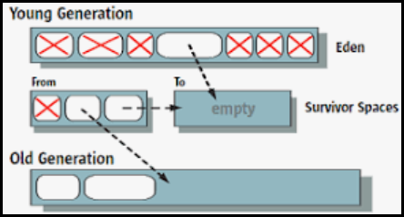

# [←](../README.md) <a id="home"></a> Garbage Collection

## Table of Content:
- [Java Memory](#memory)
- [Garbage collections](#garbage)
- [Serial And Parallel GC](#serialgc)
- [Concurrent Mark Sweep](#cms)
- [G1 Garbage Collector](#g1)
- [java.lang.ref.Reference](#ref)
- [Resources](#resources)

---------

## [↑](#home) <a id="memory"></a> Java Memory
Рассматривая сборку мусора в Java стоит вспомнить про утройство памяти в Java (Java Memory Model).

Самый шикарный MUST SEE доклад на тему памяти: **"[Андрей Паньгин — Память Java процесса по полочкам](https://www.youtube.com/watch?v=kKigibHrV5I)"**.

**Heap** (она же "Куча") - основная область памяти в JVM, в которой хранятся создаваемые Java объекты. Чтобы создать объект нужно об этом объекте иметь информация: какого он типа, возможно он статический и т.п. Такая метаинформация хранится в области **Metaspace**.


**Metaspace** - это область памяти JVM, которая хранит метаинформацию или метаданные: загруженные классы, байт-код методов, статические поля и методы. До Java версии 8 эта область памяти называлась **PermGen** (**Permanent Generation**, "постоянное поколение"). Основное отличие Metaspace от PermGen в том, что размер Metaspace динамически изменяется, в завимисоти от потребности. Кроме того, может быть особая область, называемая **"[Compressed Class Space](https://stuefe.de/posts/metaspace/what-is-compressed-class-space/)"**. Так же немного деталей есть в пункте "Ограничиваем потребление памяти: heap, non-heap, direct memory" в докладе **"[Как мы учились эксплуатировать Java в Docker](https://habr.com/ru/company/hh/blog/450954/#lim-mem-1)"**.

Стоит помнит, что JVM при запуске загружает некоторый набор "базовых" (т.е. системых) классов, без которых Java код не сможет работать. Ранее данные классы хранились в файле **rt.jar**, но начиная с java 9 базовые классы размещены в каталоге lib, а **rj.jar** удалён. Подробнее описано в **"[Migrating From JDK 8 to Later JDK Releases](https://docs.oracle.com/en/java/javase/14/migrate/index.html#JSMIG-GUID-2C896CA8-927C-4381-A737-B1D81D964B7B)"**.


**Stack** - область памяти, в которой выделяется место под стэки для потоков, а так же хранятся локальные переменные и легковесные мониторы. Подробнее про всё это можно прочитать в статье **"[Stack Overflow handling in HotSpot JVM](https://pangin.pro/posts/stack-overflow-handling)"**.


**Codecache** - область памяти JVM, которая содержит код, который был скомпилирован JIT компилятором (так называемые **hot spots**). Подробнее можно прочитать здесь: **"[15 Codecache Tuning](https://docs.oracle.com/javase/8/embedded/develop-apps-platforms/codecache.htm)"**. Иногда можно встретить информацию о том, что codecache - это часть Metaspace, но это неправда. Подтверждением того могут служить обучайющие слайды на сайте Oracle (**[HotSpot JVM Memory Management](https://www.oracle.com/webfolder/technetwork/tutorials/mooc/JVM_Troubleshooting/week1/lesson1.pdf)**) или раздел "Active Memory pools" в официальной утилите "Java Mission Control".


Есть ещё и другие области, например **Symbols** или **Internal/Other**. В Symbols лежат сигнатуры методов, названия переменных, строки (тот самый **"[пул строк](https://docs.oracle.com/en/java/javase/15/docs/api/java.base/java/lang/String.html#intern())"**). В Internal выделяется память под потребности JVM и для **[Direct Byte Buffer](https://www.youtube.com/watch?v=0y6_RDga-fk)**'ов.

Garbage Collector в основном работает с областью памяти **Heap**, но GC иногда может "собирать мусор" и вне Heap. Более подробно можно прочитать тут:
- **[How Java GC Does Direct Byte Buffer Clean Up](https://stackoverflow.com/questions/40122063/how-java-gc-does-direct-byte-buffer-clean-up-because-ibm-docs-says-it-does)**
- **[DirectByteBuffer из Java NIO](https://russianblogs.com/article/2477490991/)**

---------

## [↑](#home) <a id="garbage"></a> Garbage collection
Сборка мусора в Java опирается на **[слабую гипотезу о поколениях](https://youtu.be/ZYiQCHxgABI?t=2574)**.

**Cлабая гипотеза о поколениях** говорит о том, что большинство создаваемых объектов не живут долго и умирают молодыми. Ярким примером того может служить [Autoboxing](https://docs.oracle.com/javase/tutorial/java/data/autoboxing.html). 

На основе этой гипотезы объекты по времени жизни делят на **поколения**: **Young Generation** и **Old Generation**.\
Разделение на поколение позволяет и сборку мусора разделить на малые сборки (**minor GC**) и на полные сборки (**full GC**). Малые сборки обрабатывают только молодые объекты, что позволяет сократить количество рассматриваемых объектов при очистке памяти.

Для обеспечения работы алгоритмов сборки мусора пространство в Heap разделяется на области (как минимум логически). 

Молодое поколение (Young Generation) делится на следующие области:
- **Eden** (Эдем): здесь живут вновь созданные объекты
- **Survivor**: здесь живут объекты, которые пережили некоторое количество сборок

**Eden** - область, в которой попадают объекты при создании. Так как создание объектов может выполняться из нескольких потоков, то чтобы снизить необходимость в синхронизации используются **[TLAB](https://dzone.com/articles/thread-local-allocation-buffers)**. Каждому потоку выдаётся свой собственный участок в Eden.

**Survivor** - области (их несколько), между которыми перемещаются молодые объекты между minor сборками. Это позволяет одни survivor участки наполнять выживышими объектами, а другие очищать от неиспользуемых объектов. Кроме того, это позволяет считать кол-во пережитых сборок и определять, когда объект станет долгоживущим.

Старшее поколение (Old Generation) размещается в Tenured области.
**Tenured** - область, в которую попадают долгоживующие объекты. Эти объекты больше не участвуют в minor сборках.

Для выполнения сборки мусора JVM останавливает все потоки выполнения программы. Такие паузы называют **Stop-the-world** паузами или же коротко **STW**, т.к. останавливаются ВСЕ потоки, поэтому весь мир действительно останавливается. Сделать STW можно не в любой момент времени, а в так называемых **Safepoint**'ах.

**Safepoint**'ы - это особые места выполнения, в которых известно сотояние потока. Более подробно можно прочитать в статье Шипилёва: **"[JVM Anatomy Quark #22: Safepoint Polls](https://shipilev.net/jvm/anatomy-quarks/22-safepoint-polls/)"**. Места, где можно поставить safepoint'ы зависят от того, интерпритируется ли код или он скомпилирован JIT компилятором. В случае интерпритатора мы можем останавливаться между любыми байткод инструкциями. В случае скомпилированного кода такими точками являются места перед выходом из метода и перед выходом из цикла, а так же места вызова VM Runtime.

Про Safepoint есть отличный доклад **"[Андрей Паньгин — Safepoint — и пусть весь мир подождёт](https://www.youtube.com/watch?v=rthWVvU9gWo)"**. 

Т.к. во время паузы не происходит изменений в памяти, то сборщик мусора может начать процесс обнаружения живых объектов.
И для начала сборщик мусора должен определить отправные точки, от которых будет обходить граф объектов. Такие отправные точки называются **GC Roots**.

**GC Roots** - это корневые элементы графа, с которых выполняется поиск живых объектов. Подсмотрев в материал **"[Garbage Collection in Java](https://www.w3resource.com/java-tutorial/garbage-collection-in-java.php)"** можно узнать, что к таким элементам относятся:
- локальные переменные (local variables)
- активные потоки (active threads)
- статические переменные (static variables)
- JNI ссылки (т.е. ссылки из вызываемого native кода)

GC Roots выбраны не просто так. Когда JVM находится в состоянии паузы, прежде всего она остановила потоки и имеет к ним доступ. А это значит что у JVM есть доступ к потоками и всему что есть в стэке потока (например, локальные переменные или **[JNI local references](https://www.ibm.com/docs/en/sdk-java-technology/8?topic=collector-overview-jni-object-references)**).

Кроме этого, [классы тоже могут быть собраны сборщиком мусора](https://docs.oracle.com/javase/specs/jls/se8/html/jls-12.html#jls-12.7). А это значит, что и статические переменные также доступны для сборки.

То, каким образом дальше будет работать сборщик мусора, будет зависеть от реализации сборщика мусора. Этих реализаций есть несколько.

---------

## [↑](#home) <a id="serialgc"></a> Serial And Parallel GC
До Java 9 сборщиком мусора по умолчанию является сборщик мусора **Serial GC**.\
Данный сборщик мусора отлично описан в статье **"[Дюк, вынеси мусор! — Часть 2](https://habr.com/ru/post/269707/)"**.

Схема работы выглядит понятно и прямолинейно:




При Serial GC хип делится на регионы. Все новые объекты попадают в регион **"Eden"** (Эдем). Когда в Эдеме становится слишком тесно, тогда запускается малая сборка (**minor GC**). При такой сборке все "мёртвые" объекты удаляются из Эдема.

Кроме Эдема есть два **Survivor** региона для выживших после minor GC. Один из этих регионов всегда пустой и используется для перемещения в него всех выживших из Эдема **И** из другого Survivor региона. Таким образом выжившие объекты перемещаются то в один Survivor регион, то в другой. Это позволяет избежать излишней фрагментарности. Этот процесс называется **Compacting**.

Перемещение между Survivor не бесконечно. Если объект переживает определённое количество таких перемещений, то он перемещается в последний из доступных для перемещения регионов - **Tenured** (бессрочный).

Когда место кончается даже в Tenured, то тогда происходит полная сборка мусора (**full GC**), которая гораздо более ресурсозатратная, чем Minor GC.

Как можно догадаться из названия, данный сборщик мусора делает всё последовательно. Но у него есть альтернатива - **Parallel GC**.

**Parallel GC** - это Serial GC, который работает в несколько потоков и с некоторыми улучшениями. При малой сборке многопоточно выполняется перенос объектов в старшее поколнение, а при полной сборке - уплотнение данных в старшем поколении. Благодаря тому, что каждый поток получает свой участок для обработки (promotion buffer), с которым может работать только он, разные потоки не мешают друг другу.

Количество потоков высчитывается с учётом кол-ва ядер процессора. Каждому потоку выделяют свой участок в регионе **Old Gen** (тут так называется Tenured). Такой участок называется **promotion buffer**.

Parallel GC ведёт статистику и на основе неё может делать некоторые оптимизации, чтобы максимально попытаться уложиться в заданные параметры максимального времени сборки и пропускной способности. Данные параметры могут быть заданы при помощи опций JVM ``-XX:MaxGCPauseMillis`` и ``-XX:GCTimeRatio``.

Более подробно написано на хабре: **"[Дюк, вынеси мусор! — Часть 2](https://habr.com/ru/post/269707/)"**.

---------

## [↑](#home) <a id="cms"></a> Concurrent Mark Sweep
Как альтернативу Parallel GC создали сборщик CMS (Concurrent Mark Sweep).

Данный сборщик использует ту же организацию памяти (Eden + Survivor 0 + Survivor 1 + Tenured) и те же принципы сборки мусора, что и Parallel GC. Можно сказать, что **minor** сборка одинакова для Parallel и CMS сборщиков.

Отличия для CMS начинаются на full GC, которая здесь называется **major GC**. Называется она не full, потому что затрагивает только старшее поколение (т.е. только Tenured). Сайд эффект в этом может заключаться в том, что мусор из младшего поколения не даст очистить мусор из старшего поколения.

Кроме этого, CMS работает постоянно в фоном режиме, а не дожидается заполнения Tenured региона. Чтобы выполнить Major сборку JVM останавливает потоки и помечает все объекты, которые доступны **НАПРЯМУЮ** из GC Roots. После этого приложение возобновляет работу, а GC продолжает искать живые объекты имея в распоряжении уже начатый граф объектов. Затем снова останавливается приложение и GC снова выполняет поиск чтобы найти новые объекты, которые были созданы за время, пока GC строил граф. Когда GC заканчивает помечать живые объекты, работа приложения возобновляется, а сборщик начинает очищать память от "мёртвых" объектов. При этом работа выполняется в несколько потоков.

Кроме того, название данного сборщика отражает тот факт, что выполняется только **Mark** (разметка живых объектов) и **Sweep** (очистка от мёртвых). **Compact** (уплотнение), в отличии от Serial GC и Parallel GC не выполняется, т.к. очистка от мёртвых выполняется во время работающего приложения и уплотнить объекты затруднительно.

Про данный сборщик можно прочитать в материале **"[Дюк, вынеси мусор! — Часть 3](https://habr.com/ru/post/269863/)"**. 

В текущий момент CMS сборщик имеет статус Deprecated (см. **"[JEP 291: Deprecate the Concurrent Mark Sweep (CMS) Garbage Collector](https://openjdk.java.net/jeps/291)"**). Причина - уменьшить кодовую базу, так как для большинства случаев CMS может и должен быть заменён сборщиком G1.

---------

## [↑](#home) <a id="g1"></a> G1 Garbage Collector
Начиная с Java 9 сборщиком по умолчанию является **G1 Garbage Collector**.
Про данный сборщик можно прочитать тут: **"[Дюк, вынеси мусор! — Часть 3](https://habr.com/ru/post/269863/)"**.

Регионы тоже имеют тип Eden, Survivor и Tenured, но теперь их много. Их размер выбирается так, чтобы регионов было не больше 2048. Но бывают случаи, когда регионы объединяются в больший регион, чтобы там был очень большой объект. Такие регионы называются "громадные" (**humongous**).

Разделение регионов на Eden, Survivor и Tenured теперь логическое, регионы одного поколения не обязаны идти подряд и даже могут менять свой тип.

С некоторой периодичностью выполняются Minor сборки, во время которых живые объекты переносятся в Survivor, либо переносятся в Tenured. Перенос выполняется в несколько потоков (как в Parallel GC) с остановкой приложения.

При Minor GC очистка выполняется не на всём поколении, а только в части регионов так, чтобы не привысить желаемое время сборки. При этом GC пытается выбрать именно те, где может скопиться наибольшее количество "мёртвых" объектов. Поэтому и название G1, то есть Garbage First, т.е. "сперва мусор".

Полная сборка в G1 именуется смешанной (**mixed**), т.к. на самом деле такая очистка выполняется вместе с малой сборкой, если выполнение полной сборки необходимо. Решение об этом принимается на основании статистики о прошлых сборках. Перед тем, как включить смешанную сборку GC выполняет цикл пометки, который называется **Marking Cycle**.

Данный сборщик мусора использует тактику, которая называется **Snapshot-At-The-Beginning**. Это означает, что сборщик мусора запоминает состояние на начало сборки мусора, после чего отслеживает изменение этого снимка (т.е. новые объекты + изменение связей).

**Marking Cycle** (Цикл пометки) - особая фаза, которая выполняется параллельно с работой приложения. Состоит из нескольких шагов, часть из которых выполняется с остановкой приложения.

Выполняемые шаги:
1. **Initial mark** - остановка приложения для пометки GC Root. При этом используется статистика, полученная при выполнении малых сборок.
2. **Concurrent marking** - возобновление приложения, после которой в нескольких потоках помечаются все живые объекты в куче.
3. **Remark** - опять останавливается приложение (как в CMS), чтобы попробовать найти ещё живые объекты.
4. **Cleanup** - очищаем вспомогательные структуры (для учёта ссылок на объекты) и ищем пустые регионы, которые можно использовать для размещения объектов.

Когда данные шаги будут выполнены GC переключится в режим выполнения смешанных сборок, во время которых будут убираться мусор не только из младших поколений. То, какое количество старших регионов очищать выбирается на основе статистики. В том числе, на основе этой статистики GC будет решать, когда перестать работать в режиме смешанных сборок.

---------

## [↑](#home) <a id="finalize"></a> Finalize
Говоря про сборку мусора нужно помнить про такой метод из класса Object, который называется **[finalize](https://docs.oracle.com/en/java/javase/15/docs/api/java.base/java/lang/Object.html#finalize())**.

Данный метод можно переопределить у любого класса и тогда при сборке мусора объект, который является мусором, не будет так просто удалён. Такой объект будет помещён в особую очередь ReferenceQueue в особом фоновом потоке Finalizer, который поочерёдно из этой очереди достаёт такие объекты, вызывает на каждом из них **finalize()**. После этого такие объекты станут доступны для сборки.

Только из этого описания уже видны недостатки:
- Объекты, в классе которых есть finalize, собираются за 2 сборки мусора
- Чем больше объектов в очереди Finalizer, тем дольше начинают жить объекты, которые мусор
- Метод finalize - это просто обычный метод. Таким образом реализации могут "потерять" логику из супер класса, если забудут вызвать finalize у super
- В случае исключений в finalize финализация может не завершится и объект останется в неконсистентном состоянии, а ресурсы не будут освобождены
- Нет гарантий, в какой момент времени и в каком порядке будут вызваны finalize методы у разных объектов

Подробнее можно посмотреть в докладе **"[Вы всё ещё используете finalize()? Тогда мы идём к вам](https://www.youtube.com/watch?v=K5IctLPem0c)"**.

Таким образом механизм finalize стоит избегать. Начиная с Java 9 на замену пришёл **[java.lang.ref.Cleaner](https://bugs.openjdk.java.net/browse/JDK-8138696)**. Cleaner позволяет зарегистрировать объект и runnable, который запускается в качестве финализатора.

Разговоры про Finalize и про сборку непримернно приводят к разговору и про такой интересный инструмент как **[java.lang.ref.Reference](https://docs.oracle.com/en/java/javase/15/docs/api/java.base/java/lang/ref/Reference.html)**.

---------

## [↑](#home) <a id="ref"></a> java.lang.ref.Reference
В Java есть особый абстрактный класс, который представляет из себя ссылку на объект. Реализации этого класса обрабатываются особым образом сборщиками мусора. Каждая реализация описывает различный уровень "силы" ссылки. Эта сила влияет на то, при каких обстоятельствах объект, на который ведёт ссылка, будет собран сборщиком мусора.

Стоит помнить, что обычное присвоение ссылки на объект является "сильной" ссылкой (**Strong**). То есть пока ссылка есть - объект не соберут. Это самаое строгое обязательство.

Как антоним, для "сильных ссылок" есть "слабые ссылки" (**Weak Reference**).
**Weak Reference** - это ссылка, которая не удерживает объект от сборки GC. Как пример использования - карты **WeakHashMap**, где значения из карты удаляются тогда, когда ключи уже не используются (с оговоркой, что значения не должны держать ключи).

По середине между **Strong** и **Weak** стоит **Soft**.\
**Soft Reference**, т.е. "мягкие ссылки", собираются сборщиком только тогда, когда памяти начнёт нехватать. Если памяти хватает, а объекты уже никем не используются, то они остаются жить. Подробнее см. **"[Guidelines for using the Java 2 reference classes](https://www.ibm.com/developerworks/library/j-refs/)"**.

И самые необычные Reference - **PhantomReference**.\
**PhantomReference** - это фантомные ссылки. Такие ссылки необычны тем, что всегда возвращают null вместо объекта и нужны в основном для того, чтобы такие Reference использовать для отслеживания сборки объектов, т.к. фантомные ссылки поступают в ReferenceQueue когда объекты собраны (именно поэтому они возвращают null всегда). Вместо использования фантомных ссылок начиная с Java 9 появилась возможность использовать специальный **[Cleaner](https://www.logicbig.com/tutorials/core-java-tutorial/gc/ref-cleaner.html)**.

---------

## [↑](#home) <a id="practice"></a> Practice
Для практики нам понадобится некоторое Java приложение.\
Нам понадобится несколько импортов:
```java
import java.net.*;
import java.io.*;
import java.util.concurrent.*;
import com.sun.net.httpserver.*;
```

Нам понадобится некоторый код, который будет вызываться. Допустим:
```java
private static class MyHttpHandler implements HttpHandler {    
    @Override    
    public void handle(HttpExchange httpExchange) throws IOException {
        String htmlResponse = "Hello";
        OutputStream outputStream = httpExchange.getResponseBody();
        httpExchange.sendResponseHeaders(200, htmlResponse.length());
        outputStream.write(htmlResponse.getBytes());
        outputStream.close();
    }
}
```

И непосредственно сам код запуска:
```java
public static void main(String[] args) throws Exception {
    InetSocketAddress address = new InetSocketAddress("localhost", 8001);
    HttpServer server = HttpServer.create(address, 0);
    server.createContext("/test", new  MyHttpHandler());
    server.setExecutor(Executors.newFixedThreadPool(10));
    server.start();
    System.out.println("Server started on port 8001");
}
```

При помощи утилиты **[jps](https://docs.oracle.com/en/java/javase/11/tools/jps.html)** мы можем найти запущенный процесс и найти его process ID (PID).

При помощи утилиты [jhsdb](https://docs.oracle.com/javase/9/tools/jhsdb.htm) начиная с Java 9 мы можем подключаться к JVM по её ID процесса (PID) и запрашивать информацию. Например:
> jhsdb jmap --pid 24636 --heap

Кроме того, при помощи всё той же команды можно создавать Heap Dump:
> jhsdb jmap --pid 24636 --binaryheap --dumpfile heap.hprof

Можно так же скачать [VisualVM](https://visualvm.github.io/download.html). Более подробно о запуске можно прочитать в мануале [VisualVM: Getting Started](https://visualvm.github.io/gettingstarted.html).


---------

## [↑](#home) <a id="resources"></a> Resources
Дополнительные материалы:
- [Understanding Java Garbage Collection Logging](https://sematext.com/blog/java-garbage-collection-logs/#toc-how-to-enable-gc-logging-3)
- [Troubleshooting Memory Problems in Java Applications](https://www.youtube.com/watch?v=iixQAYnBnJw)
- [Do Your GC Logs Speak to You?](https://www.youtube.com/watch?v=Miwga8-dx0A)
- [Сборка мусора в Java: что это такое и как работает в JVM](https://medium.com/nuances-of-programming/сборка-мусора-в-java-что-это-такое-и-как-работает-в-jvm-25bb2570b44c)