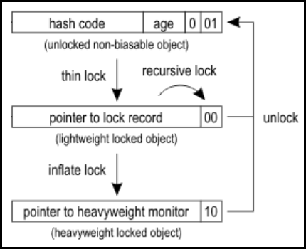
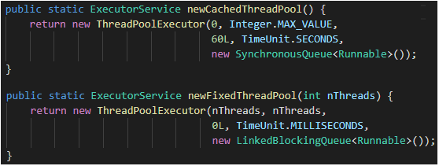
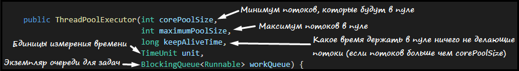
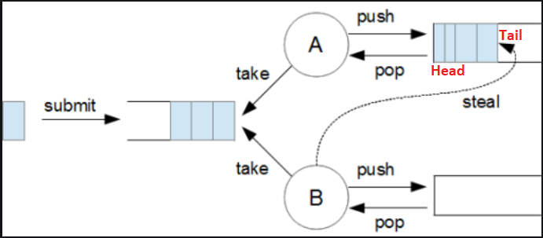

# [←](../README.md) <a id="home"></a> Threads

## Table of Contents:
- [Process](#process)
- [Thread](#thread)
    - [Daemon thread](#daemon)
    - [Thread Group](#group)
    - [Thread Priority](#priority)
    - [Yield](#yield)
    - [Thread Sleep](#sleep)
    - [Thread Interruption](#threadInterrupt)
- [Callable](#callable)

- [Синхронизация потоков](#synchronization)
    - [Synchronized](#synchronized)
    - [Wait & Nnotify](#waitnotify)
    - [Join](#join)
    - [LockSupport](#lockSupport)
    - [Синхронизаторы](#sync)
- [ExecutorService](#executor)
- [CompletableFuture](#completableFuture)
- [Fork Join Pool](#forkJoinPool)
- [Memory consistency](#memoryConsistency)
- [Resources](#resources)
----

## [↑](#home) <a id="process"></a> Process
Исходный код программы на языке Java записывается в виде текста в файлы с расширением **.java**. Чтобы этот код можно было выполнить, его необходимо при помощи компилятора **[javac](https://docs.oracle.com/javase/8/docs/technotes/tools/unix/javac.html)** скомпилировать в промежуточный формат, который называется **байт-кодом**.

Байт-код выполняется в особой среде, которая называется виртуальной машиной Java (**Java Virtual Machine**). Новый экземпляр виртуальной машины java запускается при помощи специального загрузчика, вызываемого командой **[java](https://docs.oracle.com/javase/8/docs/technotes/tools/unix/java.html)**.

Каждый экземпляр Java Virtual Machine запускается как отдельный процесс.
**Process (процесс)** - это основная единица работы в терминах операционной системы. Каждому процессу выделяются собственные ресурсы для выполнения работы. У каждого процесса есть собственная область в памяти, доступная только этому процессу. Такая область называется **Виртуальным адресным пространством**. Таким образом ни один процесс не может получить прямого доступа к командам и данным другого процесса.

Для просмотра процессов JVM используется утилита "**[jps - Java Virtual Machine Process Status Tool](https://docs.oracle.com/en/java/javase/11/tools/jps.html)**".

Процессы в свою очередь состоят из потоков (**Threads**).
Каждый процесс является своего рода контейнером, в котором выполняются потоки (**threads**), относящиеся к этому процессу. Потоки и работа с ними реализуются операционной системой. Организацией работы потоков осуществляется **Планировщиком потоков**, который так же реализован на стороне операционной системы.

В рамках JDK поставляется утилита, при помощи которой можно посмотреть потоки, которые относятся к pid процесса JVM: **"[jstack](https://docs.oracle.com/en/java/javase/11/tools/jstack.html)"**.

**Java Virtual Machine** умеет взаимодействовать с операционной системой и её планировщиком потоков. Разработчику же предоставлен своего рода API для работы с потоками. Часть этого API - специальный класс **java.lang.Thread**.


## [↑](#home) <a id="thread"></a> Thread
**java.lang.Thread** - основной класс для работы с потоками.
Важно понимать, что Thread - это не сам поток на стороне операционной системы, а лишь своего рода API для взаимодействия с потоком.

При запуске Java программы, запускается JVM (Java Virtual Machine), которая в свою очередь создаёт поток, в котором начнётся выполнение того самого **public static void main** метода. Этот поток называется **главным потоком** или **main thread**. У потока есть свой Thread Stack.

**Thread Stack** - это область памяти, которая состоит из фрэймов. Фрэйм создаётся на входе в метод и удаляется на выходе. Фрэймы содержат различные локальные данные: локальные переменные, ссылку на this, легковесный монитор. При этом размер стэка может быть задан при помощи параметра JVM "**-Xss**", так и при помощи параметра конструктора **Thread**.

**Текущий поток** - это поток, в котором выполняются код. Текущий поток доступен при помощи статического метода **Thread.currentThread()**:
```java
public static void main(String[] args) {
	System.out.println(Thread.currentThread().getName());
}
```
В данном случае, для метода main текущим потоком будет тот поток, в котором этот main метод выполняется.

У класса Thread есть два метода: **run** и **start**.
- **start**:
Метод **start** по умолчанию запускает приватный нативный метод **start**, который просит у JVM запустить новый поток. А уже в новом потоке из метода start будет запущен метод run.
- **run**:
Метод run содержит код, который будет выполнен в потоке. Поэтому, чтобы в поток передать выполняемый код нужно или переопределить метод run или воспользоваться более удобным методом - передать в конструкторе Thread экземпляр **Runnable**.

**java.lang.Runnable** - это что-то, что может быть выполнено в потоке.
Кроме того, Runnable - это фунциональный интерфейс и может быть использован в лямбда выражениях:
```java
public static void main(String[] args) {
	Thread th = new Thread(() -> System.out.println("test"));
	th.start();
}
```

Выполнение потока завершается тогда, когда когда из Thread stack будет удалён последний фрэйм, т.е. когда завершится выполнение метода, с которого начался поток.


### [↑](#home) <a id="daemon"></a> Daemon thread
Потоки можно разделить на обычные потоки и на демон потоки (**Daemon thread**).

**Daemon thread** - это служебный или фоновый поток. Условием завершения Java программы является завершение всех НЕ демон потоков.
Например, Java Finalizer создаёт поток FinalizerThread, который при необходимости запускает метод finalize() у объектов. Данный поток служебный и его завершение не требуется для завершения программы, т.к. он имеет смысл только пока есть главные потоки, которые он обслуживает. Термин "демон-поток" — это отсылка к "демону Максвелла", о чём подробнее можно прочитать в википедии в статье про "[демонов](https://ru.wikipedia.org/wiki/Демон_(программа)" =).

При создании нового потока значения группы и демон потока берутся из того потока, который запускает этот новый поток. Интересно, что группа тоже может быть демон-группой. Такая групп будет автоматически уничтожена, когда её последний поток остановлен или уничтожен.


### [↑](#home) <a id="group"></a> Thread Group
Потоки объединяются в группы **ThreadGroup**.

**ThreadGroup** представляет группу потоков. Группа потоков может иметь родительскую группу, формируя таким образом иерархию ThreadGroup.

Каждый поток входит в какую-то группу. Например, главный поток **main** находится в группе **main**, которая в свою очередь является дочерней для системной группы **system**. Группы потоков позволяют ограничивать приоритет потоков в них, а так же управлять политиками безопасности на основе ThreadGroup при помощи **[SecurityManager'а](https://stackoverflow.com/a/31039987/6604312)**.

**ThreadGroup** является довольно спорным API, т.к. даже в книге "Effective Java" про него есть глава "[Item 73: Avoid thread groups](https://books.google.ru/books?id=ka2VUBqHiWkC&lpg=PA288&dq=ThreadGroup%20Effective%20java&hl=ru&pg=PA288#v=onepage&q=ThreadGroup%20Effective%20java&f=false)".

Thread и ThreadGroup совместно устанавливают **UncaughtExceptionHandler**.
**UncaughtExceptionHandler** - это обработчик неперехваченных исключений. Если у потока не установлен свой личный обработчик (при помощи setUncaughtExceptionHandler), тогда будет вызван метод **ThreadGroup#uncaughtException**. По умолчанию, данный метод реализован так, что он проверяет, не назначен ли **setDefaultUncaughtExceptionHandler**. Если назначен - вызывает его. Если не назначен, тогда идёт по иерархии групп вверх до тех пор, пока не достигнет корневой группы. Если по пути ни одна из ThreadGroup не переопределит метод **uncaughtException**, тогда при достижении корневой группы в System.err будет выведен stacktrace из Exception.


### [↑](#home) <a id="priority"></a> Thread priority
Как выше было сказано, за организацию работы потоков отвечает планировщик потоков, реализованный на стороне операционной системы. Однако, в Java предусмотрены средства, при помощи которых можно сделать подсказку планировщику. Для этого потокам можно изменить приоритет.

**Priority** - атрибут потока, который указывает желаемый приоритет потока. Приоритет может быть указан в диапазоне от 1 до 10 или при помощи констант:
```java
Runnable task = () -> System.out.println(Thread.currentThread().getName());
Thread newThread = new Thread(task);
newThread.setPriority(Thread.MAX_PRIORITY);
```
Приоритет - лишь подсказка планировщику потоков, какому потоку желательно отдавать приоритет при выполнении. Никаких гарантий нет.

Единицой рассчёта времени выполнения является **Clock tick**.
**Clock tick** - это своего рода принятая условная единицы осчёта, которая в разных операционных системах может отличаться. Clock tick в Windows и Linux отличаются в продолжительности в мс (похоже на то, как один доллар и один евро содержат разное количество рублей).

Планировщик потоков выделяет каждому потоку свой **Timeslice**, который состоит из некоторого числа **Clock tick**. Это число не константное, а высчитывается планировщиком операционной системе, в том числе и на основе приоритетов. Когда у потока заканчивается **Timeslice**, он вытесняется другими потоками, у которых их время ещё не закончилось. Когда у всех работающих потоков заканчивается время, то планировщик занового высчитывает **Timeslice** всех потоков и потоки снова могут работать. Подробнее на примере linux см. **"[Квант времени в Linux](https://it.wikireading.ru/1747)"**.


### [↑](#home) <a id="yield"></a> Yield
В Java с помощью метода "**[yield()](https://docs.oracle.com/en/java/javase/15/docs/api/java.base/java/lang/Thread.html#yield()**" можно подсказать планировщику, что выполнение потока сейчас не критично и можно отдать процессорное время. Подробнее про это можно прочитать здесь: **"[Thread.yield](https://www.javamex.com/tutorials/threads/yield.shtml)"**.

Кроме того, начиная с Java 9 появился статический метод **Thread#onSpinWait**, который даёт шанс оптимизировать выполнение так называемых spin wait.
Подробнее можно прочитать в материале **"[onSpinWait() method from Thread class](https://ionutbalosin.com/2018/06/onspinwait-method-from-thread-class/)"**.


### [↑](#home) <a id="sleep"></a> Thread Sleep
Время выполнения потока можно отдать более надёжным способом, чем yeild.
Поток можно перевести в спящий режим, вызвав метод **sleep**:
```java
public static void main(String[] args) {
	try {
		Thread.sleep(10000);
    } catch (InterruptedException e) {
        e.printStackTrace();
    }
}
```
Это приведёт к тому, что поток откажется от своих timeslice на время сна. И только после этого времени планировщик снова выдаст время выполнения данному потоку. При этом поток переходи в состояние **"TIMED_WAITING (sleeping)"**:
```
"main" #1 prio=5 os_prio=0 cpu=156.25ms elapsed=10.16s tid=0x00000255856a0000 nid=0x18cc waiting on condition  [0x00000068150ff000]
   java.lang.Thread.State: TIMED_WAITING (sleeping)
        at java.lang.Thread.sleep(java.base@14.0.1/Native Method)
        at TestClass.main(TestClass.java:10)
```

Одно из основных правил работы с потоками - любое ожидание потока может быть прервано. По этой причине вызов методов, которые приводят к ожиданию потока, должны обрабатывать **InterruptedException**.


### [↑](#home) <a id="threadInterrupt"></a> Thread interrupt
Любой Thread может быть прерван при помощи метода **interrupt()**.
У каждого экземпляра Thread есть приватный флаг **"private volatile boolean interrupted"**.

Данный флаг может быть проверен методом **isInterrupted**, который возвращает значение этого флага и не меняет его.

Кроме того, есть схожий по названию, но статический метод **Thread#interrupted**, который возвращает текущее значение флага для текущего потока (в котором выполняется вызов) и при этом сбрасывает значение флага.
В учебном материале от Oracle (**"[Supporting Interruption](https://docs.oracle.com/javase/tutorial/essential/concurrency/interrupt.html)"**) рекомендуется конструкция:
```java
if (Thread.interrupted()) {
    throw new InterruptedException();
}
```

**InterruptedException** - это проверяемое (checked) исключение, которое бросается при прерывании потока. Возникнуть оно может как по воле разработчика (как в примере выше), так и может возникнуть в местах, где поток уходит в ожидание и не может проверить флаг **interrupted**.


## [↑](#home) <a id="callable"></a> Callable
Итак, **Thread** - это представление потока. Чтобы передать в поток задачу для выполнения необходимо передать в поток экземпляр **Runnable**. Этот базовый способ ограничен тем, что у нас нет прямого доступа к результатам.

**Calable** - это альтернативный вариант представления задачи для потока, но который в отличии от **Runnable** возвращает результат. А что самое приятное, метод выполнения задачи объявлен как **throws Exception**, что позволяет не обрабатывать исключения напрямую в описании задачи. Например:
```java
Callable task = () -> {
	Thread.currentThread().sleep(1000);
	return 2 + 2;
};
```

Результат таких задач в Java выражен интерфейсом **Future**.
**Future** - это что-то, что должно быть выполнено в будущем. Задачи могут быть отменены при помощи метода **cancel**. При этом при помощи параметра **mayInterruptIfRunning** можно указать, прерывать ли поток, если задача уже выполняется. Кроме того, Future предоставляет метод **get** для получения результата. Данный метод синхронный, т.е. он будет ждать, пока результат не появится. А так же есть его альтернатива с указанием максимального времени ожидания.

**FutureTask** - это реализация Future и Runnable, т.е. представляет собой некий таск, который будет выполнен в будущем и от которого будет получен результат. Можно сказать, что это такой адаптер Callable к Runnable:
```java
FutureTask future = new FutureTask(task);
new Thread(future).start();
try {
	System.out.println(future.get());
} catch (InterruptedException | ExecutionException e) {
    e.printStackTrace();
}
```


## [↑](#home) <a id="synchronization"></a> Синхронизация потоков
При одновременной работе нескольких потоков может возникнуть гонка, которая называется "[Race Condition](https://en.wikipedia.org/wiki/Race_condition)". Без механизмов синхронизации потоки при обращении к одному и тому же ресурсу могут получить неожианный результат. По этой причине на стороне Java реализованы различные средства синхронизации потоков.

### [↑](#home) <a id="synchronized"></a> Synchronized
Базовым механизмом синхронизации является ключевое слово **synchronized**.
**Synchronized** - это блок кода (также иногда называемый критической секцией), который может быть выполнен в 1 момент времени только лишь одним потоком.

Согласно материалу от Oracle **"[Intrinsic Locks and Synchronization](https://docs.oracle.com/javase/tutorial/essential/concurrency/locksync.html)"**, синхронизация построена вокруг системной сущности, которая называется **intrinsic lock** или **monitor lock**. Так же сказано, что часто **monitor lock** в документации Java API называют просто монитором (**monitor**).
Например:
```java
public static void main(String[] args) {
	Object mutex = new Object();
    Object mutex2 = new Object();
    synchronized (mutex) {
    	System.out.println(Thread.holdsLock(mutex));    //TRUE
        System.out.println(Thread.holdsLock(mutex2));   //FALSE
    };
}
```
В данном случае в качестве монитора используется объект mutex.

Так же синхронизированными могут быть методы:
```java
public synchronized int capacity() {
	return elementData.length;
}
```
В случае синхронизированных методов в качестве монитора будет выступать или экземпляр текущего объекта, метод которого вызывается. А если метод статический, то монитором будет являться экземпляр класса (например, Vector.class).


**Monitor** - это специальная сущность, которая ассоциируется с экземпляром объекта в Java. Любой объект в Java имеет заголовок объека (**Object Header**).
**Object Header** — это заголовок объекта, своего рода метаданные объекта. Заголовок объекта недоступен разработчику из java кода, но доступен JVM для корректное работы с объектами.

Заголовок объекта состоит из **Class Ptr** (ссылка на метаданные о классе объекта) и **Mark Word**, которое описывает состояие объекта. Подробнее см. в статье **"[Заголовок Java объекта](https://habr.com/ru/post/447848/)"**.
Состояние объекта содержит хэш-код объекта,



Заголовок содержит некий маркер, по которому JVM может понять состояние монитора. Например, если этот маркер равен "01" (см. картинку выше), то значит монитор ещё никем не занят (т.е. свободен).
Как видно, монитор может быть **thin monitor** и **heavyweight monitor**.

**thin monitor** - это монитор, который не требует использование средств синхронизации операционной системы, что позволяет сократить накладные расходы.
Если монитор свободен, тогда на стэке того потока, который хочет занять ресурс, создаётся копия настоящего mark word из объекта и при помощи **[CAS](https://www.ibm.com/developerworks/ru/library/j-jtp11234/index.html)** операции поток пытается заменить настоящий mark word ссылкой на него. Если CAS удался, тогда монитор занят, а значит поток захватывает ресурс, синхронизированный данным монитором. При этом значение маркера устанавливается в другое значение, чтобы другие потоки знали, что данный монитор уже захвачен и что вместо Mark word записана ссылка на этот mark word. Такой монитор называется **thin**.

Если **CAS** не удался (т.е. кто-то занял уже монитор пока мы пытались его занять) или если в заголовке объекта указано, что монитор уже занят кем-то, тогда thin монитор заменяется на **heavyweight monitor**.

**heavyweight monitor** - это монитор, реализованный средствами операционной системы. Работа с ним сложнее и по этой причине более затратна. Такой монитор имеет у себя две очереди: **WAIT SET** и **ENTRY LIST**.

Потоки, которые хотели зайти в секцию синхронизации, но не смогли, становятся в **ENTRY LIST**. При этом статус таких потоков меняется на **BLOCKED**.

Есть ещё потоки, которые специально ожидают на мониторе. Такие потоки помещаются в **WAIT SET**, а потоки помещаются в статус **WAITING**. Об этом чуть позже.

До JDK15 (см. **"[JEP 374: Disable and Deprecate Biased Locking](https://openjdk.java.net/jeps/374)"**) так же существовала оптимизаци, которая называлась **Biased Locking**.
**Biased Locking** - это блокировка, при которой монитор фактически (как сущность) ещё не создаётся, а вместо hashcode объекта записывались данные потока, который захватил "монитор". Такая блокировка действовала до тех пор, пока с одним и тем же монитором не начинали работать разные потоки. Более подробно см. в материале **"[Synchronization and Object Locking](https://wiki.openjdk.java.net/display/HotSpot/Synchronization)"**.


### [↑](#home) <a id="waitnotify"></a> WAIT & NOTIFY
У каждого объекта в Java (благодаря неявному наследованию от java.lang.Object) есть два метода: **Wait** и **Notify**. Данные методы вызываются на указанном мониторе. Однако чтобы эти методы отработали без ошибки, вызывающий поток должен владеть этим монитором, иначе мы получим Exception:
```
java.lang.IllegalMonitorStateException: current thread is not owner
```

Соответственно, данные методы должны использоваться **ВНУТРИ** блоков синхронизации. Например:
```java
public static void main(String[] args) {
    Object mutex = new Object();
	Runnable task = () -> {
		synchronized (mutex) {
			mutex.notify();
        }
    };
    synchronized (mutex) {
		new Thread(task).start();
		try {
			mutex.wait();
		} catch (InterruptedException e) {
			e.printStackTrace();
		}
	}
	System.out.println("END");
}
```
Как видно из примера, сначала main поток занимает монитор, запускает из него второй поток и уходит в WAIT SET монитора. Это позволяет точно не завершиться main потоку, точно запуститься потоку, выполняющему task и поток task точно не успеет выполнить notify быстрее, чем поток main выполнит wait, т.к. элементарно не сможет войти в synchronized по mutex.

Т.к. WAIT - это ожидание потоком, то любое такое место должно обрабатывать checked exception **InterruptedException**.


### [↑](#home) <a id="join"></a> JOIN
Ещё одним методом перевода потока в состояние **WAITING** является **join**.
Часто, ожидание на мониторе необходимо для того, чтобы дождаться результатов другого потока. Поэтому, неудобно писать каждый раз столько обвязки и работать на таком низком уровне, как wait/notify. Поэтому, придумали чуть-чуть более высокоуровневый механиз **[join](https://docs.oracle.com/javase/tutorial/essential/concurrency/join.html)**.

**join** - это метод, который позволяет потоку, в котором он выполняется, ожидать результатов другого потока.

Как же это работает?
Метод **join** объявлен следующим образом:
```java
public final void join() throws InterruptedException {
```
Кроме того, важно прочитать Java API данного метода:
> This implementation uses a loop of this.wait calls conditioned on this.isAlive. As a thread terminates the this.notifyAll method is invoked.

Это значит, что когда поток T1 вызывает на потоке T2 метод **join**, то:
- T1 дожидается доступности монитора экземпляра T2
- T1 вызывает на нём wait. Это значит, что он записывается в wait set монитора T2, после чего освобождает монитор T2
- T2 завершает своё выполнение, после чего выполняет notifyAll и все, кто сделал join на мониторе T2 просыпаются


### [↑](#home) <a id="lockSupport"></a> LockSupport
Начиная с **JDK 1.5** появились более высокоуровневые средства, призванные упростить работу в многопоточном окружении. Основаны они на **LockSupport**.

**LockSupport** - это механизм "парковки" потоков, при котором не используется монитор, а используются менее затратные платформо-специфические вещи. Например, это могут быть "[Windows Events](https://docs.microsoft.com/en-us/windows/win32/sync/using-event-objects)" или "[nix Conditional Wait](https://www.ibm.com/support/knowledgecenter/ssw_ibm_i_74/apis/users_77.htm)".

LockSupport предоставляет два метода:
- LockSupport.park() паркует поток, в котором вызван
- LockSupport.unpark(thread) распарковывает указанный поток

И ещё одной особенностью парковки является то, что поток в запаркованном состоянии можно прервать методом interrupt(), но при этом не возникнет исключения, хотя **isInterrupted()** потока вернёт true.

На основе LockSupport основаны реализация **java.util.concurrent.locks.Lock**.
Например, **ReentrantLock**:
```java
ReentrantLock lock = new ReentrantLock();
new Thread(() -> {
	lock.lock();
	System.out.println("Hello, world!");
	lock.unlock();
}).start();
```

**ReentrantLock** - это лок, который позволяет захватывать и отдавать лок по аналогии с взятием/освобождением монитора, но работать с ним удобнее.
Например, взятие лока и его освобождение может выполняться в разных методах. Кроме того, лок можно брать как без бросания InterruptedException при прерывании потока, так и с бросанием.
Интересно, что **ReentrantLock** используется в методах блокирующих очередей (например, ArrayBlockingQueue).

Кроме того, **ReentrantLock** поддерживает возможность похожую на **Thread#wait**, которая называется **Condition**, т.е. ожидание по условию.
Например, реальный пример из **ArrayBlockingQueue#take()**:
```java
public E take() throws InterruptedException {
	final ReentrantLock lock = this.lock;
	lock.lockInterruptibly();
	try {
		while (count == 0)
			notEmpty.await();
		return dequeue();
	} finally {
		lock.unlock();
	}
}
```
Как видно, при вызове метода take мы пытаемся взять блок или встаём на паркинг до тех пор, пока нас не распаркуют. Если лок захвачен, тогда мы проверяем условие, что кол-во элементов равно нулю. Если так, то мы вызываем метод await по Condition, которое называется notEmpty. Когда вставка элемента вызовет **notEmpty.signal()**, тогда выполнение продолжится и выполнит извлечение элемента.

**ReentrantReadWriteLock** - это лок, который похож на ReentrantLock, но состоит из двух локов - на запись и на чтение. Такое разделение локов на чтение и на запись использует, например, **[ZipFileSystem](https://docs.oracle.com/javase/8/docs/technotes/guides/io/fsp/zipfilesystemprovider.html)**:
```java
private void endWrite() {
	rwlock.writeLock().unlock();
}

private void beginRead() {
	rwlock.readLock().lock();
}
```

**StampedLock** - это вариация лока, использующий в качестве лока некий **stamp** в виде long значения. Это своего рода версия лока. По этой версии можно проверять блокировку и снимать её, указывая stamp. В первую очередь это нужно для реализации оптимистичной блокировки, при которой можно избежать локов:
```java
double distanceFromOriginV1() { // A read-only method
     long stamp;
     if ((stamp = sl.tryOptimisticRead()) != 0L) { // optimistic
       double currentX = x;
       double currentY = y;
       if (sl.validate(stamp))
         return Math.sqrt(currentX * currentX + currentY * currentY);
     }
     stamp = sl.readLock(); // fall back to read lock
     try {
       double currentX = x;
       double currentY = y;
         return Math.sqrt(currentX * currentX + currentY * currentY);
     } finally {
       sl.unlockRead(stamp);
     }
}
```
Подробнее см. **"[Рабочие заметки : StampedLock](https://dev.cheremin.info/2012/10/stampedlock.html)"**.


### [↑](#home) <a id="sync"></a> Синхронизаторы
Кроме данных механизмов существует целый набор синхронизаторов. Одним из самых известных синхронизаторов является "семафор".

**Semaphore** - интересное средство синхронизации, которое в глубинах использует парковку потоков и которое основано на разрешениях. Поток может запросить разрешение и если оно не ноль - то поток продолжит работу, а если разрешений нет, то поток будет ждать до тех пор, пока разрешение не появится. Семафоры могут быть созданы с разным количеством доступных разрешений.

По семафорам можно так же почитать следующие ресурсы:
- [Mutex vs Semaphore](https://www.geeksforgeeks.org/mutex-vs-semaphore/)
- [Typical Semaphore Use](http://www.embeddedlinux.org.cn/rtconforembsys/5107final/LiB0039.html)

Про другие синхронизаторы обязателен к прочтению материал:
- [Справочник по синхронизаторам java.util.concurrent.*](https://habr.com/ru/post/277669/)


## [↑](#home) <a id="executor"></a> ExecutorService
Потоки это хорошо, но вручную их создавать не очень удобно. Поэтому в Java представлен интерфейс **java.util.concurrent.Executor**, который имеет всего один метод - ``execute(Runnable command)``.

У Executor'а есть наследник - **ExecutorService**.
**ExecutorService** - это Executor, который умеет обслуживать (service) выполняемые задачи: отслеживать прогресс, останавливать их и т.д.

Для создания ExecutorSerivce'ов используется утилитный класс-фабрика **java.util.concurrent.Executors**. С помощью данного класса можно создавать наиболее часто-используемые конфигурации **ExecutorService**:
```java
ExecutorService service = Executors.newFixedThreadPool(4);
```

ExecutorService позволяет удобно отправлять задачи на выполнение при помощи метода submit, при этом получать экземпляр **Future** для асинхронной обработки результата:
```java
ExecutorService service = Executors.newFixedThreadPool(4);
Future future = service.submit(() -> 2 + 2);
System.out.println(future.get());
service.shutdown();
```

Стоит отметить, что при первом выполнении submit'а будут созданы новые потоки и для того, чтобы они завершились, необходимо выполнить метод **shutdown**.

ExecutorService отличаются друг от друга тем, каким образом был настроен лежащий в основе их **ThreadPoolExecutor**.
**ThreadPoolExecutor** - это пул потоков, в котором будут выполняться задачи:



Конфигурация **ThreadPoolExecutor** выглядит следующим образом:



На основе этих конфигураций настраиваются следующие конфигурации пулов:
- **Single Thread Pool**
Задачи складываются в почти неограниченную [LinkedBlockingQueue](https://docs.oracle.com/en/java/javase/15/docs/api/java.base/java/util/concurrent/LinkedBlockingQueue.html). Задачи от туда идут одна за другой в один поток.
- **Fixed Thread Pool**
Задачи складываются в почти неограниченную [LinkedBlockingQueue](https://docs.oracle.com/en/java/javase/15/docs/api/java.base/java/util/concurrent/LinkedBlockingQueue.html). Задачи от туда идут одна за другой в указанное количество потоков. Потоки живут неограниченное число. Их будет создано столько, сколько указано.
- **Cached Thread Pool**
Задачи складываются в SynchronousQueue. Поток, который помещает задачу останавливается до тех пор, пока задача не уйдет в выполнение. Пул стартует с 0 потоками и расширяется при необходимости до Max Integer потоков. При этом потоки  бездействуют только минуту, после чего они останавливаются.
- **WorkStealingPool**
Пул потоков, основанный на work stealing алгоритме и применяя ForkJoinPool.



Кроме того, есть специальный вид пулов, которые позволяют выполнять задачи с отложенным стартом:
```java
ScheduledExecutorService service = Executors.newScheduledThreadPool(4);
Callable task = () -> { return 2 + 2;};
ScheduledFuture future = service.schedule(task, 1, TimeUnit.MINUTES);
System.out.println(future.get());
```


## [↑](#home) <a id="completableFuture"></a> CompletableFuture
**CompletableFuture** - это описание задачи, которая будет выполнена в будущем, но кроме этого эта задача может быть разбита на этапы/стадии, что выражено интерфейсом **CompletionStage**, который предоставляет управление этапами.
Данное средство является одним из самых высокоуровневых API, поэтому используется в работе фрэймворков. Например, Spring Framework использует CompletableFuture для асинхронной обработки запросов и аннотации **"[@Async](https://spring.io/guides/gs/async-method/)"**.

Самый простой способ создать CompletableFuture - создать завершённую Future:
```java
public static CompletableFuture< String> getResult() {
	return CompletableFuture.completedFuture("result");
}
```

Но есть куда более интересные вещи.
CompletableFuture обладает статическими методами, название которых начинается с **Async**, т.к. главная цель CompletableFuture - вернуть в текущем потоке некий объект СЕЙЧАС, через который можно получить доступ к результату, который будет получен ПОТОМ.
Во-вторых, Completable Future для вычесления использует не Callable, а **java.util.function.Supplier**, чтобы сделать максимальный акцент на работе и минимально вдаваться в подробности работы с потоками.
Например:
```java
public static CompletableFuture< String> getResult() {
	Supplier< String> supplier = () -> "result";
	return CompletableFuture.supplyAsync(supplier);
}
```
В данном случае supplyAsync запустит на выполнение supplier, но при этом уже вернёт новую CompletableFuture ДО того, как результат будет готов.

Теперь, когда у нас есть экземпляр completable future мы можем выстраивать цепочки:
```java
public static CompletableFuture< String> getResult() {
        Supplier< String> supplier = () -> "result";
        return CompletableFuture.supplyAsync(supplier)
                .thenApply(s -> s + "!");
}
```

Подробнее про Completable Future можно прочитать в статье **"[Руководство по CompletableFuture с примерами](https://annimon.com/article/3462)"** и материал **"[Asynchronous web service using CompletableFuture](https://nickebbitt.github.io/blog/2017/03/22/async-web-service-using-completable-future)"**.


## [↑](#home) <a id="forkJoinPool"></a> Fork Join Pool
Начиная с Java 1.7 появился интересный механизм - **Fork Join Pool**.
**Fork Join Pool** - это пул потоков, основанный на алгоритме work stealing:


Таким образом каждый поток имеет свою очередь, в которую он кладёт задачи с одной стороны, а забирает с другой. Кроме того, когда задачи у потока кочаются, то поток может брать задачи у другого потока. Если задач нет, то задачи забирается из некоторой общей очереди, части которой ассоциированы с потоками.

Т.к. это пул, то можно использовать Fork Join неявным образом через ExecutorService:
```java
ExecutorService service = Executors.newWorkStealingPool();
Future future = service.submit(() -> "test");
```

Но название такое у Fork Join Pool'а не случайное. Fork Join Pool заточен под то, что любую задачу можно разбить на подзадачи. Каждую задачу можно выполнить либо в том же потоке (compute) или в другом (fork). Если задача форкнута, то на неё можно сделать join:
```java
public static class FibonacciTask extends RecursiveTask< Integer> {
	private final int number;

	FibonacciTask(int number) {
		this.number = number;
	}

	@Override
	public Integer compute() {
		if (number < 2) return number;
		FibonacciTask f1 = new FibonacciTask(number - 1);
		FibonacciTask f2 = new FibonacciTask(number - 2);
		f1.fork();
		return f2.compute() + f1.join();
	}
}
```

Такая задача просто отправляется в пул, после чего начинат делиться уже во время исполнения:
```java
ForkJoinPool fjp = new ForkJoinPool();
Integer result = fjp.invoke(new FibonacciTask(6));
System.out.println(result);
```

Кроме того, есть RecursiveAction - аналог RecursiveTask, который не возвращает результат. Можно сказать, что это своего рода аналоги Callable и Runnable.

Более подробно можно посмотреть доклад **"[Алексей Шипилёв — ForkJoinPool в Java 8](https://www.youtube.com/watch?v=t0dGLFtRR9c)**", а так же прочитать **"[Top highlight The Unfairly Unknown ForkJoinPool](https://medium.com/swlh/the-unfairly-unknown-forkjoinpool-c262777def6a)"**.


## [↑](#home) <a id="memoryConsistency"></a> Memory consistency
Многопоточное выполнение имеет не только свои преимущества, но и различные "подводные" камни. И оснавная проблема - **Memory consistency**.

**Memory consistency** - это непротиворечивое и правильное состояние памяти. Oracle говорит в **"[Java Tutorial: Memory Consistency Errors](https://docs.oracle.com/javase/tutorial/essential/concurrency/memconsist.html)"**, что из-за **Memory Consistency Errors** данные, которые должны быть видны одинаково разным потокам, видны в разном состоянии (с разным значении).

Причиной этих ошибок являются оптимизации при выполнении инструкций программы процессором. Эти оптимизации позволяют увеличить производительность, но расплатой за это является более сложная логика выполнения.

Чтобы упростить жизнь Java разработчикам была описана **[Java Memory Model](https://docs.oracle.com/javase/specs/jls/se15/html/jls-17.html#jls-17.4)**.
**Java Memory Model** - модель памяти, которая объясняет возможное поведение потоков (какие данные и когда они видят) и то, каким правилам должен следовать разработчик чтобы достигнуть ожидаемый результат.
На эту тему есть шикарный доклад Алексея Шипилёва "[Близкие Контакты JMM-степени](https://youtu.be/C6b_dFtujKo?t=2855)" о том, что от большинства проблем спасёт знание и чёткое следование правилам, указанным Memory Model.

Данные правила выражены таким понятием, как **Happens-before**, которые описаны в Java Language Specification: **[17.4.5. Happens-before Order](https://docs.oracle.com/javase/specs/jls/se8/html/jls-17.html#jls-17.4.5)**.
Так же эти правила легко найти в JavaDoc пакета **[java.util.concurrent](https://docs.oracle.com/javase/8/docs/api/java/util/concurrent/package-summary.html#MemoryVisibility)**.

Так же полезно прочитать про **[Safe Publication](https://shipilev.net/blog/2014/safe-public-construction/)**. Это правило, которое выражено следующим образом:
> Safe publication makes all the values written before the publication visible to all readers that observed the published object.


## [↑](#home) <a id="resources"></a> Resources
Дополнительные материалы для ознакомления:
- [Справочник по синхронизаторам java.util.concurrent.*](https://habr.com/ru/post/277669/)
- [Обзор java.util.concurrent.*](https://habr.com/ru/company/luxoft/blog/157273/)
- [Top highlight The Unfairly Unknown ForkJoinPool](https://medium.com/swlh/the-unfairly-unknown-forkjoinpool-c262777def6a)
- [Be Aware of ForkJoinPool#commonPool](https://dzone.com/articles/be-aware-of-forkjoinpoolcommonpool)
- [Алексей Шипилёв — ForkJoinPool в Java 8](https://www.youtube.com/watch?v=t0dGLFtRR9c)
- [Роман Елизаров — Жди своего счастья без блокировки!](https://youtu.be/XivoUctdPIU?t=1226)
- [Многопоточное программирование в Java 8. Часть вторая.](https://tproger.ru/translations/java8-concurrency-tutorial-2/)