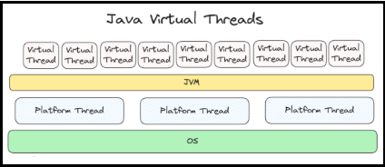
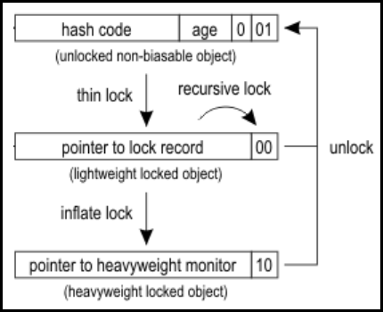
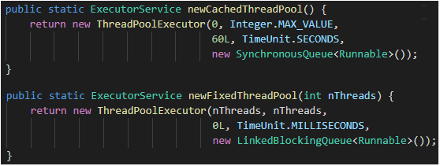
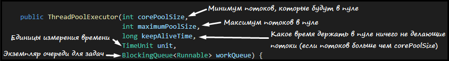
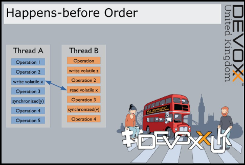

# [←](../README.md) <a id="home"></a> Threads

## Table of Contents:
- [Process](#process)
- [Thread](#thread)
    - [Daemon thread](#daemon)
    - [Thread Group](#group)
    - [Thread Priority](#priority)
    - [Yield](#yield)
    - [Thread Sleep](#sleep)
    - [Thread Interruption](#threadInterrupt)
- [Callable](#callable)
- [Threads Synchronization](#synchronization)
    - [Synchronized](#synchronized)
    - [Wait & Nnotify](#waitnotify)
    - [Join](#join)
	- [Deadlock](#deadlock)
    - [LockSupport](#lockSupport)
    - [Synchronizators](#sync)
- [ExecutorService](#executor)
- [CompletableFuture](#completableFuture)
- [Fork Join Pool](#forkJoinPool)
- [Memory consistency](#memoryConsistency)
- [Volatile keyword](#volatile)
- [Thread local](#threadlocal)
- [Atomicity](#atomicity)
- [Execution order](#order)
- [Synchronization primitives (Synchronizers)](#primitives)

----

## [↑](#home) <a id="process"></a> Process
The source code of a Java program is written as text in files with the **.java** extension.\
To execute this code, it must be compiled into an intermediate format called **bytecode** using the **[javac](https://docs.oracle.com/javase/8/docs/technotes/tools/unix/javac.html)** compiler.

The bytecode runs in a special environment called the Java Virtual Machine (**Java Virtual Machine**).\
A new instance of the Java Virtual Machine is launched using a special loader called by the **[java](https://docs.oracle.com/javase/8/docs/technotes/tools/unix/java.html)** command.

Each instance of the Java Virtual Machine runs as a separate process.\
**Process** is the basic unit of work in operating system terms.\
Each process is allocated its own resources to perform its work.\
Each process has its own memory area accessible only to that process.\
This area is called the **Virtual Address Space**.\
Therefore, no process can directly access the commands and data of another process.

To view JVM processes, use the **"Java Virtual Machine Process Status Tool"** utility (https://docs.oracle.com/en/java/javase/11/tools/jps.html).

Processes, in turn, consist of threads (Threads).\
Each process is a kind of container in which threads (Threads) related to that process run.\
Threads and their management are implemented by the operating system. Thread management is performed by the Thread Scheduler, which is also implemented on the operating system side.

The JDK includes a utility that can be used to view threads associated with a JVM process's PID: **"[jstack](https://docs.oracle.com/en/java/javase/11/tools/jstack.html)"**.

**The Java Virtual Machine** can interact with the operating system and its thread scheduler.\
Developers are provided with an API for working with threads. Part of this API is the special **java.lang.Thread** class.

----

## [↑](#home) <a id="thread"></a> Thread
**java.lang.Thread** is the primary class for working with threads.\
It's important to understand that **Thread** is not a thread itself on the operating system side,\
but rather an API for interacting with a thread.

When a Java program starts, the JVM (Java Virtual Machine) is launched, which in turn creates a thread in which the execution of the **public static void main** method will begin.\
This thread is called the **main thread**. The thread has its own Thread Stack.

The **Thread Stack** is a memory area consisting of frames.\
A frame is created upon method entry and deleted upon exit.\
Frames contain various local data: local variables, a reference to this, and a lightweight monitor.\
The stack size can be specified using the "**-Xss**" JVM parameter or the **Thread** constructor parameter.

The **current thread** is the thread in which the code is executing.\
The current thread is accessed using the static **Thread.currentThread()** method:
```java
public static void main(String[] args) {
	System.out.println(Thread.currentThread().getName());
}
```
In this case, for the main method, the current thread is the thread in which the main method is executed.

The Thread class has two methods: **run** and **start**.
- **start**:
The **start** method, by default, launches the private native **start** method, which asks the JVM to start a new thread. The run method will then be launched in the new thread from the start method.
- **run**:
The run method contains the code that will be executed in the thread.\
Therefore, to pass executable code to a thread, you must either override the run method or use a more convenient method: pass a **Runnable** instance in the Thread constructor.

**java.lang.Runnable** is something that can be executed in a thread.\
Furthermore, Runnable is a functional interface and can be used in lambda expressions:
```java
public static void main(String[] args) {
	Thread th = new Thread(() -> System.out.println("test"));
	th.start();
}
```

A thread terminates when the last frame is removed from the Thread stack, i.e., when the method where the thread began completes execution.


Since Java 21 we have the Virtual Threads in Java:



The idea is to use lightweight threads (virtual threads) on top of heavy and expensive platform threads.\
The **Continuations** are used to mount and unmount virtual threads from carrier thread (i.e. from platform thread).\
Continuations allow to store stack frames into heap and restore them back from heap to thread stack.

For more information:
- [Java Threads vs Virtual Threads | Why This Changes Everything](https://www.youtube.com/watch?v=0NtIcbSsjBc)
- [Continuations: The magic behind virtual threads in Java by Balkrishna Rawool @ Spring I/O 2024](https://www.youtube.com/watch?v=pwLtYvRK334)
- [Virtual Threads in JDK-24: The Synchronized Block Breakthrough Explained](https://www.youtube.com/watch?v=V4gsffMge7E)

It's intersting that virtual threads are always daemon threads, i.e. JVM doesn't wait untill all virtual threads will be finished.

----

### [↑](#home) <a id="daemon"></a> Daemon thread
Threads can be divided into regular threads and **Daemon threads**.

**Daemon thread** is a service or background thread.\
A Java program terminates when all non-daemon threads terminate.\
For example, the Java Finalizer creates a FinalizerThread, which, if necessary, calls the finalize() method on objects.\
This thread is a service thread, and its termination is not required for program termination, as it only functions while there are primary threads it services.\

The term **"daemon thread"** is a reference to Maxwell's demon, which can be further discussed in the Wikipedia article on **"[daemons](https://ru.wikipedia.org/wiki/Демон_(програма)"** =).

When a new thread is created, the thread group and daemon values ​​are taken from the thread that starts the new thread.\
Interestingly, a group can also be a daemon group.\
Such a group will be automatically destroyed when its last thread is stopped or destroyed.

----

### [↑](#home) <a id="group"></a> Thread Group
Threads are grouped into **ThreadGroups**.

A ThreadGroup represents a group of threads.\
A ThreadGroup can have a parent group, thus forming a ThreadGroup hierarchy.

Each thread belongs to a thread group.\
For example, the main thread (main) belongs to the main thread group, which is in turn a child of the system thread group (system).\
Thread groups allow you to restrict the priority of threads within them, as well as manage ThreadGroup-based security policies using SecurityManager.

ThreadGroup is a rather controversial API because it Even the book "Effective Java" has a chapter about it, "[Item 73: Avoid thread groups](https://books.google.ru/books?id=ka2VUBqHiWkC&lpg=PA288&dq=ThreadGroup%20Effective%20java&hl=ru&pg=PA288#v=onepage&q=ThreadGroup%20Effective%20java&f=false)".

Thread and ThreadGroup jointly set the **UncaughtExceptionHandler**.

**UncaughtExceptionHandler** is a handler for uncaught exceptions.\
If a thread hasn't set its own handler (using setUncaughtExceptionHandler), then the **ThreadGroup#uncaughtException** method will be called.\
By default, this method is implemented so that it checks whether **setDefaultUncaughtExceptionHandler** is assigned.\
If one is assigned, it calls it.\
If not assigned, then it goes up the thread group hierarchy until it reaches the root thread group.\
If no ThreadGroup overrides the **uncaughtException** method along the way, then upon reaching the root thread group, the stacktrace of Exception will be printed to System.err.

----

### [↑](#home) <a id="priority"></a> Thread priority
As mentioned above, the operating system's thread scheduler is responsible for thread management.\
However, Java provides tools to hint the scheduler. For this purpose, thread priorities can be changed.

**Priority** is a thread attribute that specifies the desired thread priority.\
Priority can be specified in the range from 1 to 10 or using constants:
```java
Runnable task = () -> System.out.println(Thread.currentThread().getName());
Thread newThread = new Thread(task);
newThread.setPriority(Thread.MAX_PRIORITY);
```
Priority is simply a hint to the thread scheduler about which thread should be given priority during execution.\
There are no guarantees.

The unit of execution time is **Clock tick**.\
A clock tick is a kind of conventional unit of measurement that can differ across operating systems.\
Clock ticks in Windows and Linux differ in duration in milliseconds (similar to how one dollar and one euro contain different numbers of rubles).

The thread scheduler allocates a timeslice to each thread, which consists of a certain number of clock ticks.\
This number is not constant but is calculated by the operating system scheduler, including based on priorities.\
When a thread runs out of its timeslice, it is preempted by other threads whose time has not yet expired.\
When all running threads have expired, the scheduler recalculates the timeslices for all threads, and the threads can run again.\
For more information on Linux, see "[Time Slice in Linux](https://it.wikireading.ru/1747)"**.

----

### [↑](#home) <a id="yield"></a> Yield
In Java, the "**[yield()](https://docs.oracle.com/en/java/javase/15/docs/api/java.base/java/lang/Thread.html#yield()**)" method can be used to signal to the scheduler that the thread's execution is not critical and that CPU time can be yielded.

You can read more about this here: **"[Thread.yield](https://www.javamex.com/tutorials/threads/yield.shtml)"**.

Furthermore, starting with Java 9, the static **Thread#onSpinWait** method was introduced, which provides a chance to optimize the execution of so-called spin waits.\
For more information, see **"[onSpinWait() method from Thread class](https://ionutbalosin.com/2018/06/onspinwait-method-from-thread-class/)"**.

----

### [↑](#home) <a id="sleep"></a> Thread Sleep
A thread's execution time can be given away more reliably than yeild.

A thread can be put to sleep by calling the **sleep** method:
```java
public static void main(String[] args) {
	try {
		Thread.sleep(10000);
	} catch (InterruptedException e) {
		e.printStackTrace();
	}
}
```

This will cause the thread to give up its timeslices for the duration of its sleep.\
Only after this time will the scheduler again give away execution time to the thread.\
The thread then enters the **"TIMED_WAITING (sleeping)"** state:
```
"main" #1 prio=5 os_prio=0 cpu=156.25ms elapsed=10.16s tid=0x00000255856a0000 nid=0x18cc waiting on condition [0x00000068150ff000]
java.lang.Thread.State: TIMED_WAITING (sleeping)
at java.lang.Thread.sleep(java.base@14.0.1/Native Method)
at TestClass.main(TestClass.java:10)
```

One of the fundamental rules of working with threads is that any wait on a thread can be interrupted.\
For this reason, method calls that cause a thread to wait must handle **InterruptedException**.

----

### [↑](#home) <a id="threadInterrupt"></a> Thread interrupt
Any Thread can be interrupted using the **interrupt()** method.\
Every Thread instance has a private flag, **"private volatile boolean interrupted"**.

This flag can be checked using the **isInterrupted** method, which returns the value of this flag and does not change it.

There is also a similarly named but static method, **Thread#interrupted**, which returns the current flag value for the current thread (in which the call is made) and resets the flag.

The Oracle tutorial (**"[Supporting Interruption](https://docs.oracle.com/javase/tutorial/essential/concurrency/interrupt.html)"**) recommends the following construct:
```java
if (Thread.interrupted()) {
	throw new InterruptedException();
}
```

**InterruptedException** is a checked exception that is thrown when a thread is interrupted.\
It can be thrown either by the developer (as in the example above) or when a thread waits and fails to check the **interrupted** flag.

----

## [↑](#home) <a id="callable"></a> Callable
So, **Thread** is a representation of a thread. To submit a task to a thread for execution, you must pass it a **Runnable** instance.\
This basic method is limited by the fact that we don't have direct access to the results.

**Calable** is an alternative way to represent a task for a thread, but unlike **Runnable**, it returns a result.\
Best of all, the task's execution method is declared as **throws Exception**, which eliminates the need to handle exceptions directly in the task definition.\
For example:
```java
Callable task = () -> {
	Thread.currentThread().sleep(1000);
	return 2 + 2;
};
```

The result of such tasks in Java is expressed by the **Future** interface.\
**Future** is something to be executed in the future.\
Tasks can be canceled using the **cancel** method.\
The **mayInterruptIfRunning** parameter can be used to specify whether to interrupt the thread if the task is already running.\
Future also provides a **get** method for retrieving the result.\
This method is synchronous, meaning it will wait until the result is available.\
There is also an alternative method that specifies a maximum wait time.

**FutureTask** is an implementation of Future and Runnable, meaning it represents a task that will be executed in the future and from which the result will be retrieved.\
It can be considered an adapter from Callable to Runnable:
```java
FutureTask future = new FutureTask(task);
new Thread(future).start();
try {
	System.out.println(future.get());
} catch (InterruptedException | ExecutionException e) {
	e.printStackTrace();
}
```

----

## [↑](#home) <a id="synchronization"></a> Thread synchronization
When multiple threads are running simultaneously, a race condition called a "[Race Condition](https://en.wikipedia.org/wiki/Race_condition)" can occur.\
Without synchronization mechanisms, threads accessing the same resource can produce unexpected results.\
For this reason, Java implements various thread synchronization mechanisms.

### [↑](#home) <a id="synchronized"></a> Synchronized
The basic synchronization mechanism is the **synchronized** keyword.\
**Synchronized** is a block of code (also sometimes called a critical section) that can be executed by only one thread at a time.

According to Oracle's **"[Intrinsic Locks and Synchronization](https://docs.oracle.com/javase/tutorial/essential/concurrency/locksync.html)"**, synchronization is built around a system entity called an **intrinsic lock** or **monitor lock**.\
It is also noted that the **monitor lock** is often simply called a monitor in the Java API documentation.
For example:
```java
public static void main(String[] args) {
	Object mutex = new Object();
	Object mutex2 = new Object();
	synchronized (mutex) {
		System.out.println(Thread.holdsLock(mutex)); //TRUE
		System.out.println(Thread.holdsLock(mutex2)); //FALSE
	};
}
```
In this case, a mutex object is used as the monitor.

Methods can also be synchronized:
```java
public synchronized int capacity() {
	return elementData.length;
}
```
For synchronized methods, the monitor will be either the instance of the current object whose method is called.\
If the method is static, the monitor will be an instance of a class (for example, Vector.class).

**Monitor** is a special entity associated with an object instance in Java.\
Every object in Java has an object header (**Object Header**).

**Object Header** is the header of an object, a kind of metadata for the object.\
The object header is not accessible to the developer from Java code, but is available to the JVM for proper object manipulation.

The object header consists of a **Class Ptr** (a link to the object's class metadata) and a **Mark Word**, which describes the object's state.\
For more information, see the article **[Java Object Header](https://habr.com/ru/post/447848/)**.\
The object's state contains the object's hash code,



The header contains a marker that the JVM uses to determine the monitor's state.\
For example, if this marker is "01" (see the image above), it means the monitor is not yet occupied (i.e., free).\
As you can see, a monitor can be either a **thin monitor** or a **heavyweight monitor**.

A thin monitor is a monitor that doesn't require operating system synchronization, reducing overhead.\
If the monitor is free, a copy of the object's current mark word is created on the stack of the thread seeking to acquire the resource.\
Using the CAS operation, the thread attempts to replace the current mark word with a reference to it.\
If the CAS operation succeeds, the monitor is busy, meaning the thread acquires the resource synchronized by this monitor.\
The marker value is then set to a different value so that other threads know this monitor is already acquired and that the mark word has been replaced with a reference to this mark word.\
This type of monitor is called a thin monitor.

If **CAS** fails (i.e., someone already occupied the monitor while we were trying to allocate it) or if the object header indicates that the monitor is already occupied, then the thin monitor is replaced with a **heavyweight monitor**.

A **heavyweight monitor** is a monitor implemented by the operating system.\
Working with it is more complex and therefore more expensive.\
This monitor has two queues: **WAIT SET** and **ENTRY LIST**.

Threads that attempted to enter the synchronization section but were unable to do so are placed in the **ENTRY LIST**.\
The status of such threads changes to **BLOCKED**.

There are also threads that specifically wait on a monitor.\
These threads are placed in **WAIT SET**, while threads that are not are placed in the **WAITING** status.\
More on this later.

Prior to JDK15 (see **"[JEP 374: Disable and Deprecate Biased Locking](https://openjdk.java.net/jeps/374)"**), there was also an optimization called **Biased Locking**.

**Biased Locking** is a lock in which the monitor (as an entity) is not actually created yet, and instead of the object's hashcode, the data of the thread that captured the "monitor" is written.\
This lock remains in effect until different threads start using the same monitor.\
For more details, see **"[Synchronization and Object Locking](https://wiki.openjdk.java.net/display/HotSpot/Synchronization)"**.

----

### [↑](#home) <a id="waitnotify"></a> WAIT & NOTIFY
Every Java object (thanks to implicit inheritance from java.lang.Object) has two methods: **Wait** and **Notify**.\
These methods are called on the specified monitor.\
However, for these methods to work correctly, the calling thread must own this monitor, otherwise we'll get an Exception:
```
java.lang.IllegalMonitorStateException: current thread is not owner
```

Consequently, these methods must be used **INSIDE** synchronization blocks.\
For example:
```java
public static void main(String[] args) {
	Object mutex = new Object();
	Runnable task = () -> {
		synchronized (mutex) {
			mutex.notify();
		}
	};
	synchronized (mutex) {
		new Thread(task).start();
		try {
			mutex.wait();
		} catch (InterruptedException e) {
			e.printStackTrace();
		}
	}
	System.out.println("END");
}
```
As can be seen from the example, the main thread first occupies the monitor, starts a second thread from it, and enters the monitor's WAIT SET state.\
This ensures that the main thread doesn't terminate, that the thread executing the task starts, and that the task thread won't be able to execute notify before the main thread executes wait, as it simply won't be able to enter synchronized mode on the mutex.

Since WAIT is a thread-specific wait, any such block must handle the checked exception **InterruptedException**.

Also, there is a **notifyAll** method to wake up all waiting threads for the used monitor.\
It can be important in cases when several threads are waiting for the monitor.\
Because blocked thread will be unblocked when monitor is available.\
But waiting thread will not be unblocked whe monitor is available. It will be unblocked only with notification.

----

### [↑](#home) <a id="join"></a> JOIN
Another method for putting a thread into the **WAITING** state is **join**.\
Often, waiting on a monitor is necessary to await the results of another thread.\
Therefore, it's inconvenient to write so much code each time and work at such a low level as wait/notify.\
Therefore, a slightly higher-level mechanism was invented: **[join](https://docs.oracle.com/javase/tutorial/essential/concurrency/join.html)**.

**join** is a method that allows the thread in which it is running to wait for the results of another thread.

How does it work?\
The **join** method is declared as follows:
```java
public final void join() throws InterruptedException {
```

Also, it's important to read the Java API of this method:
> This implementation uses a loop of this.wait calls conditioned on this.isAlive. As a thread terminates, the this.notifyAll method is invoked.

This means that when thread T1 calls the **join** method on thread T2, then:
- T1 waits for instance T2's monitor to become available
- T1 calls wait on it. This means it joins monitor T2's wait set, after which it releases monitor T2
- T2 completes its execution, after which it executes notifyAll, and everyone who joined on monitor T2 wakes up

----

### [↑](#home) <a id="deadlock"></a> Deadlock
There can be a situation when threads are waiting for each other for the infinite time.\
Such cases are called deadlocks:
```java
public static void main(String[] args) throws Exception {
	Object mutex1 = new Object(), mutex2 = new Object();
	BiConsumer<Object, Object> taskConsumer = (o1, o2) -> {
	  new Thread(() -> {
		  synchronized (o1){
			  try {
				  Thread.sleep(500);
				  synchronized (o2){
					  System.out.println("done");
				  }
			  } catch (InterruptedException e) {
				  throw new RuntimeException(e);
			  }
		  }
	  }).start();
	};
	taskConsumer.accept(mutex1, mutex2);
	taskConsumer.accept(mutex2, mutex1);
}
```
Similar thing is a live lock. In that case threads are not blocked, but they are constantly trying to get locks.\
Instead of blocking they release blocks and try to get monitors again and again.

----

### [↑](#home) <a id="lockSupport"></a> LockSupport
Starting with JDK 1.5, higher-level features were introduced to simplify working in a multithreaded environment.\
They are based on **LockSupport**.

**LockSupport** is a thread **"parking"** mechanism that doesn't use a monitor, but rather uses less expensive platform-specific features.\
For example, these could be Windows Events or Conditional Wait.

LockSupport provides two methods:
- LockSupport.park() parks the thread in which it was called
- LockSupport.unpark(thread) unparks the specified thread

Another feature of parking is that a parked thread can be interrupted using the interrupt() method, but this will not raise an exception, although the thread's **isInterrupted()** will return true.

The implementation of **java.util.concurrent.locks.Lock** is based on LockSupport.\
For example, **ReentrantLock**:
```java
ReentrantLock lock = new ReentrantLock();
new Thread(() -> {
	lock.lock();
	System.out.println("Hello, world!");
	lock.unlock();
}).start();
```

**ReentrantLock** is a lock that allows you to acquire and release a lock similar to acquiring and releasing a monitor, but it's more convenient to use.\
For example, acquiring and releasing a lock can be done in different methods.\
Furthermore, a lock can be acquired either without throwing an InterruptedException when a thread is interrupted, or with an InterruptedException.

Interestingly, **ReentrantLock** is used in blocking queue methods (e.g., ArrayBlockingQueue).

Furthermore, **ReentrantLock** supports a feature similar to **Thread#wait**, called **Condition**, i.e., waiting on a condition.\
For example, a real-world example from **ArrayBlockingQueue#take()**:
```java
public E take() throws InterruptedException {
	final ReentrantLock lock = this.lock;
	lock.lockInterruptibly();
	try {
		while (count == 0)
			notEmpty.await();
			return dequeue();
		} finally {
			lock.unlock();
		}
}
```
As you can see, when calling the take method, we attempt to take a block or park it until we are unparked.\
If the lock is acquired, we check whether the count of elements is zero.\
If so, we call the await method on the Condition, which is called notEmpty.\
When inserting an element triggers **notEmpty.signal()**, execution continues and retrieves the element.

**ReentrantReadWriteLock** is a lock similar to ReentrantLock, but consists of two locks: one for writing and one for reading.\
This separation of read and write locks is used, for example, by **[ZipFileSystem](https://docs.oracle.com/javase/8/docs/technotes/guides/io/fsp/zipfilesystemprovider.html)**:
```java
private void endWrite() {
	rwlock.writeLock().unlock();
}

private void beginRead() {
	rwlock.readLock().lock();
}
```

**StampedLock** is a lock variation that uses a **stamp** long value as a lock.\
It's a kind of lock version. With this version, you can check for a lock and release it by specifying a stamp.\
This is primarily used to implement optimistic locking, which avoids locks:
```java
double distanceFromOriginV1() { // A read-only method
	long stamp;
	if ((stamp = sl.tryOptimisticRead()) != 0L) { // optimistic 
		double currentX = x; 
		double currentY = y; 
		if (sl.validate(stamp)) 
			return Math.sqrt(currentX * currentX + currentY * currentY); 
	} 
	stamp = sl.readLock(); // fall back to read lock 
	try { 
		double currentX = x; 
		double currentY = y; 
		return Math.sqrt(currentX * currentX + currentY * currentY); 
	} finally { 
		sl.unlockRead(stamp); 
	}
}
```
For more details, see **"[Class StampedLock](https://docs.oracle.com/javase/8/docs/api/java/util/concurrent/locks/StampedLock.html)"**.

----

### [↑](#home) <a id="sync"></a> Synchronizators
In addition to these mechanisms, there is a whole range of synchronizers.\
One of the most well-known is the "semaphore."

Semaphore is an interesting synchronization tool that uses thread parking and is based on permissions.\
A thread can request a permission, and if it is non-zero, it continues running.\
If there are no permissions, the thread will wait until a permission becomes available.\
Semaphores can be created with varying numbers of available permissions.

You can also read the following resources about semaphores:
- [Mutex vs. Semaphore](https://www.geeksforgeeks.org/mutex-vs-semaphore/)
- [Typical Semaphore Use](http://www.embeddedlinux.org.cn/rtconforembsys/5107final/LiB0039.html)

Regarding other synchronizers, the following resources are a must-read:
- [Reference on java.util.concurrent.* Synchronizers](https://habr.com/ru/post/277669/)

----

## [↑](#home) <a id="executor"></a> ExecutorService
Threads are great, but creating them manually isn't very convenient.\
Therefore, Java provides the java.util.concurrent.Executor interface, which has just one method: execute(Runnable command).

Executor has a subclass, ExecutorService.\
ExecutorService is an Executor that can service running tasks: track progress, stop them, etc.

The java.util.concurrent.Executors factory utility class is used to create ExecutorServices.\
This class allows you to create the most commonly used ExecutorService configurations:
```java
ExecutorService service = Executors.newFixedThreadPool(4);
```

ExecutorService allows us:
- execute runnables
- submit calleble (and runnable) and get the Future to handle the result

As soon as the first runnable/callable is executed the Executor Service creates threads that will not allow to finish the application.\
That's why we should **shutdown** the executor service. In that case already launched tasks will be finished, but new tasks will be ignored.

The **shutdown** method changes the executor service "isShutdown" state to true.\
All old tasks will be executed, new tasks produces rejected exception.

The **shutdownNow** method tries to innterupt currently runned tasks (if code handle interruption).\
queued tasks will be returned as a list, new tasks throw rejected exception.

The **awaitTermination** method blocks the current thread and wait until all running tasks will be executed.\
When executor service completed all tasks after shutdown the "isTerminated" state will be true.

Since Java 19 the ExecutorService is AutoCloseable resource:
```java
public interface ExecutorService extends Executor, AutoCloseable {
```
So now we can use it with try-with-resources:
```java
public static void main(String[] args) throws Exception {
	try (var executorService = Executors.newFixedThreadPool(5)){
		executorService.submit(() -> System.out.println("test"));
	}
}
```

ExecutorService allows you to conveniently submit tasks for execution using the submit method, while also receiving a **Future** instance for asynchronous processing of the result:
```java
ExecutorService service = Executors.newFixedThreadPool(4);
Future future = service.submit(() -> 2 + 2);
System.out.println(future.get());
service.shutdown();
```

It's worth noting that the first time you submit, new threads will be created, and to terminate them, you must execute the **shutdown** method.

ExecutorServices differ from each other in how the underlying **ThreadPoolExecutor** is configured.\
**ThreadPoolExecutor** is the thread pool where tasks will be executed:



The **ThreadPoolExecutor** configuration looks like this:



The following pool configurations are configured based on these configurations:
- **Single Thread Pool**
Tasks are stacked in a nearly unlimited [LinkedBlockingQueue](https://docs.oracle.com/en/java/javase/15/docs/api/java.base/java/util/concurrent/LinkedBlockingQueue.html). From there, tasks are sent one after another to a single thread.
- **Fixed Thread Pool**
Tasks are stored in a nearly unlimited [LinkedBlockingQueue](https://docs.oracle.com/en/java/javase/15/docs/api/java.base/java/util/concurrent/LinkedBlockingQueue.html). From there, tasks are sent one after another to the specified number of threads. Threads have an unlimited lifespan. The specified number of threads will be created.
- **Cached Thread Pool**
Tasks are stored in a SynchronousQueue. The thread that places a task is suspended until the task is executed. The pool starts with 0 threads and expands as needed to Max Integer threads. Threads are idle for only a minute, after which they are suspended.
- **WorkStealingPool**
A thread pool based on the work stealing algorithm and using the ForkJoinPool.


Furthermore, there is a special type of pool that allows for executing tasks with a delayed start:
```java
ScheduledExecutorService service = Executors.newScheduledThreadPool(4);
Callable task = () -> { return 2 + 2;};
ScheduledFuture future = service.schedule(task, 1, TimeUnit.MINUTES);
System.out.println(future.get());
```

----

## [↑](#home) <a id="completableFuture"></a> CompletableFuture
A **CompletableFuture** is a description of a task to be executed in the future.\
This task can also be broken down into stages, as expressed by the **CompletionStage** interface, which provides stage management.\
This feature is one of the highest-level APIs, so it's used in frameworks.\
For example, the Spring Framework uses CompletableFuture for asynchronous request processing and the **"[@Async](https://spring.io/guides/gs/async-method/)"** annotation.

The simplest way to create a CompletableFuture is to create a completed Future:
```java
public static CompletableFuture<String> getResult() {
	return CompletableFuture.completedFuture("result");
}
```

But there are much more interesting things.\
CompletableFuture has static methods whose names begin with **Async**, as the main purpose of CompletableFuture is to return an object NOW in the current thread, through which the result to be obtained LATER can be accessed.

Secondly, Completable Futures use java.util.function.Supplier for computation, not Callable, to maximize the focus on the work and minimize the details of threading.\
For example:
```java
public static CompletableFuture<String> getResult() {
	Supplier<String> supplier = () -> "result";
	return CompletableFuture.supplyAsync(supplier);
}
```
In this case, supplyAsync will execute supplier, but will return a new CompletableFuture BEFORE the result is ready.

Now that we have a completable future instance, we can build chains:
```java
public static CompletableFuture<String> getResult() {
	Supplier<String> supplier = () -> "result";
	return CompletableFuture.supplyAsync(supplier)
		.thenApply(s -> s + "!");
}
```

For more details:
- **"[Asynchronous Web Service Using CompletableFuture](https://nickebbitt.github.io/blog/2017/03/22/async-web-service-using-completable-future)"**

----

## [↑](#home) <a id="forkJoinPool"></a> Fork Join Pool
Starting with Java 1.7, an interesting mechanism was introduced: **Fork Join Pool**.\
**Fork Join Pool** is a thread pool based on the work stealing algorithm:


Thus, each thread has its own queue, into which it places tasks on one side and takes them from the other.\
Furthermore, when a thread's tasks are rotating, it can take tasks from another thread.\
If there are no tasks, tasks are taken from a shared queue, parts of which are associated with threads.

Since this is a pool, Fork Join can be used implicitly via ExecutorService:
```java
ExecutorService service = Executors.newWorkStealingPool();
Future future = service.submit(() -> "test");
```

(!) It's important to know that there is a specific common ForkJoinPool that can be used for different mechanisms in java.\
It's called **Common Pool** and it's available with:
```java
ForkJoinPool.commonPool()
```
This pool is used by default by CompletableFuture async methods and by parallel streams.

The name Fork Join Pool is not accidental.\
Fork Join Pool is designed so that any task can be broken down into subtasks.\
Each task can be executed either on the same thread (compute) or on a different thread (fork).\
If a task is forked, it can be joined:
```java
public static class FibonacciTask extends RecursiveTask< Integer> {
	private final int number;

	FibonacciTask(int number) {
		this.number = number;
	}

	@Override
	public Integer compute() {
		if (number < 2) return number;
		FibonacciTask f1 = new FibonacciTask(number - 1);
		FibonacciTask f2 = new FibonacciTask(number - 2);
		f1.fork();
		return f2.compute() + f1.join();
	}
}
```

This task is simply sent to the pool, after which it begins to be shared during execution:
```java
ForkJoinPool fjp = new ForkJoinPool();
Integer result = fjp.invoke(new FibonacciTask(6));
System.out.println(result);
```

Furthermore, there is RecursiveAction, a RecursiveTask analogue that does not return a result.\
You could say it's a kind of Callable and Runnable analogue.

For more details, please check: **"[Jakob Jenkov: Java ForkJoinPool](https://www.youtube.com/watch?v=aiwuJQt7YJU)**".

Also:
- [What is a Fork Join pool?](https://www.youtube.com/shorts/ZE2pBylyoFA)
- [What is the difference between a Fork Join pool and an Executor Service?](https://www.youtube.com/shorts/sSw8r2hxCtk)
- [What is the difference between an Executor Service and a Fork / Join pool?](https://www.youtube.com/shorts/czrQeV5ovSQ)

----

## [↑](#home) <a id="memoryConsistency"></a> Memory consistency
Multithreading has its advantages, but also its pitfalls.\
The main problem is memory consistency.

Memory consistency is the consistent and correct state of memory.\
Oracle states in "[Java Tutorial: Memory Consistency Errors](https://docs.oracle.com/javase/tutorial/essential/concurrency/memconsist.html)" that memory consistency errors cause data that should be visible to different threads to be seen in different states (with different values).

These errors are caused by optimizations in the execution of program instructions by the processor.\
These optimizations improve performance, but at the cost of more complex execution logic.

To make life easier for Java developers, the **[Java Memory Model](https://docs.oracle.com/javase/specs/jls/se15/html/jls-17.html#jls-17.4)** was described.\
**The Java Memory Model** is a memory model that explains the possible behavior of threads (what data they see and when) and the rules the developer must follow to achieve the expected result.

There is a brilliant talk on this topic by Alexey Shipilov, "[Close Encounters of the JMM Degree](https://youtu.be/C6b_dFtujKo?t=2855)", which explains that knowing and strictly following the rules specified by the Memory Model will save you from most problems.

These rules are expressed by the concept of **Happens-before**, which are described in the Java Language Specification: **[17.4.5. Happens-before Order](https://docs.oracle.com/javase/specs/jls/se8/html/jls-17.html#jls-17.4.5)**.\
These rules are also easily found in the JavaDoc of the **[java.util.concurrent](https://docs.oracle.com/javase/8/docs/api/java/util/concurrent/package-summary.html#MemoryVisibility)** package.

It's also useful to read about **[Safe Publication](https://shipilev.net/blog/2014/safe-public-construction/)**.\
This rule is expressed as follows:
> Safe publication makes all values ​​written before publication visible to all readers that observe the published object.

----

## [↑](#home) <a id="volatile"></a> Volatile keyword
What does it mean **[Volatile](https://www.youtube.com/shorts/qJm6RoEy9_s)** keyword.

Volatile means that something is expected to be changed.\
The idea is that volatile fields are expected to be changed from different threads.\
And in that case we need to establish the **happens before** relations between different threads.



There can be different reasons why it will not work without volatile: cpu caches, reordering or other optimizations.\
Java developers can only rely on the **happens before** guarantees.

Volatile keyword establish **happens before** guarantees without synchronizations.\
So it means that we do not fix such things as race conditions, only visibility problem.

Main rule:
> volatile writes happens before volatile read

----

## [↑](#home) <a id="threadlocal"></a> Thread local
Java provides an interesting mechanism:
```java
ThreadLocal<String> user = new ThreadLocal<>();
```
Such variables allows to define variable and share it across different threads.\
BUT each thread will see own value.

By default, ThreadLocal doesn't see parent threads.\
But there is a specific version: ``InheritableThreadLocal``.\
For example:
```java
<String> local =
        new InheritableThreadLocal<>();
```
In that case child threads will see parent thread data.


ThreadLocals are very useful for frameworks.\
For example, Hibernate uses ThreadLocal for transaction propagation.\
See ``TransactionSynchronizationManager`` for more details.

ThreadLocal can be a reason for memory leak.\
Pooled threads can store data longer than expected.\
Also, thread locals can hold virtual threads in "pinned" state.\
That's why thread local usage in virtual threads is antipattern.

----

## [↑](#home) <a id="atomicity"></a> Atomicity
Atomicity is a very important aspect for concurrency programming.

For example, increment is not an atomic operation:
```java
a++; // read value, increment it, store it
```
In the concurrency program we can increment old value, we can override already incremented value,we can read old data.\
That's why atomicity should be implemented when it's needed by specific Java tools.

The easiest thing is: **Atomic** types.\
For example:
```java
AtomicInteger counter = new AtomicInteger();
counter.getAndIncrement(); // the same as counter++ for regular int
```

How it works?\
It's based on the **CAS (Compare and swap)** idea:
```java
do {
    oldValue = value.get();
    newValue = calculateNewValue(oldValue);
} while (!value.compareAndSet(oldValue, newValue));
``` 
That's why we don't need to block threads.\
We just repeat our action until the old value (snapshot before the operation) is equal to the current value.\
It means that we calculated value for the most recent state.

There are different data structures that use CAS.\
For example, there are Lock-free queues: ConcurrentLinkedQueue and ConcurrentLinkedDeque.\
As you can see, the are "linked", i.e. has references from elements to elements.\
That's why the CAS approach and Atomic References can be used in such cases.

It's interesting that previously in old days of Java, the long и double are not guaranteed to be read and write atomatically.\
That's why JVM specification does't guarantees atomic read/write for them.\
But on modern systems it's not the case anymore.\
But previously such variables should have been marked as volatile for atomic read/write.

It's interesting that Atomics can be a problem with high contetion.\
In that case the ``LongAdder`` can be used.\
It uses the "eventually consistency" idea when it's not important to get the exact value.\
With hight contention LongAdder splits into several cells. The counter incremented in different cells.\
The result getter just summarize them all without any blocking. That's why it has the eventually consistency.

----

## [↑](#home) <a id="order"></a> Execution order
Execution order is a complex topic when code works in multithreaded environment.

In the same thread there is a rule:
> each action happens-before next action inside the sabe thread

This order is called **Program Order**.\
Or **the Program Order Rule**.

**Race Condition** occures when several threads work with the same code and result depends on the execution order.\
For example, we have shared resource:
```java
AtomicInteger balance = new AtomicInteger(100);
```

And then we have several threads that perform the same code:
```java
if (balance.get() >= 100) {
    balance.addAndGet(-100);
}
```
The problem here that we have a race condition.\
We have a thread-safe atomic method ``get`` and ``addAndGet``.\
But the code is not thread-safe.\
There is some time between if condition and if body. Other threads can change the result of balance.get at this time.\
So that's why we can't guarantee the code correctness in that case and such code is not thread-safe.

There are cases that are called **Data race** when race conditions happens for non atomic actions in terms of used constructions (i.e. syntax).

For example, object publishing can be treated as data race.\
The safest way to publish objects (i.e. make them visible to other threads) it to make them final.\
Final fields follow the **"happens before"** rule:
> final fields initializations go BEFORE reads from such fields

Also, ``volatile`` keyword guarantee safe publication of object.\
So, it means that it can be used for non-final context.

Also, synchronized sections OR locks guarantee safe publication.\
BUT only if read and write operations use the same locks/monitors.

When we are talking about Race condition we also should mention the **Starvation**.\
**Starvation** happens when some threads can't get a chance to execute actions and wait for other threads.\
For example, **synchoronized** mechanism doesn't guarantee the fairness of getting time to execute instructions.

**ReentrantLock** in java has an additional parameter for fairness.\
Also, **Semaphore** has the fairness attribute and the **ArrayBlockingQueue**.\
It's not so common because fairness reduces throughput.\
That's why the **non-fair** mode is enabled by default in most cases.

----

## [↑](#home) <a id="primitives"></a> Synchronization primitives (Synchronizers)
Synchronization primitives or Synchronizers are special tools to synchronize threads.

The most simple one is **Semaphore**.\
Semaphore has a limited permits count (that is defined at construction time).\
Each thread can **acquire** permits or **release** permits.\
When there are no available permits then thread will be waiting in parked state.\
For example:
```java
public static void main(String[] args) throws Exception {
	Semaphore sem = new Semaphore(3);
	AutoCloseable resource = sem::release;
	Runnable task = () -> {
		try (resource){
			sem.acquire();
			Thread.sleep(1000);
			System.out.println(Thread.currentThread().getName());
		} catch (Exception e) {
			throw new RuntimeException(e);
		}
	};
	for (int i = 0; i < 10; i++) Thread.ofPlatform().start(task);
}
```

The **CountDownLatch** a little bit similar to **Latch** in electronics.\
It has a counter. Threads can reduce the counter. When counter is zero then all threads in waiting state will be released.\
```java
public static void main(String[] args) throws Exception {
	CountDownLatch latch = new CountDownLatch(3);
	Runnable longTask = () -> {
		try {
			Thread.sleep(1000);
			latch.countDown();
		} catch (InterruptedException e) {
			throw new RuntimeException(e);
		}
	};
	for (int i = 0; i < 3; i++) Thread.ofPlatform().start(longTask);
	latch.await();
}
```

The next option is **CyclicBarrier**.\
Example:
```java
public static void main(String[] args) throws Exception {
	int parties = 3;
	CyclicBarrier barrier = new CyclicBarrier(parties);
	Runnable task = () -> {
		try {
			System.out.println("Phase 1");
			barrier.await();
			System.out.println("Phase 2");
			barrier.await();
		} catch (InterruptedException | BrokenBarrierException e) {
			throw new RuntimeException(e);
		}
	};
	for (int i = 0; i < parties; i++) new Thread(task).start();
}
```
The problem is that barrier can be broken.\
When one of these thread die other threads get a BrokenBarrierException.\
This synchronizer is not very flexible. That's why the **Phaser** is recommended instead.

```java
public static void main(String[] args) throws Exception {
	Phaser phaser = new Phaser(3);
	Runnable task = () -> {
		for (int i = 0; i < 3; i++) {
			System.out.println(Thread.currentThread().getName() + " phase " + i);
			phaser.arriveAndAwaitAdvance();
		}
	};
	for (int i = 0; i < 3; i++) new Thread(task).start();
}
```
Phaser provides a very flexible API.\
For example, we can not only arrive, but we can deregister the thread from Phaser.\
Also, Phaser supports hierarchy of Phasers when child phaser register itself as a single participant.\
In that case when all threads in child Phaser arrive then it's treated as a single arrival on parent Phaser.

The last synchronizer in this list - **Exchanger**.\
Echanger just exchange the reference between threads.\
It means that one thread calls exchange and wait untill other thread calls exchange on the same exchanger.\
For example:
```java
public static void main(String[] args) throws Exception {
	interface Task { void run() throws Exception; }
	Function<Task, Runnable> convert = (task) -> () -> {
		try {task.run();} catch (Exception e) {e.printStackTrace();}
	};
	byte[] data = new byte[100];
	Exchanger<byte[]> exchanger = new Exchanger<>();
	Task writeTask = () -> {
		for (int i = 0; i < 100; i++) data[i] = 1;
		Thread.sleep(2000);
		exchanger.exchange(data);
	};
	new Thread(convert.apply(writeTask)).start();
	Task readTask = () -> {
		byte[] result = exchanger.exchange(data);
		for(byte b : result) System.out.print(b);
	};
	new Thread(convert.apply(readTask)).start();
}
``` 

----
