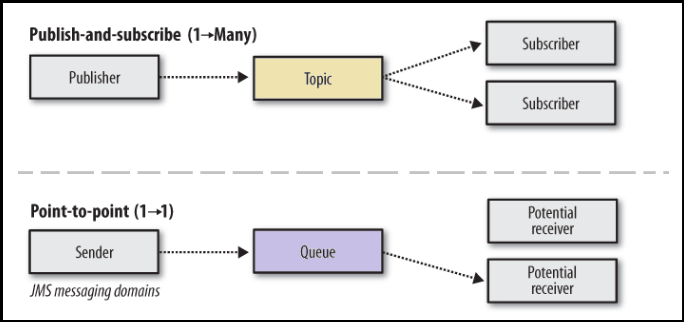
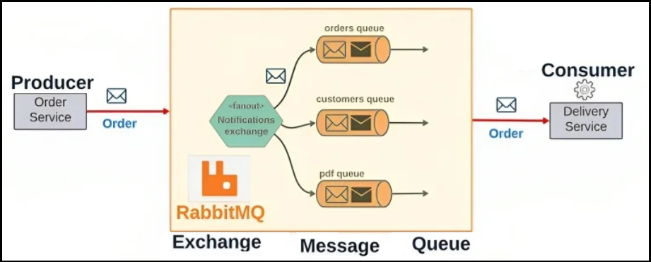
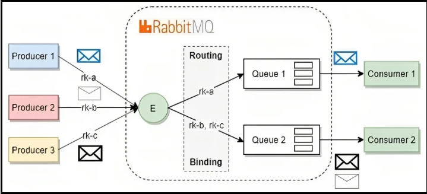
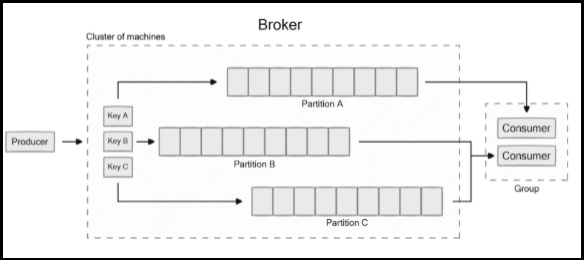

# [←](../README.md) <a id="home"></a> Brokers

## Table of content:
- [JMS](#jms)
- [RabbitMQ](#mq)
- [Kafka](#kafka)

----

## [↑](#Home) <a name="jms"></a> JMS
There are different message brokers exists.\
Previously, there was an attempt to standardize them.\
This is how the contract came about: **JMS**.

**Java Message Service (JMS)** is a contract or API for messaging.\
Core components are: provider, client and messages.\

It supports two main styles: 
- Point-to-Point (Queue):\
Messages are sent to a specific queue and consumed by exactly one receiver. The message is held in the queue until it is successfully processed.
- Publish/Subscribe (Topic):\
Messages are published to a topic and can be delivered to multiple subscribers (receivers) simultaneously.

The Difference between topic and queue visualization:



There are different types of JMS messages that can be used:
- TextMessage
- MapMessage (key as strings, values as java primitives)
- BytesMessage
- StreamMessage (Java primitive sequence)
- ObjectMessage (serialized java object)
- Message (empty message)

There are also Message Selectors.\
**Message selector** in JMS is a condition that **consumer** defines when subscribes to topic or queue.\
Broker checks conditions and sends only matched messages.\
For example:
```java
MessageConsumer consumer =
    session.createConsumer(queue, "type = 'NEW'");
```
It's quite similar to SQL where conditions.

Also, the JMS message durability is an interesting topic.\
The message durability approach depends on JMS mode: queue or topic.

There are two **delivery modes**:
- PERSISTENT 
```java
producer.setDeliveryMode(
    DeliveryMode.PERSISTENT
);
```
Message will be stored until consumer takes it even if broker will die.
- NON_PERSISTENT
```java
producer.setDeliveryMode(
    DeliveryMode.NON_PERSISTENT
);
```
Message will be lost if broker will die

Usually, if topic subscriber is offline the message will not be consumed.\
But consumer can be created as a **durable consumer**:
```java
TopicSubscriber subscriber =
    session.createDurableSubscriber(
        topic,
        "subscriber1"
    );
```
In that case broker resends message when consumer is online.

Consumers can define when message retrieval will be acknowledged.\
Consumers have differet **acknowledgment** options:\
AUTO_ACKNOWLEDGE, CLIENT_ACKNOWLEDGE (do not have cancel/roll back options), DUPS_OK_ACKNOWLEDGE (at least once), Session.SESSION_TRANSACTED (exactly once).

----

## [↑](#Home) <a name="mq"></a> RabbitMQ
RabbitMQ is another message broker that is similar to JMS API BUT doesn't implement JMS API directly.



RabbitMQ has an idea of exchanges that defines rules of message routing via bindings.



----

## [↑](#Home) <a name="kafka"></a> Kafka
Kafka is a message broker that uses topics to provide and consume messages.



The idea is to send message to a topic.\
Topic consists of several partitions.\
Messages are stored in partitions at some **offset** (i.e. internal index in partition).

Consumers belongs to a group.\
Kafka knows where (i.e. at which offset) each group reads messages for partitions (as group.id + topic + partition).

Messages by default distributed across different partitions.\
But producer can use the **partitioning key** to send all messages with the same key to the same partition.\
That guarantees the messages order inside the SAME partition.

To ensure **message uniqueness** there can be set the **idempotent** feature.\
It can be enabled on the producer and on the consumer side.

Idempotent producer has a specific configuration ``enable.idempotence=true``.\
Also, it should have non-zero ``retries`` config and ``max.in.flight.requests.per.connection`` not bigger than 5.\
Also, it should have ``acks = all`` to ensure that we safely acknowledge messages.

Idempotent consumer should implement checks programmatically (i.e. store it in database).

Also, it's interesting that Kafka returns **metadata** to producers:
```java
ProducerRecord<String, String> record =
        new ProducerRecord<>("orders", "order-1");
Future<RecordMetadata> future =
        producer.send(record);
RecordMetadata metadata = future.get();
long offset = metadata.offset();
```
So it means that we know metadata of our sent data.

The more interesting topic is how Kafka brokers communicate with each other and how to configuret them.

At first, it worth to mention the fanstastic youtube chanel from **[Confluent](https://www.youtube.com/@Confluent)**.\
This channel contains **A LOT** of information about Kafka. Let's use it.

It's recommended to start with: **"[Apache Kafka 101(2025 Edition ft. Tim Berglund)](https://www.youtube.com/watch?v=hyfX3_RB5cw&list=PLf38f5LhQtheK16nwnCYFqH23WUUvZfSb)"**.\
Then, it will be nice to check **"[Apache Kafka® Architecture](https://www.youtube.com/watch?v=RYC-7wECMds&list=PLa7VYi0yPIH14oEOfwbcE9_gM5lOZ4ICN)"** for more details.

Kafka can be easily used from Java: **"[Spring Framework and Apache Kafka](https://www.youtube.com/watch?v=g5hkBP4cMRM&list=PLa7VYi0yPIH1Su3nVNuRePh2Gdw6_UujU)"**.

Also, there are several useful playlists:
- **"[Designing Event-Driven Microservices](https://www.youtube.com/watch?v=U3o9Br6JsY8&list=PLa7VYi0yPIH0IpUKXb3q7NSjpJGO9GGGZ)"**
- **"[Designing Events and Event Streams Course](https://www.youtube.com/watch?v=HBGyGT-vbEE&list=PLa7VYi0yPIH145SVtPoh3Efv8xZ1ehUYy)"**
- **"[Kafka Security Course](https://www.youtube.com/watch?v=-HlRFh9GfWw&list=PLa7VYi0yPIH2t3_wc1tm1rHDO9tbtfX1T)"**
- **"[Event Sourcing and Event Storage with Apache Kafka](https://www.youtube.com/watch?v=p_sSRwpBkgs&list=PLa7VYi0yPIH1TXGUoSUqXgPMD2SQXEXxj)"**
- **"[Kafka Streams 101 Course](https://www.youtube.com/watch?v=gJUTErFyuY4&list=PLa7VYi0yPIH35IrbJ7Y0U2YLrR9u4QO-s)"**

----
