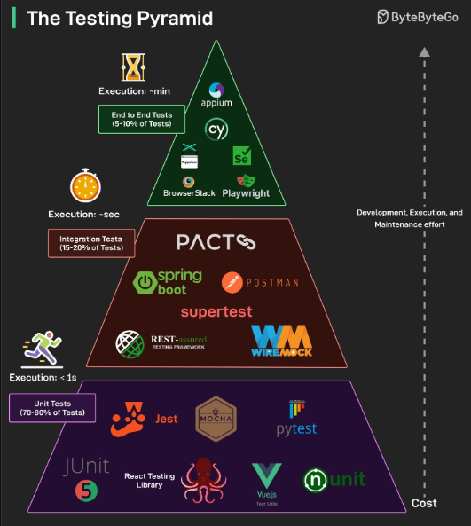
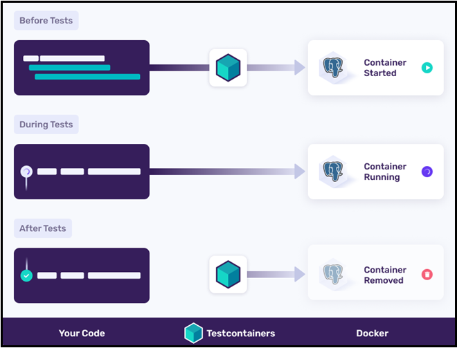
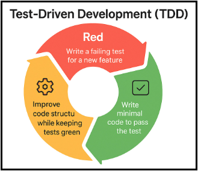

# [←](../README.md) <a id="Home"></a> JUnit

## Table of content:
- [Testing](#tests)
- [Test-Driven Development (TDD)](#tdd)
- [JUnit architecture (engine vs runner)](#arch)
- [Test categorization (tags and categories)](#category)
- [Parametrization](#parameters)
- [Assertions](#asserts)
- [Mocks](#mocks)
- [Behavior-Driven Development (BDD)](#bdd)

----

## [↑](#Home) <a name="tests"></a> Testing
Code should be tested. It can reduce a chance of having bugs.

There are different approaches to test applications.\
We can look at Test Pyramid:



Unit Tests allow to check specific unit (usually method) without real external dependencies.\
Other categories add new participants and such tests are more complex and they require more efforts to create them and maintain.

Integration tests can be implemented in different ways.\
Frameworks (like Spring) may provide own libraries to manage integration tests.\
Also, **Testcontainers** allow to perform such tests:



Also, there are **end-to-end** tests to test fully set system.\
For example, the **RestAssured** can be used for such tests.

To tests contracts between different components the specific **contract tests** can be used.\
For example: Pact or Spring Cloud Contract can be used.

Also, even performance can be tested.\
The **JMeter** can be used for such purposes.


----

## [↑](#Home) <a name="tdd"></a> Test-Driven Development (TDD)
Test-Driven Development is a specific approach to write code:



The idea is that tests should go first and then properly written test should became green when implementation will be correct.\
Also, the idea is that we can improve code and test it already because we have a test that can prove that feature is working fine.

For example: **"[Dan Vega: Test Driven Development (TDD) in Spring](https://www.youtube.com/watch?v=-H5sud1-K5A)"**

There are different [TDD Katas](https://www.tddbuddy.com/katas/) on the internet that can be used to practice TDD.

----

## [↑](#Home) <a name="arch"></a> JUnit architecture (engine vs runner)
There are two main JUnit versions: [JUnit4](https://junit.org/junit4/) and [JUnit5](https://junit.org/).\
JUnit version 5 is not final and there can be already new version. The idea is more about the architecture changes.\
It's not about just improvements. The whole architecture was changed.

The JUnit4 was provided as a single artifact.\
JUnit4 uses **Runners** that control test executions.\
If test execution should be changed the Runner can be replaced.\
For example, [Mockito Runner](https://mincong.io/2019/09/13/init-mock/) can be used:
```java 
@RunWith(MockitoJUnitRunner.class)
public class BookReaderAnnotationWithRunnerTest {
```
The problem is that it's possible to use only one Runner.

New JUnit architecture (JUnit5+) consists of several components:
- JUnit Platform
- JUnit Jupiter (test engine)
- JUnit Vintage (test engine)

The main idea is that test framework is provided as a **JUnit Platform**.\
Different engines can be used to control test execution.\
JUnit5 platform can use Vintage platform to execute JUnit4 tests on JUnit5 platform.

Now JUnit5 uses **Extensions** that do not control the execution, but they can change some aspects.\
Mockito now can be enabled via extensions:
```java
@ExtendWith(MockitoExtension.class)
```
Now we can use one or more (i.e. several) extensions at the same time.\
Because for JUnit4 ONLY ONE runner can be used.

For JUnit4 the ``@Rule`` mechanism was used for features extensions.\
The JUnit5 uses specific annotations for the same feature OR extensions.

| JUnit4 Rules 		| JUnit5 											|
| ----------------- | ------------------------------------------------- |
| TemporaryFolder 	| @TempDir 											|
| Timeout 			| @Timeout(5) 										|
| ExpectedException | assertThrows 										|
| TestName			| TestInfo (or ExtensionContext.getDisplayName())	|
| TestWatcher		| @ExtendWith(TestWatcher implementation)			|	
| Custom Rule		| Custom Extension 									|

Also, previously the **TestNG** was provided as an alternative to the JUnit4.\
But JUnit5 has all features that were missed in the JUnit4 and now the **TestNG** not used that often.

Besides this, there is the **Spock** framework to write unit tests on Groovy.\
But the JUnit5 now is practically standard for Java development.

----

## [↑](#Home) <a name="category"></a> Test categorization (tags and categories)
JUnit4 uses ``@Category`` to group tests by categories.\
**[@Category](https://github.com/junit-team/junit4/wiki/categories)** should be an interface:
```java
@Category(SlowTests.class)
@Test
public void b() {
}
```
But the problem that it's not very convenient to use such tests in CI/CD tools (you need to define the full path).\
Also, the idea of JUnit5 to step aside from interfaces in such places, because it's more like a metadata and not a contract.

For JUnit5 the ``@Tag`` annotation is used that uses string as a data.\
Strings are more convenient for modern cicd tools that's why they are used for [tags](https://docs.junit.org/5.0.2/api/org/junit/jupiter/api/Tag.html):
```java
@Test
@Tag("IntegrationTest")
public void testAddEmployeeUsingSimpelJdbcInsert() {
}
```

JUnit4 and JUnit5 have the similar idea of test suites.\
Classes can include and exclude categories or tags (depends on JUnit version).

JUnit4 example:
```java
@IncludeCategory(SlowTests.class)
@SuiteClasses( { A.class, B.class }) // Note that Categories is a kind of Suite
public class SlowTestSuite {
  // Will run A.b and B.c, but not A.a
}
```

JUnit5 example:
```
@IncludeTags("UnitTest")
public class EmployeeDAOUnitTestSuite {
}
```

But for JUnit5 [Test suite mechanism](https://docs.junit.org/6.1.0/advanced-topics/junit-platform-suite-engine.html#example) was improved.\
Filtering can be don based on different things. For example:
- @SelectPackages("com.baeldung.tags")
- @SelectClasses(UserRepositoryTest.class)
- @IncludeClassNamePatterns(".*Tests")
- @IncludeTags("UnitTest")

For JUnit4 some of these features can be implemented but with additional efforts or should be done on the build tool side.\
For example, there is not direct analog of ``@SelectPackages`` in JUnit4.

----

## [↑](#Home) <a name="parameters"></a> Parametrization
Parametrization is another aspect that is diffent between JUnit4 and JUnit5+.

In JUnit4 the [Theories](https://github.com/junit-team/junit4/wiki/theories) were used for parametrization.\
Also, [JUnit4 parametrization](https://github.com/junit-team/junit4/wiki/parameterized-tests) was used through a specific runner:
```java
@Parameters
@RunWith(Parameterized.class
``` 

Also, for JUnit4 the **JUnitParams** library was used.\
But it's not used for JUnit5 because JUnit5 already provides better parametrization out-of-the-box.

For JUnit5 parametrization implemented in a more flexible way.\
For more information: [Parametrized classes and tests](https://docs.junit.org/6.1.0/writing-tests/parameterized-classes-and-tests.html).

For example, JUnit5 allows to parameterize specific test:
```java
@ParameterizedTest
@ValueSource(strings = { "racecar", "radar", "able was I ere I saw elba" })
void palindromes(String candidate) {
	assertTrue(StringUtils.isPalindrome(candidate));
}
```

or the whole test class:
```java
@ParameterizedClass
@ValueSource(strings = { "racecar", "radar", "able was I ere I saw elba" })
class PalindromeTests {

	@Parameter
	String candidate;

	@Test
	void palindrome() {
		assertTrue(StringUtils.isPalindrome(candidate));
	}
```

JUnit5 uses different ways for parametrization:
- @ValueSource (value as a source)
- @CsvSource (csv format as a source)
- @MethodSource (method should provide parameters)

----

## [↑](#Home) <a name="asserts"></a> Assertions
**Asserts** is a core mechanism of checking things in tests:
```java
@Test
void shouldCheckUser() {

    User user = new User("John", 30);

    assertEquals("John", user.getName());
    assertEquals(30, user.getAge());
}
```
But sometimes it can be not so expressive.\
In that case additional libraries can be used.

For example, the **Hamcrest** library provides **Hamcrest Matchers**:
```java
@Test
void shouldCheckUser() {

    User user = new User("John", 30);

    assertThat(user.getName(), is("John"));
    assertThat(user.getAge(), equalTo(30));
}
```

or something like this:
```java
assertThat(user.getName(), allOf(startsWith("J"), endsWith("n")));
```

The **AssertJ** library is a modern alternative:
```java
assertThat(user)
    .satisfies(u -> {
        assertThat(u.getName()).isEqualTo("John");
        assertThat(u.getAge()).isEqualTo(30);
    })
    .extracting(u -> u.getAddress().getCity())
    .isEqualTo("NY");
```

Other libraries can be used to compare data in tests.\
For example, **XmlUnit** allows to compare XMLs as structures and not as just a text.

----

## [↑](#Home) <a name="mocks"></a> Mocks
Unit tests should test units.\
It means that integrations (i.e. other participants) should be mocked.

The most used mocking framework is **Mockito**.\
For JUnit5+ the Mockit extension should be used:
```java
@ExtendWith(MockitoExtension.class)
class UserServiceUnitTest {

}
```

To create mock we just need to use the Mock annotation:
```java
@Mock
UserRepository repo;
```

Then we can define the mock behavior:
```java
when(repo.findById(1L))
    .thenReturn(new User(1L, "John"));
```

or we can define exceptions that should be thrown:
```java
when(repo.findById(1L))
    .thenThrow(new RuntimeException("DB error"));
```

Mock - is a fake object with the full control of Mockito.\
But we can create a real object that will be handled by Mockito:
```java
@Spy
List<String> list = new ArrayList<>();
```

In that case real methods are called but we can spy on them:
```java
@Test
void testSpy() {
	list.add("A");

	verify(list).add("A");
}
```

Mockito even allows us to capture arguments that are passed to method.\
The **ArgumentCaptor** is used for such purposes:
```java
@ExtendWith(MockitoExtension.class)
class UserServiceTest {

    @Mock
    UserRepository repo;

    @InjectMocks
    UserService service;

    @Test
    void shouldSaveUserWithCorrectName() {
        // given
        ArgumentCaptor<User> captor =
                ArgumentCaptor.forClass(User.class);

        // when
        service.register("John");

        // then
        verify(repo).save(captor.capture());

        User savedUser = captor.getValue();
        assertThat(savedUser.getName()).isEqualTo("John");
    }
}
```
Also, we should remember that **@InjectMocks** creates real objects.\
Without additional annotations we can't spy on them or override their behaviors because they are not mocks.

Previously, the **PowerMock** library was used for static/private method mocking.\
But now JUnit5 allows us:
- mock static methods (Mockito.mockStatic)
- mock final classes (Mockito.mock(FinalClass.class))
- mock constructors (Mockito.mockConstruction)

Private methods can't be mocked by JUnit5 because it's implementation details that MUST NOT be tested directly.

Spring provides additional handling for Mockito to make logic for Spring Beans handling:
```java
@SpringBootTest(classes = {VaultConfig.class, JwtService.class})
public class JwtServiceIntegrationTest {
    // Our Stub for Vault Service (because we don't have Vault)
    @MockitoBean
    private VaultService vaultService;

    // Our Mock for JWT signer. Fully functional component
    @MockitoSpyBean
    private JWSSigner signer;
```
Spring tests do not require **InjectMocks** analog because the default Spring **@Autowired** feature should be used in that case.

----

## [↑](#Home) <a name="bdd"></a> Behavior-Driven Development (BDD)
At first, we need to understand what is the Behavior-Driven Development.

Behavior-Driven Development (BDD) puts emphasis on behavior.\
That's why BDD-style of tests is: ``Given–When–Then``.

The main idea is that tests should express contract or system behavior, not the implementation details.

Some of test frameworks like REST Assured also support BDD style.\
For example:
```java 
@Test
void shouldReturnCreatedUser() {

    given()
        .contentType(ContentType.JSON)
        .body("""
            {
                "name": "John",
                "age": 30
            }
            """)
    .when()
        .post("/users")
    .then()
        .statusCode(201)
        .body("name", equalTo("John"))
        .body("age", equalTo(30));
}
```

Also, there are even more complex things.\
For example, there is a **Gherkin** language to describe the BDD tests.\
And BDD frameworks like **Cucumber** that can use/understand the **Gherkin** language to run tests.

----
